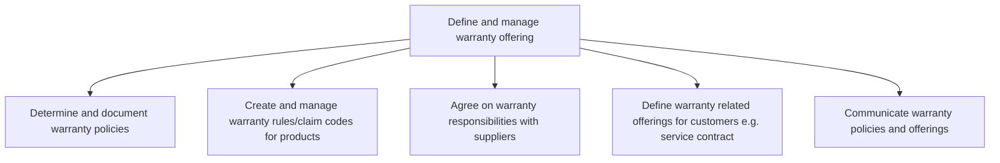
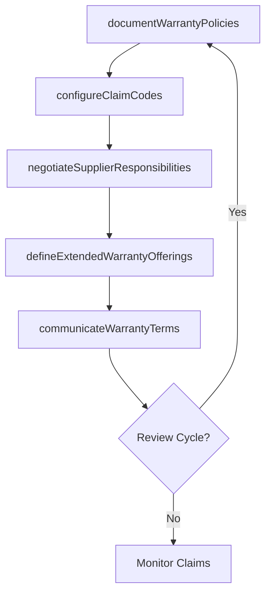

# Define and manage warranty offering

> Business-as-Code definition for warranty offering management. Models warranty policy creation, claim code configuration, supplier responsibility agreements, extended warranty offerings, and communication of warranty terms.

## Overview

Establishing and managing product warranty programs including policy documentation, claim processing rules, supplier responsibility allocation, customer-facing warranty offerings such as service contracts, and communication of warranty terms to all stakeholders.

## Process Hierarchy



## GraphDL

```yaml
define:
  object: And Manage Warranty Offering
  actor: WarrantyProgramManager
  result: WarrantyPolicyDocument
```

## Actions

| Action | Description |
|--------|-------------|
| documentWarrantyPolicies | Create and publish warranty terms, conditions, and coverage details |
| configureClaimCodes | Define claim types, routing rules, and processing codes for products |
| negotiateSupplierResponsibilities | Establish warranty cost-sharing agreements with suppliers |
| defineExtendedWarrantyOfferings | Create service contracts and extended warranty products for customers |
| communicateWarrantyTerms | Distribute warranty policies to customers, dealers, and service teams |

## Events

| Event | Description |
|-------|-------------|
| warrantyPoliciesDocumented | Warranty terms and conditions published |
| claimCodesConfigured | Warranty claim types and routing rules established |
| supplierResponsibilitiesNegotiated | Supplier warranty cost-sharing agreements finalized |
| extendedWarrantyOfferingsDefined | Service contracts and extended warranty products created |
| warrantyTermsCommunicated | Warranty information distributed to stakeholders |

## Searches

| Search | Description |
|--------|-------------|
| getWarrantyPolicies | Retrieve warranty policies by product line or region |
| getClaimCodes | List active warranty claim codes and routing rules |
| getSupplierAgreements | Query supplier warranty responsibility agreements |
| getExtendedWarrantyProducts | List available extended warranty offerings by product |

## Process Flow



## RACI Matrix

| Activity | Responsible | Accountable | Consulted | Informed |
|----------|-------------|-------------|-----------|----------|
| documentWarrantyPolicies | Warranty Program Manager | VP Customer Service | Legal, Product | Sales |
| configureClaimCodes | Warranty Administrator | Warranty Program Manager | IT, Finance | Service Teams |
| negotiateSupplierResponsibilities | Procurement Manager | VP Customer Service | Legal, Quality | Finance |
| defineExtendedWarrantyOfferings | Product Manager | VP Customer Service | Finance, Marketing | Sales |
| communicateWarrantyTerms | Training Coordinator | Warranty Program Manager | Marketing | Dealers, Agents |

## Sub-Processes

| ID | Name | Description |
|----|------|-------------|
| 6.1.6.1 | Determine and document warranty policies | Establishing warranty policies to assure customers that the company will guarantee its warranties th |
| 6.1.6.2 | Create and manage warranty rules/claim codes for products | Establishing and maintaining claims processing and routing rules. Establish and maintain claims proc |
| 6.1.6.3 | Agree on warranty responsibilities with suppliers | Negotiating and formalizing warranty cost-sharing agreements, defect liability terms, and recall responsibilities with component and product suppliers. |
| 6.1.6.4 | Define warranty related offerings for customers e.g. service contract | Designing extended warranty programs, service contracts, and protection plans that customers can purchase beyond standard warranty coverage. |
| 6.1.6.5 | Communicate warranty policies and offerings | Communicating rules and updates via training manuals for new products and training resources. |

## Related Processes

| Process | Relationship |
|---------|-------------|
| 6.3.2 Process warranty claims | Downstream - warranty terms define claims processing rules |
| 6.3.3 Manage supplier recovery | Downstream - supplier agreements define recovery process |
| 6.5.6 Evaluate and manage warranty performance | Feedback loop - performance data informs policy revisions |

## Related Departments

| Department | Role |
|-----------|------|
| Warranty Administration | Manages warranty policies and claim code configuration |
| Legal | Reviews warranty terms for regulatory compliance |
| Procurement | Negotiates supplier warranty responsibility agreements |
| Product Management | Defines product-specific warranty coverage |

## Related Occupations

| Occupation | Involvement |
|-----------|-------------|
| Warranty Program Manager | Oversees warranty policy development and management |
| Product Warranty Analyst | Analyzes warranty data to inform policy decisions |
| Procurement Specialist | Negotiates supplier cost-sharing terms |

## KPIs

| KPI | Description | Unit |
|-----|-------------|------|
| Warranty Cost as Percentage of Revenue | Total warranty spend relative to product revenue | % |
| Supplier Recovery Rate | Percentage of eligible warranty costs recovered from suppliers | % |
| Extended Warranty Attach Rate | Percentage of customers purchasing extended warranty | % |
| Policy Update Frequency | Number of warranty policy revisions per year | Count |

## Usage

```typescript
import { defineAndManageWarrantyOffering } from '@headlessly/define-and-manage-warranty-offering'

const warranty = defineAndManageWarrantyOffering()

// Document warranty policies
const policy = await warranty.documentWarrantyPolicies({
  productLine: 'industrial-motors',
  coveragePeriod: { months: 24 },
  coverageType: 'parts-and-labor',
  exclusions: ['cosmetic-damage', 'misuse']
})

// Configure claim codes
await warranty.configureClaimCodes({
  policyId: policy.id,
  claimTypes: ['defect', 'premature-failure', 'DOA'],
  routingRules: { severity: 'high', autoApprove: false }
})
```
