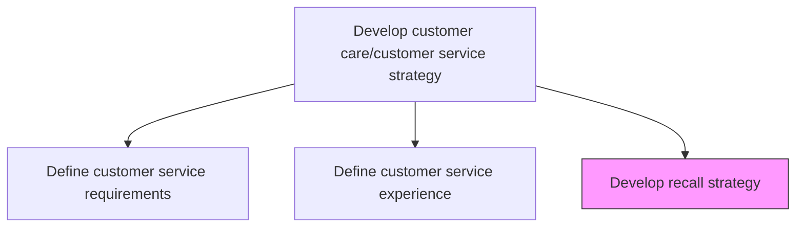
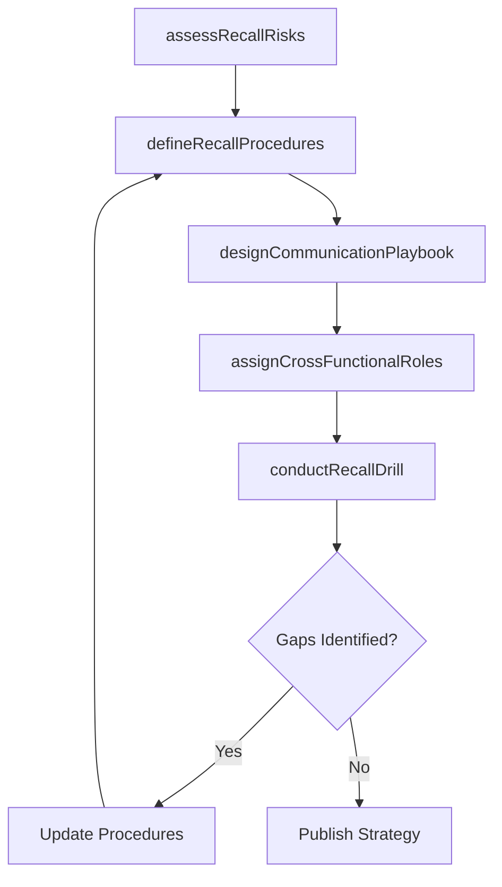

# Develop recall strategy

> Business-as-Code definition for product recall strategy development. Models the creation of recall procedures, escalation protocols, communication playbooks, and cross-functional coordination plans for handling defective product recalls.

## Overview

Establishing procedures to handle recalls of defective products.

## Process Hierarchy



## GraphDL

```yaml
develop:
  object: Recall Strategy
  actor: RecallStrategyManager
  result: RecallPlaybook
```

## Actions

| Action | Description |
|--------|-------------|
| assessRecallRisks | Identify product categories and failure modes most likely to require recalls |
| defineRecallProcedures | Establish step-by-step recall execution workflows and decision criteria |
| designCommunicationPlaybook | Create templates and protocols for customer, media, and regulatory notifications |
| assignCrossFunctionalRoles | Define responsibilities across quality, legal, communications, and supply chain |
| conductRecallDrill | Run tabletop exercises to validate recall readiness and identify gaps |

## Events

| Event | Description |
|-------|-------------|
| recallRisksAssessed | Product recall risk assessment completed across all product lines |
| recallProceduresDefined | Recall execution procedures documented and approved |
| communicationPlaybookDesigned | Recall notification templates and protocols finalized |
| crossFunctionalRolesAssigned | Recall team responsibilities defined and communicated |
| recallDrillConducted | Recall readiness simulation exercise completed with findings |

## Searches

| Search | Description |
|--------|-------------|
| getRecallPlaybook | Retrieve current recall strategy playbook by product line or risk category |
| getRecallRiskAssessment | Query product recall risk assessments by severity or product type |
| getRecallDrillResults | Retrieve results and findings from recall readiness exercises |
| getRecallTeamRoster | List assigned cross-functional recall team members and roles |

## Process Flow



## RACI Matrix

| Activity | Responsible | Accountable | Consulted | Informed |
|----------|-------------|-------------|-----------|----------|
| assessRecallRisks | Quality Manager | VP Quality | Product Engineering, Safety | Executive Team |
| defineRecallProcedures | Recall Strategy Manager | VP Quality | Legal, Supply Chain | Operations |
| designCommunicationPlaybook | Corporate Communications | VP Quality | Legal, Marketing | Customer Service |
| assignCrossFunctionalRoles | Recall Strategy Manager | VP Quality | All Departments | HR |
| conductRecallDrill | Recall Strategy Manager | VP Quality | All Recall Team Members | Executive Team |

## Related Processes

| Process | Relationship |
|---------|-------------|
| 6.4.1 Develop a recall strategy | Downstream - operational recall strategy implements the strategic framework |
| 6.2.5 Report incidents, adverse events and CAPA | Upstream - incident data informs recall risk assessment |
| 6.4.2 Initiate a recall | Downstream - recall initiation follows the defined strategy |

## Related Departments

| Department | Role |
|-----------|------|
| Quality Assurance | Leads recall risk assessment and procedure development |
| Legal | Advises on regulatory requirements and liability management |
| Corporate Communications | Develops recall notification playbooks |
| Supply Chain | Plans product retrieval and replacement logistics |

## Related Occupations

| Occupation | Involvement |
|-----------|-------------|
| Recall Strategy Manager | Leads recall strategy development and readiness testing |
| Quality Engineer | Conducts product risk assessments for recall planning |
| Corporate Communications Manager | Designs recall communication protocols |

## KPIs

| KPI | Description | Unit |
|-----|-------------|------|
| Recall Readiness Score | Assessment score from recall drill exercises | Score (1-100) |
| Strategy Update Frequency | Number of recall strategy reviews and updates per year | Count |
| Drill Participation Rate | Percentage of recall team members participating in readiness exercises | % |
| Gap Closure Rate | Percentage of identified readiness gaps resolved within target timeframe | % |

## Usage

```typescript
import { developRecallStrategy } from '@headlessly/develop-recall-strategy'

const strategy = developRecallStrategy()

// Assess recall risks for a product line
const risks = await strategy.assessRecallRisks({
  productLine: 'residential-heaters',
  failureModes: ['overheating', 'electrical-short', 'gas-leak'],
  historicalIncidents: true
})

// Conduct a recall readiness drill
const drill = await strategy.conductRecallDrill({
  scenario: 'class-I-safety-recall',
  productLine: 'residential-heaters',
  participants: ['quality', 'legal', 'communications', 'supply-chain']
})
```
