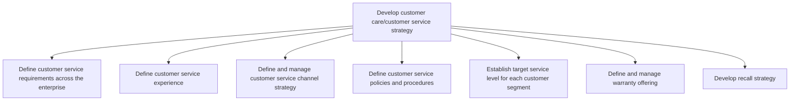
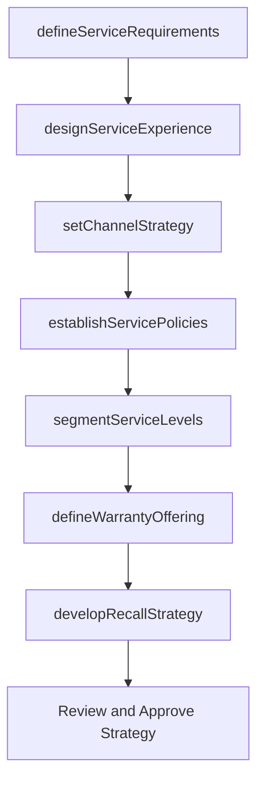

# Develop customer care/customer service strategy

> Business-as-Code definition for customer care strategy development. Models the formulation of service requirements, channel strategy, policies, service levels, warranty offerings, and recall preparedness.

## Overview

Defining a plan that removes customer obstacles by gathering operational insight and competitive insight, as well as improving soft skills and forward resolution for employees. Develop customer segmentation. Define rules and regulations for customer service. Establish service levels for customers.

## Process Hierarchy



## GraphDL

```yaml
develop:
  object: Customer Care/customer Service Strategy
  actor: CustomerServiceStrategist
  result: ServiceStrategyPlan
```

## Actions

| Action | Description |
|--------|-------------|
| defineServiceRequirements | Establish enterprise-wide customer service competency and behavior standards |
| designServiceExperience | Specify target customer experience across all touchpoints |
| setChannelStrategy | Define and prioritize customer service delivery channels |
| establishServicePolicies | Create customer service policies, procedures, and escalation rules |
| segmentServiceLevels | Define differentiated service level targets per customer segment |
| defineWarrantyOffering | Establish warranty terms, claim codes, and supplier responsibilities |
| developRecallStrategy | Create procedures and playbooks for product recall execution |

## Events

| Event | Description |
|-------|-------------|
| serviceRequirementsDefined | Enterprise-wide service requirements documented and approved |
| serviceExperienceDesigned | Target customer service experience specification completed |
| channelStrategySet | Service channel strategy established and resourced |
| servicePoliciesEstablished | Customer service policies and procedures published |
| serviceLevelsSegmented | Per-segment service level targets defined and communicated |
| warrantyOfferingDefined | Warranty terms and claim processes finalized |
| recallStrategyDeveloped | Product recall strategy and playbook completed |

## Searches

| Search | Description |
|--------|-------------|
| getServicePolicies | Retrieve customer service policies filtered by channel, segment, or region |
| getServiceLevelTargets | Query service level targets by customer segment |
| getWarrantyTerms | Retrieve warranty offering terms by product line |
| getChannelPerformance | Query service channel utilization and performance metrics |

## Process Flow



## RACI Matrix

| Activity | Responsible | Accountable | Consulted | Informed |
|----------|-------------|-------------|-----------|----------|
| defineServiceRequirements | Customer Service Strategist | VP Customer Service | Operations, IT | All Departments |
| designServiceExperience | CX Designer | VP Customer Service | Marketing, Product | Customer Service Agents |
| setChannelStrategy | Channel Manager | VP Customer Service | IT, Finance | Operations |
| establishServicePolicies | Service Policy Manager | VP Customer Service | Legal, Compliance | All Service Staff |
| segmentServiceLevels | Customer Insights Analyst | VP Customer Service | Sales, Finance | Account Managers |

## Sub-Processes

| ID | Name | Description |
|----|------|-------------|
| 6.1.1 | Define customer service requirements across the enterprise | Defining a set of behaviors, skills, and policies needed to provide customer service effectively acr |
| 6.1.2 | Define customer service experience | Communicating to the customer service resources what is expected when engaging the customer. Relate  |
| 6.1.3 | Define and manage customer service channel strategy | Establishing and refining procedures for customer service and technical support. |
| 6.1.4 | Define customer service policies and procedures | Outlining the framework of policies and methods for developing customer service strategy. Establish  |
| 6.1.5 | Establish target service level for each customer segment | Determining and implementing levels for customer services. Benchmark certain customer service practi |
| 6.1.6 | Define and manage warranty offering | Establishing warranty policies, defining coverage terms and conditions, negotiating supplier responsibilities, and creating warranty-related service offerings for customers. |
| 6.1.7 | Develop recall strategy | Establishing procedures to handle recalls of defective products. |

## Related Processes

| Process | Relationship |
|---------|-------------|
| 6.2 Plan and manage customer service operations | Downstream - strategy guides operational execution |
| 6.5 Evaluate customer service operations and customer satisfaction | Feedback loop - evaluation informs strategy revision |
| 3.3 Market and sell products and services | Parallel - aligns service strategy with go-to-market |

## Related Departments

| Department | Role |
|-----------|------|
| Customer Service | Primary owner of strategy development and implementation |
| Marketing | Aligns brand promise with service experience design |
| Product Management | Provides product knowledge for warranty and recall strategy |
| Legal | Reviews policies for regulatory compliance |
| Information Technology | Enables channel strategy with platform capabilities |

## Related Occupations

| Occupation | Involvement |
|-----------|-------------|
| Customer Experience Strategist | Leads service strategy formulation |
| Service Operations Planner | Translates strategy into operational plans |
| Business Analyst | Analyzes customer data to inform segmentation |

## KPIs

| KPI | Description | Unit |
|-----|-------------|------|
| Strategy Adoption Rate | Percentage of service teams aligned with current strategy | % |
| Channel Coverage | Number of active service channels available to customers | Count |
| Policy Compliance Rate | Percentage of interactions adhering to defined policies | % |
| Segment SLA Definition Coverage | Percentage of customer segments with defined SLAs | % |

## Usage

```typescript
import { developCustomerCareCustomerServiceStrategy } from '@headlessly/develop-customer-care-customer-service-strategy'

const strategy = developCustomerCareCustomerServiceStrategy()

// Define service requirements
const requirements = await strategy.defineServiceRequirements({
  enterprise: 'global',
  channels: ['phone', 'email', 'chat', 'self-service'],
  languages: ['en', 'es', 'fr']
})

// Segment service levels
const levels = await strategy.segmentServiceLevels({
  segments: ['enterprise', 'mid-market', 'smb'],
  metrics: ['responseTime', 'resolutionTime', 'availability']
})
```
