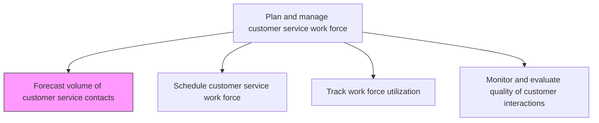
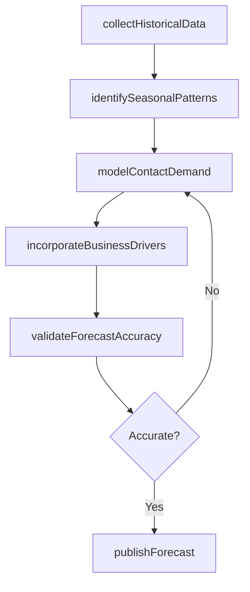

# Forecast volume of customer service contacts

> Business-as-Code definition for projecting incoming customer service contact volumes across channels, time periods, and categories to drive workforce planning decisions.

## Overview

Projecting the total work force required to service customer service inquiries in order to effectively predict the volume of vendor contracts required. Estimate the number of the customer service contracts in an agreed-upon time frame in order to strategically maintain the work force necessitated for customer inquires. Analyze historical data around customer service contracts, the universe of customer inquiries, frequency of inquiries, servicing capability (per head) of the employees, etc.

## Process Hierarchy



## GraphDL

```yaml
forecast:
  object: Volume Of Customer Service Contacts
  actor: WorkforceManagementAnalyst
  result: ContactVolumeForecast
```

## Actions

| Action | Description |
|--------|-------------|
| collectHistoricalData | Aggregate past contact volumes by channel, category, and time period |
| identifySeasonalPatterns | Detect cyclical trends and seasonal spikes in contact demand |
| modelContactDemand | Apply forecasting models to predict future contact volumes |
| incorporateBusinessDrivers | Adjust forecasts based on product launches, campaigns, and known events |
| validateForecastAccuracy | Compare prior forecasts against actuals and refine models |
| publishForecast | Distribute finalized contact volume projections to planning teams |

## Events

| Event | Description |
|-------|-------------|
| historicalDataCollected | Contact history data aggregated and cleansed for analysis |
| seasonalPatternsIdentified | Cyclical trends and seasonal demand patterns detected |
| contactDemandModeled | Forecasting model generated with projected volumes |
| businessDriversIncorporated | Forecast adjusted for upcoming events and campaigns |
| forecastAccuracyValidated | Forecast model accuracy reviewed against prior actuals |
| forecastPublished | Contact volume forecast distributed to workforce planners |

## Searches

| Search | Description |
|--------|-------------|
| getHistoricalVolumes | Retrieve past contact volumes by channel, period, or category |
| getForecastProjections | Query forecasted contact volumes for a future period |
| getForecastAccuracy | Retrieve forecast-versus-actual variance metrics |

## Process Flow



## RACI Matrix

| Activity | Responsible | Accountable | Consulted | Informed |
|----------|-------------|-------------|-----------|----------|
| collectHistoricalData | Workforce Analyst | WFM Manager | IT | Service Operations |
| modelContactDemand | Workforce Analyst | WFM Manager | Data Science | Finance |
| incorporateBusinessDrivers | Workforce Analyst | WFM Manager | Marketing, Product | Team Leads |
| publishForecast | WFM Manager | Service Operations Manager | Finance | VP Customer Service |

## Related Processes

| Process | Relationship |
|---------|-------------|
| 6.2.1.2 Schedule customer service work force | Downstream - forecast drives scheduling |
| 6.2.2 Manage customer service problems, requests, and inquiries | Parallel - inquiry volumes inform forecasts |
| 6.1.5 Establish target service level for each customer segment | Upstream - SLA targets set staffing requirements |

## Related Departments

| Department | Role |
|-----------|------|
| Workforce Management | Owns forecasting models and projections |
| Customer Service Operations | Provides historical data and domain expertise |
| IT | Maintains data pipelines and forecasting tools |
| Finance | Reviews cost implications of volume projections |

## Related Occupations

| Occupation | Involvement |
|-----------|-------------|
| Workforce Management Analyst | Builds and maintains forecasting models |
| Data Analyst | Supports statistical analysis of contact patterns |
| Service Operations Manager | Reviews and approves forecasts |

## KPIs

| KPI | Description | Unit |
|-----|-------------|------|
| Forecast Accuracy | Deviation between forecasted and actual contact volumes | % |
| Mean Absolute Percentage Error | Average forecasting error across periods | % |
| Forecast Horizon | Number of weeks ahead forecast is reliably produced | Weeks |
| Forecast Refresh Frequency | How often the forecast is updated with new data | Per Week |

## Usage

```typescript
import { forecastVolumeOfCustomerServiceContacts } from '@headlessly/forecast-volume-of-customer-service-contacts'

const forecast = forecastVolumeOfCustomerServiceContacts()

// Model contact demand for next quarter
const projection = await forecast.modelContactDemand({
  channels: ['phone', 'email', 'chat'],
  period: '2025-Q2',
  granularity: 'daily'
})

// Validate forecast accuracy against last period
const accuracy = await forecast.validateForecastAccuracy({
  forecastId: projection.id,
  comparisonPeriod: '2025-Q1'
})
```
