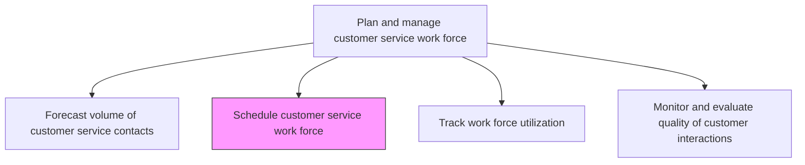
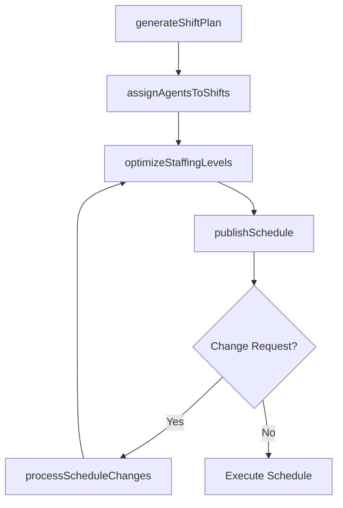

# Schedule customer service work force

> Business-as-Code definition for assigning customer service agents to shifts and channels based on forecasted demand, skill requirements, and service level targets.

## Overview

Deploying the work force to manage customer service contracts. Create a systematic summary of the operations and service required, as well as the specific amount of work force that is to be deployed to the customer service operations. Ensure work force is directly proportional to the estimated forecast of customer service contracts.

## Process Hierarchy



## GraphDL

```yaml
schedule:
  object: Customer Service Work Force
  actor: WorkforcePlanner
  result: AgentSchedule
```

## Actions

| Action | Description |
|--------|-------------|
| generateShiftPlan | Create shift patterns based on forecasted demand and SLA targets |
| assignAgentsToShifts | Match agents to shifts based on skills, availability, and preferences |
| publishSchedule | Release the finalized schedule to agents and supervisors |
| processScheduleChanges | Handle shift swaps, time-off requests, and overtime approvals |
| optimizeStaffingLevels | Adjust agent counts per interval to minimize overstaffing and understaffing |

## Events

| Event | Description |
|-------|-------------|
| shiftPlanGenerated | Shift patterns created for the scheduling period |
| agentsAssignedToShifts | Agents matched to shifts and channels |
| schedulePublished | Finalized schedule released to all agents |
| scheduleChangeProcessed | Shift swap or schedule modification approved |
| staffingLevelsOptimized | Agent allocation adjusted to match demand intervals |

## Searches

| Search | Description |
|--------|-------------|
| getAgentSchedule | Retrieve schedule for a specific agent or team |
| getShiftCoverage | Query staffing levels by shift, channel, or date |
| getPendingScheduleChanges | List open shift swap or time-off requests |

## Process Flow



## RACI Matrix

| Activity | Responsible | Accountable | Consulted | Informed |
|----------|-------------|-------------|-----------|----------|
| generateShiftPlan | Workforce Planner | WFM Manager | Team Leads | Finance |
| assignAgentsToShifts | Workforce Planner | WFM Manager | Agents | Team Leads |
| publishSchedule | WFM Manager | Service Operations Manager | HR | VP Customer Service |
| processScheduleChanges | Team Lead | WFM Manager | HR | Workforce Planner |

## Related Processes

| Process | Relationship |
|---------|-------------|
| 6.2.1.1 Forecast volume of customer service contacts | Upstream - forecasts drive scheduling decisions |
| 6.2.1.3 Track work force utilization | Downstream - schedule adherence feeds utilization tracking |
| 7.6.6 Manage workforce scheduling | Parallel - enterprise workforce scheduling practices |

## Related Departments

| Department | Role |
|-----------|------|
| Workforce Management | Creates and optimizes agent schedules |
| Human Resources | Enforces labor rules and manages time-off policies |
| Customer Service Operations | Executes schedules and manages day-of adjustments |

## Related Occupations

| Occupation | Involvement |
|-----------|-------------|
| Workforce Planner | Builds and publishes agent schedules |
| Team Lead | Manages day-of schedule adjustments and shift swaps |
| HR Analyst | Ensures compliance with labor regulations |

## KPIs

| KPI | Description | Unit |
|-----|-------------|------|
| Schedule Adherence | Percentage of agents working their assigned schedules | % |
| Shrinkage Rate | Percentage of scheduled time lost to breaks, training, and absences | % |
| Overstaffing/Understaffing Index | Variance between scheduled and required agents per interval | Count |
| Schedule Publication Lead Time | Days in advance the schedule is published | Days |

## Usage

```typescript
import { scheduleCustomerServiceWorkForce } from '@headlessly/schedule-customer-service-work-force'

const scheduler = scheduleCustomerServiceWorkForce()

// Generate a shift plan from forecast
const plan = await scheduler.generateShiftPlan({
  forecastId: 'FC-2025-Q2',
  shiftDuration: 8,
  channels: ['phone', 'chat'],
  serviceLevelTarget: 0.80
})

// Assign agents to shifts
const schedule = await scheduler.assignAgentsToShifts({
  planId: plan.id,
  team: 'tier-1-support',
  optimizeFor: 'skill-coverage'
})
```
