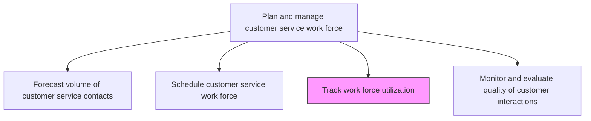
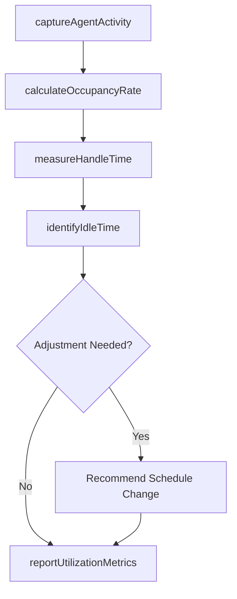

# Track work force utilization

> Business-as-Code definition for monitoring and measuring the productive use of customer service agents across shifts, channels, and interaction types.

## Overview

Tracking the utilization of work force deployed for managing customer service operations. Monitor the utility of the work force deployed for managing customer service operations in order to evaluate its efficiency and cost effectiveness. Calculate the overall labor effectiveness, which measures the utility, performance, and quality of the work force.

## Process Hierarchy



## GraphDL

```yaml
track:
  object: Work Force Utilization
  actor: WorkforceManagementAnalyst
  result: UtilizationReport
```

## Actions

| Action | Description |
|--------|-------------|
| captureAgentActivity | Record real-time agent state transitions between ready, busy, wrap-up, and idle |
| calculateOccupancyRate | Compute the ratio of productive time to total logged-in time |
| measureHandleTime | Track average handle time across interactions and channels |
| identifyIdleTime | Detect periods of low agent utilization for schedule optimization |
| reportUtilizationMetrics | Generate utilization dashboards and reports for management |

## Events

| Event | Description |
|-------|-------------|
| agentActivityCaptured | Agent state transition logged in the workforce system |
| occupancyRateCalculated | Agent occupancy metrics computed for the reporting period |
| handleTimeMeasured | Average handle time statistics updated |
| idleTimeIdentified | Low-utilization periods flagged for schedule adjustment |
| utilizationMetricsReported | Utilization report generated and distributed to stakeholders |

## Searches

| Search | Description |
|--------|-------------|
| getAgentUtilization | Retrieve utilization metrics for specific agents or teams |
| getOccupancyTrends | Query occupancy rate trends by period and channel |
| getIdleTimePeriods | Identify time intervals with excess agent idle time |

## Process Flow



## RACI Matrix

| Activity | Responsible | Accountable | Consulted | Informed |
|----------|-------------|-------------|-----------|----------|
| captureAgentActivity | WFM System | WFM Manager | IT | Team Leads |
| calculateOccupancyRate | Workforce Analyst | WFM Manager | Finance | VP Customer Service |
| identifyIdleTime | Workforce Analyst | WFM Manager | Team Leads | Service Operations |
| reportUtilizationMetrics | Workforce Analyst | Service Operations Manager | Finance | Executive Team |

## Related Processes

| Process | Relationship |
|---------|-------------|
| 6.2.1.2 Schedule customer service work force | Upstream - schedules determine expected utilization |
| 6.2.1.4 Monitor and evaluate quality of customer interactions | Parallel - quality and utilization jointly assess performance |
| 6.5.2 Track performance against customer service scorecard | Downstream - utilization feeds scorecard metrics |

## Related Departments

| Department | Role |
|-----------|------|
| Workforce Management | Tracks and analyzes agent utilization data |
| Customer Service Operations | Manages agent productivity and schedule adherence |
| Finance | Reviews labor cost effectiveness |

## Related Occupations

| Occupation | Involvement |
|-----------|-------------|
| Workforce Management Analyst | Monitors and reports on utilization metrics |
| Team Lead | Coaches agents on time management and productivity |
| Service Operations Manager | Reviews utilization trends and drives improvements |

## KPIs

| KPI | Description | Unit |
|-----|-------------|------|
| Agent Occupancy Rate | Percentage of logged-in time spent handling customer interactions | % |
| Agent Utilization Rate | Percentage of scheduled time spent on productive work | % |
| Average Idle Time | Mean idle duration between customer interactions | Seconds |
| Cost Per Contact | Total labor cost divided by number of contacts handled | USD |

## Usage

```typescript
import { trackWorkForceUtilization } from '@headlessly/track-work-force-utilization'

const utilization = trackWorkForceUtilization()

// Calculate occupancy rates for a team
const occupancy = await utilization.calculateOccupancyRate({
  team: 'tier-1-support',
  period: '2025-03',
  groupBy: 'agent'
})

// Identify idle time windows
const idlePeriods = await utilization.identifyIdleTime({
  threshold: 300,
  channel: 'phone',
  period: '2025-03-15'
})
```
