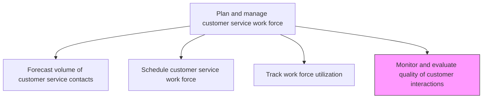
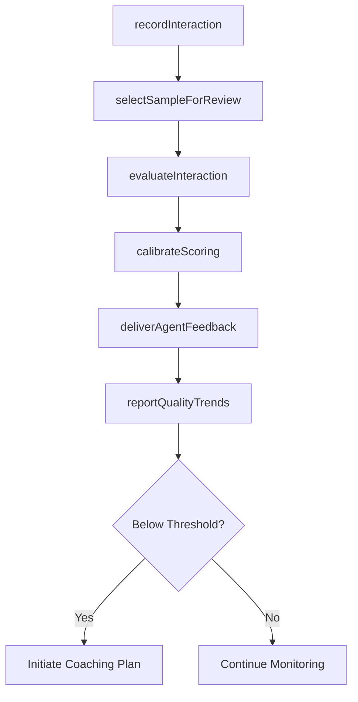

# Monitor and evaluate quality of customer interactions with customer service representatives

> Business-as-Code definition for assessing and scoring the quality of customer-agent interactions through call monitoring, transcript review, and performance evaluation.

## Overview

Tracking and determining the quality of interactions between the customer and customer representatives. Use electronic devices to record and effectively assess customer representatives' interactions.

## Process Hierarchy



## GraphDL

```yaml
monitor:
  object: And Evaluate Quality Of Customer Interactions With Customer Service Representatives
  actor: QualityAssuranceAnalyst
  result: InteractionQualityScorecard
```

## Actions

| Action | Description |
|--------|-------------|
| recordInteraction | Capture audio, chat transcript, or screen recording of customer interactions |
| selectSampleForReview | Choose a statistically valid sample of interactions for quality evaluation |
| evaluateInteraction | Score an interaction against quality criteria such as professionalism, accuracy, and resolution |
| calibrateScoring | Align scoring standards across QA evaluators through calibration sessions |
| deliverAgentFeedback | Provide quality evaluation results and coaching recommendations to agents |
| reportQualityTrends | Generate quality trend reports for management review |

## Events

| Event | Description |
|-------|-------------|
| interactionRecorded | Customer-agent interaction captured for quality review |
| sampleSelectedForReview | Interaction sample selected for QA evaluation |
| interactionEvaluated | Quality score assigned to a customer interaction |
| scoringCalibrated | QA evaluator scoring standards aligned through calibration |
| agentFeedbackDelivered | Quality evaluation feedback provided to the agent |
| qualityTrendsReported | Quality trend analysis completed and shared with management |

## Searches

| Search | Description |
|--------|-------------|
| getQualityScores | Retrieve interaction quality scores by agent, team, or period |
| getEvaluationQueue | List interactions pending quality review |
| getAgentCoachingHistory | Query coaching and feedback history for a specific agent |
| getQualityTrends | Retrieve quality score trends over time by team or category |

## Process Flow



## RACI Matrix

| Activity | Responsible | Accountable | Consulted | Informed |
|----------|-------------|-------------|-----------|----------|
| recordInteraction | Contact Center System | IT Manager | Legal | Agents |
| evaluateInteraction | QA Analyst | QA Manager | Team Leads | Training |
| calibrateScoring | QA Manager | Service Operations Manager | QA Analysts | VP Customer Service |
| deliverAgentFeedback | Team Lead | QA Manager | Training | Agent |

## Related Processes

| Process | Relationship |
|---------|-------------|
| 6.2.1.3 Track work force utilization | Parallel - quality and utilization jointly assess performance |
| 6.5.3 Measure customer satisfaction with customer problems, requests, and inquiries handling | Downstream - quality scores correlate with satisfaction |
| 6.2.2 Manage customer service problems, requests, and inquiries | Upstream - interactions being evaluated originate here |

## Related Departments

| Department | Role |
|-----------|------|
| Quality Assurance | Evaluates and scores customer interactions |
| Customer Service Operations | Provides interactions for review and acts on feedback |
| Training | Develops coaching programs based on quality findings |

## Related Occupations

| Occupation | Involvement |
|-----------|-------------|
| Quality Assurance Analyst | Scores interactions and identifies improvement areas |
| Training Specialist | Designs coaching plans based on quality gaps |
| Team Lead | Delivers feedback and coaches agents |

## KPIs

| KPI | Description | Unit |
|-----|-------------|------|
| Quality Assurance Score | Average interaction quality score across all evaluations | Score (1-100) |
| Evaluation Coverage | Percentage of agents evaluated per month | % |
| Critical Error Rate | Percentage of interactions with critical compliance or accuracy errors | % |
| Coaching Completion Rate | Percentage of recommended coaching sessions completed | % |

## Usage

```typescript
import { monitorAndEvaluateQualityOfCustomerInteractionsWithCustomerServiceRepresentatives } from '@headlessly/monitor-and-evaluate-quality-of-customer-interactions-with-customer-service-representatives'

const quality = monitorAndEvaluateQualityOfCustomerInteractionsWithCustomerServiceRepresentatives()

// Evaluate a sample of interactions
const evaluation = await quality.evaluateInteraction({
  interactionId: 'INT-2025-98765',
  criteria: ['professionalism', 'accuracy', 'resolution', 'empathy'],
  evaluatorId: 'QA-005'
})

// Report quality trends for a team
const trends = await quality.reportQualityTrends({
  team: 'tier-1-support',
  period: '2025-Q1',
  groupBy: 'category'
})
```
