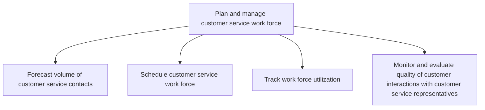
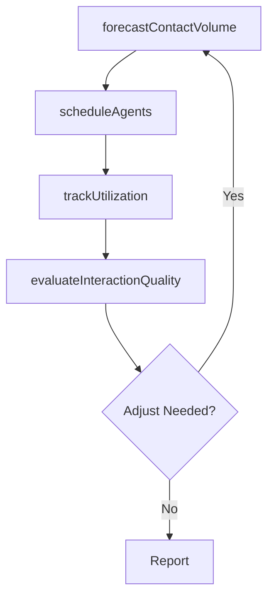

# Plan and manage customer service work force

> Business-as-Code definition for customer service workforce planning and management. Models contact volume forecasting, agent scheduling, utilization tracking, and interaction quality monitoring.

## Overview

Creating and administering the work force deployed for the customer service process. Forecast the customer work force needs to correctly schedule the work force. Track the utility of the work force deployed. Examine the interactions between the customer and customer service representatives to achieve high quality.

## Process Hierarchy



## GraphDL

```yaml
plan:
  object: And Manage Customer Service Work Force
  actor: WorkforcePlanner
  result: WorkforceSchedule
```

## Actions

| Action | Description |
|--------|-------------|
| forecastContactVolume | Project incoming contact volumes by channel, time, and category |
| scheduleAgents | Assign agents to shifts based on forecasted demand and skill sets |
| trackUtilization | Monitor agent occupancy, idle time, and productive hours |
| evaluateInteractionQuality | Score and review customer-agent interactions for quality |

## Events

| Event | Description |
|-------|-------------|
| contactVolumeForecasted | Contact volume predictions generated for planning period |
| agentsScheduled | Agent shift assignments published |
| utilizationTracked | Workforce utilization metrics updated and reviewed |
| interactionQualityEvaluated | Quality evaluation for customer interactions completed |

## Searches

| Search | Description |
|--------|-------------|
| getVolumeForecast | Retrieve contact volume predictions by channel and period |
| getAgentSchedule | Query agent schedules by team, shift, or date |
| getUtilizationMetrics | Retrieve workforce utilization data by agent or team |

## Process Flow



## RACI Matrix

| Activity | Responsible | Accountable | Consulted | Informed |
|----------|-------------|-------------|-----------|----------|
| forecastContactVolume | Workforce Planner | Service Operations Manager | IT | Finance |
| scheduleAgents | Workforce Planner | Service Operations Manager | Team Leads | Agents |
| trackUtilization | Team Lead | Service Operations Manager | Workforce Planner | VP Customer Service |
| evaluateInteractionQuality | Quality Analyst | Service Operations Manager | Training | Team Leads |

## Sub-Processes

| ID | Name | Description |
|----|------|-------------|
| 6.2.1.1 | Forecast volume of customer service contacts | Projecting the total work force required to service customer service inquiries in order to effective |
| 6.2.1.2 | Schedule customer service work force | Deploying the work force to manage customer service contracts. Create a systematic summary of the op |
| 6.2.1.3 | Track work force utilization | Tracking the utilization of work force deployed for managing customer service operations. Monitor th |
| 6.2.1.4 | Monitor and evaluate quality of customer interactions with customer service representatives | Tracking and determining the quality of interactions between the customer and customer representativ |

## Related Processes

| Process | Relationship |
|---------|-------------|
| 6.2.2 Manage customer service problems, requests, and inquiries | Downstream - workforce enables inquiry handling |
| 6.1.5 Establish target service level for each customer segment | Upstream - SLAs drive staffing requirements |
| 7.6.6 Manage workforce scheduling | Parallel - shared workforce planning practices |

## Related Departments

| Department | Role |
|-----------|------|
| Customer Service Operations | Executes workforce planning and scheduling |
| Human Resources | Supports hiring and training of service agents |
| Quality Assurance | Monitors and evaluates interaction quality |

## Related Occupations

| Occupation | Involvement |
|-----------|-------------|
| Workforce Management Analyst | Forecasts volume and optimizes schedules |
| Quality Assurance Analyst | Evaluates agent interaction quality |

## KPIs

| KPI | Description | Unit |
|-----|-------------|------|
| Forecast Accuracy | Deviation between forecasted and actual contact volumes | % |
| Schedule Adherence | Percentage of agents working their assigned schedules | % |
| Agent Utilization Rate | Percentage of agent time on productive customer work | % |
| Quality Score | Average interaction quality evaluation score | Score (1-100) |

## Usage

```typescript
import { planAndManageCustomerServiceWorkForce } from '@headlessly/plan-and-manage-customer-service-work-force'

const workforce = planAndManageCustomerServiceWorkForce()

// Forecast contact volume
const forecast = await workforce.forecastContactVolume({
  channel: 'phone',
  period: '2025-04',
  granularity: 'hourly'
})

// Schedule agents based on forecast
const schedule = await workforce.scheduleAgents({
  forecastId: forecast.id,
  team: 'tier-1-support',
  optimizeFor: 'service-level'
})
```
