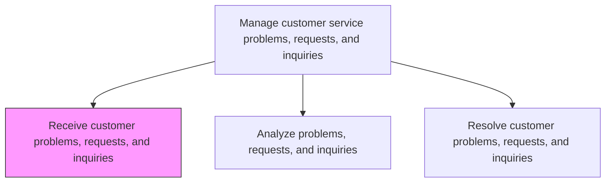
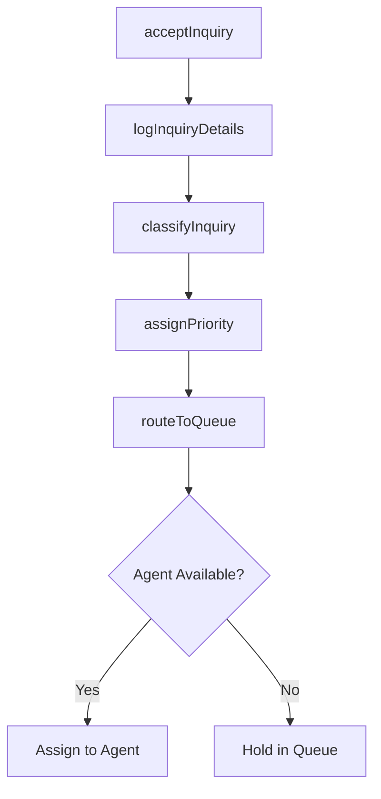

# Receive customer problems, requests, and inquiries

> Business-as-Code definition for multi-channel customer inquiry intake. Models the receipt, logging, classification, and initial routing of customer problems, requests, and inquiries across all service channels.

## Overview

Receiving requests for information from customers over multiple channels. Receive various requests and inquiries from customers regarding products/services. Accept these inquiries through channels such as email, telephone, online forms, text messages, social media, and in person. Supply dedicated equipment, systems, and personnel.

## Process Hierarchy



## GraphDL

```yaml
receive:
  object: Customer Problems, Requests, And Inquiries
  actor: CustomerServiceAgent
  result: InquiryRecord
```

## Actions

| Action | Description |
|--------|-------------|
| acceptInquiry | Receive customer contact through any supported channel |
| logInquiryDetails | Record inquiry details including customer identity, issue type, and channel |
| classifyInquiry | Categorize the inquiry by type, product, and urgency |
| assignPriority | Determine priority level based on customer segment and issue severity |
| routeToQueue | Direct the inquiry to the appropriate service queue or agent |

## Events

| Event | Description |
|-------|-------------|
| inquiryAccepted | Customer inquiry received through a service channel |
| inquiryDetailsLogged | Inquiry details recorded in the case management system |
| inquiryClassified | Inquiry categorized by type and product area |
| priorityAssigned | Inquiry priority level determined and set |
| inquiryRouted | Inquiry directed to the appropriate service queue |

## Searches

| Search | Description |
|--------|-------------|
| getIncomingInquiries | List incoming inquiries by channel, status, or time period |
| getCustomerContext | Retrieve customer profile and prior interaction history for context |
| getQueueStatus | Query service queue depth and agent availability by team |
| getChannelVolume | Retrieve inquiry volume metrics by channel and time period |

## Process Flow



## RACI Matrix

| Activity | Responsible | Accountable | Consulted | Informed |
|----------|-------------|-------------|-----------|----------|
| acceptInquiry | Customer Service Agent | Team Lead | IT Systems | Quality |
| logInquiryDetails | Customer Service Agent | Team Lead | Knowledge Base | Data Analytics |
| classifyInquiry | Customer Service Agent | Team Lead | Product Specialists | Service Operations |
| assignPriority | Customer Service Agent | Team Lead | SLA Policy | Workforce Planner |
| routeToQueue | Routing System | Team Lead | Workforce Planner | Service Operations |

## Related Processes

| Process | Relationship |
|---------|-------------|
| 6.2.2.2 Analyze problems, requests, and inquiries | Downstream - received inquiries are analyzed for resolution |
| 6.2.1 Plan and manage customer service work force | Upstream - workforce availability determines routing capacity |
| 6.2.3.1 Receive customer complaints | Parallel - complaints follow a similar intake process |

## Related Departments

| Department | Role |
|-----------|------|
| Customer Service | Operates intake channels and logs inquiries |
| Information Technology | Maintains CRM, IVR, and omnichannel routing systems |
| Quality Assurance | Monitors intake accuracy and classification consistency |

## Related Occupations

| Occupation | Involvement |
|-----------|-------------|
| Customer Service Representative | Frontline handler of incoming inquiries |
| Contact Center Agent | Manages phone and chat inquiry intake |
| Help Desk Technician | Receives technical support requests |

## KPIs

| KPI | Description | Unit |
|-----|-------------|------|
| Average Speed of Answer | Mean time from customer contact to agent connection | Seconds |
| Abandonment Rate | Percentage of inquiries abandoned before reaching an agent | % |
| Classification Accuracy | Percentage of inquiries correctly categorized on first attempt | % |
| Channel Distribution | Breakdown of inquiry volume across service channels | % |

## Usage

```typescript
import { receiveCustomerProblemsRequestsAndInquiries } from '@headlessly/receive-customer-problems-requests-and-inquiries'

const intake = receiveCustomerProblemsRequestsAndInquiries()

// Accept an inquiry from a customer
const inquiry = await intake.acceptInquiry({
  customerId: 'cust_12345',
  channel: 'phone',
  subject: 'Product not functioning as expected',
  product: 'industrial-pump-X200'
})

// Classify and prioritize
await intake.classifyInquiry({
  inquiryId: inquiry.id,
  category: 'product-issue',
  subCategory: 'malfunction',
  priority: 'high'
})
```
