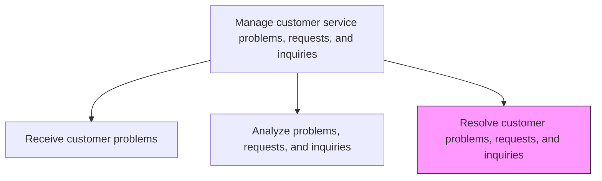
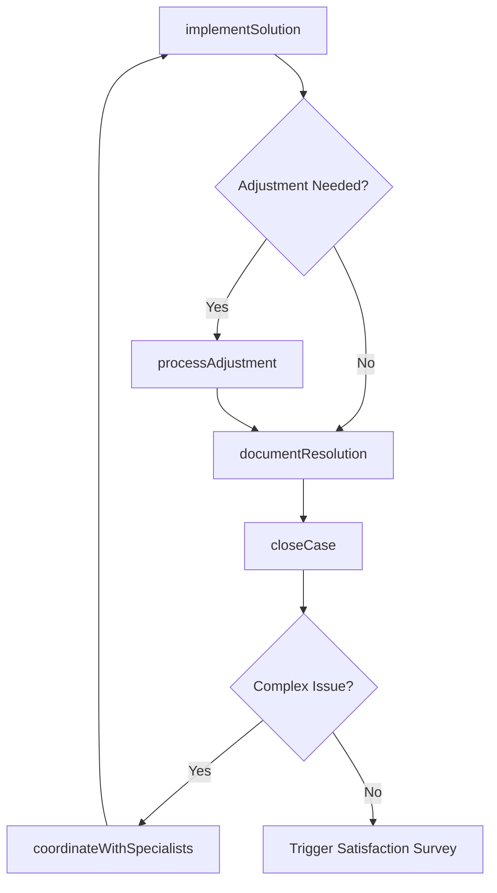

# Resolve customer problems, requests, and inquiries

> Business-as-Code definition for customer inquiry resolution. Models the investigation, solution implementation, and case closure for customer problems, requests, and inquiries.

## Overview

Routing customer inquiries in order to service them with the most apposite response. Direct customer inquires to the best suited personnel or system. Have a system or procedure capable of efficiently channeling these requests.

## Process Hierarchy



## GraphDL

```yaml
resolve:
  object: Customer Problems, Requests, And Inquiries
  actor: CustomerServiceAgent
  result: CaseResolution
```

## Actions

| Action | Description |
|--------|-------------|
| implementSolution | Execute the identified resolution action for the customer issue |
| processAdjustment | Apply account adjustments, credits, or refunds as needed |
| coordinateWithSpecialists | Engage subject matter experts for complex issue resolution |
| documentResolution | Record the resolution details and root cause in the case record |
| closeCase | Mark the case as resolved and trigger follow-up workflows |

## Events

| Event | Description |
|-------|-------------|
| solutionImplemented | Resolution action executed for the customer issue |
| adjustmentProcessed | Account adjustment, credit, or refund applied |
| specialistsCoordinated | Subject matter experts engaged and resolution provided |
| resolutionDocumented | Resolution details and root cause recorded in case |
| caseClosed | Customer case marked as resolved and archived |

## Searches

| Search | Description |
|--------|-------------|
| getPendingResolutions | List cases awaiting resolution by agent, priority, or age |
| getResolutionHistory | Retrieve resolution history for a customer or product |
| getResolutionTemplates | Query standard resolution templates by issue type |
| getSpecialistAvailability | Check availability of subject matter experts by domain |

## Process Flow



## RACI Matrix

| Activity | Responsible | Accountable | Consulted | Informed |
|----------|-------------|-------------|-----------|----------|
| implementSolution | Customer Service Agent | Team Lead | Knowledge Base | Customer |
| processAdjustment | Customer Service Agent | Team Lead | Finance | Billing |
| coordinateWithSpecialists | Customer Service Agent | Team Lead | Subject Matter Experts | Service Operations |
| documentResolution | Customer Service Agent | Team Lead | Quality | Data Analytics |
| closeCase | Customer Service Agent | Team Lead | Quality | Customer |

## Related Processes

| Process | Relationship |
|---------|-------------|
| 6.2.2.2 Analyze problems, requests, and inquiries | Upstream - analysis provides diagnosis for resolution |
| 6.2.2.4 Respond to customer problems, requests, and inquiries | Downstream - resolution is communicated to customer |
| 6.5.3 Measure customer satisfaction with problems handling | Downstream - resolution outcomes feed satisfaction measurement |

## Related Departments

| Department | Role |
|-----------|------|
| Customer Service | Executes case resolution and documents outcomes |
| Finance | Approves and processes financial adjustments and refunds |
| Product Support | Provides specialist expertise for product-related issues |
| Quality Assurance | Reviews resolution quality and consistency |

## Related Occupations

| Occupation | Involvement |
|-----------|-------------|
| Customer Service Representative | Implements resolutions for standard issues |
| Technical Support Specialist | Resolves complex product and technical problems |
| Billing Specialist | Processes financial adjustments related to resolutions |

## KPIs

| KPI | Description | Unit |
|-----|-------------|------|
| First Contact Resolution Rate | Percentage of cases resolved on the first interaction | % |
| Average Resolution Time | Mean time from case creation to resolution | Hours |
| Resolution Quality Score | Quality audit score for resolution accuracy and completeness | Score (1-100) |
| Reopen Rate | Percentage of resolved cases reopened within 30 days | % |

## Usage

```typescript
import { resolveCustomerProblemsRequestsAndInquiries } from '@headlessly/resolve-customer-problems-requests-and-inquiries'

const resolver = resolveCustomerProblemsRequestsAndInquiries()

// Implement a solution for a customer case
const resolution = await resolver.implementSolution({
  caseId: 'CS-2025-5678',
  solutionType: 'replacement-shipped',
  rootCause: 'manufacturing-defect',
  notes: 'Replacement unit shipped via express delivery'
})

// Close the case
await resolver.closeCase({
  caseId: 'CS-2025-5678',
  resolutionId: resolution.id,
  satisfactionSurvey: true
})
```
