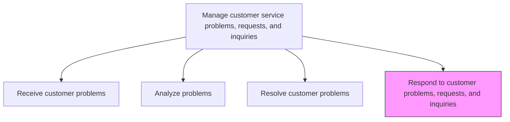
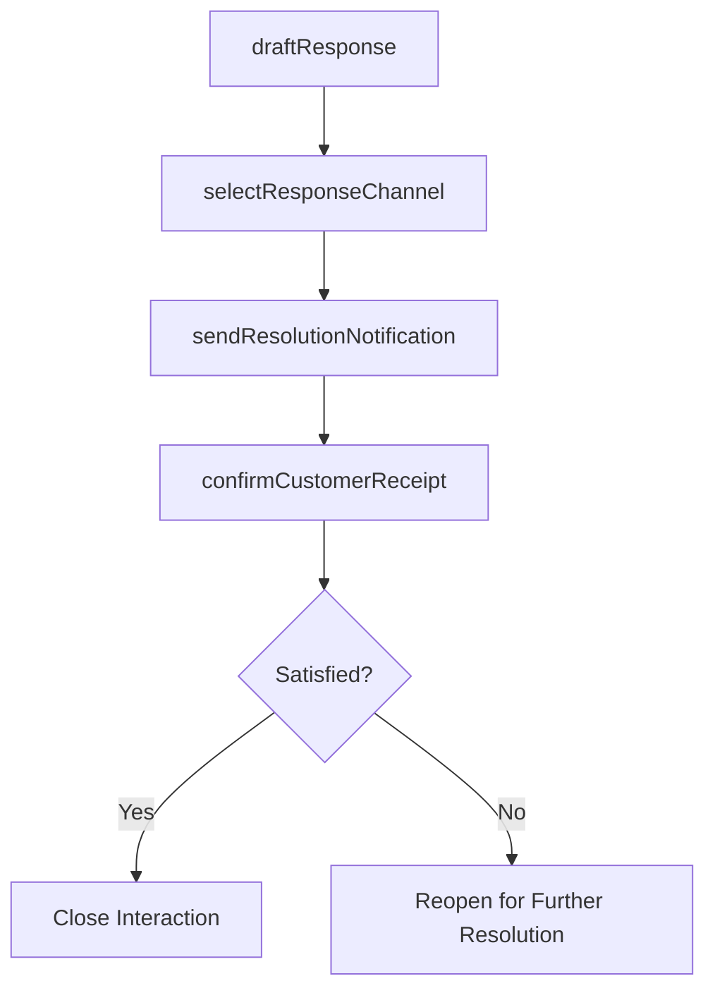

# Respond to customer problems, requests, and inquiries

> Business-as-Code definition for customer response delivery. Models the communication of resolutions, status updates, and follow-up actions to customers across all service channels.

## Overview

Responding to customer requests by email, conversation, interactive voice response, mail, etc. with the most appropriate reply. Instill a robust process to locate the right information for a solution to a customer's problem.

## Process Hierarchy



## GraphDL

```yaml
respond:
  object: To Customer Problems, Requests, And Inquiries
  actor: CustomerServiceAgent
  result: CustomerResponse
```

## Actions

| Action | Description |
|--------|-------------|
| draftResponse | Prepare a response communication tailored to the customer issue and channel |
| selectResponseChannel | Choose the most appropriate channel for delivering the response |
| sendResolutionNotification | Communicate the resolution outcome and any follow-up actions to the customer |
| provideStatusUpdate | Send interim status updates for inquiries requiring extended resolution time |
| confirmCustomerReceipt | Verify the customer received and understood the response |

## Events

| Event | Description |
|-------|-------------|
| responseDrafted | Response communication prepared and reviewed |
| responseChannelSelected | Delivery channel determined based on customer preference |
| resolutionNotificationSent | Resolution communicated to the customer |
| statusUpdateProvided | Interim update sent to the customer on pending inquiry |
| customerReceiptConfirmed | Customer acknowledged receipt and understanding of response |

## Searches

| Search | Description |
|--------|-------------|
| getResponseTemplates | Retrieve response templates by issue type and channel |
| getPendingResponses | List cases with completed resolutions awaiting customer communication |
| getCustomerChannelPreference | Query preferred communication channel for a customer |
| getResponseHistory | Retrieve all responses sent to a customer for a specific case |

## Process Flow



## RACI Matrix

| Activity | Responsible | Accountable | Consulted | Informed |
|----------|-------------|-------------|-----------|----------|
| draftResponse | Customer Service Agent | Team Lead | Knowledge Base | Quality |
| selectResponseChannel | Customer Service Agent | Team Lead | Channel Manager | IT |
| sendResolutionNotification | Customer Service Agent | Team Lead | Compliance | Service Operations |
| provideStatusUpdate | Customer Service Agent | Team Lead | Resolution Team | Customer |
| confirmCustomerReceipt | Customer Service Agent | Team Lead | Quality | Service Operations |

## Related Processes

| Process | Relationship |
|---------|-------------|
| 6.2.2.3 Resolve customer problems, requests, and inquiries | Upstream - resolution informs the response content |
| 6.2.2.5 Identify and capture upsell/cross-sell opportunities | Downstream - response interactions may reveal sales opportunities |
| 6.5.3 Measure customer satisfaction with problems handling | Downstream - response quality feeds satisfaction measurement |

## Related Departments

| Department | Role |
|-----------|------|
| Customer Service | Composes and delivers customer responses |
| Communications | Provides response templates and tone guidelines |
| Quality Assurance | Reviews response quality and adherence to standards |

## Related Occupations

| Occupation | Involvement |
|-----------|-------------|
| Customer Service Representative | Drafts and delivers customer responses |
| Quality Assurance Analyst | Evaluates response quality and consistency |
| Communications Specialist | Maintains response templates and guidelines |

## KPIs

| KPI | Description | Unit |
|-----|-------------|------|
| Response Time | Average time from resolution to customer notification | Hours |
| Response Quality Score | Quality audit score for response accuracy and professionalism | Score (1-100) |
| Customer Acknowledgment Rate | Percentage of responses acknowledged by customers | % |
| First Response Time | Average time from inquiry receipt to first customer communication | Minutes |

## Usage

```typescript
import { respondToCustomerProblemsRequestsAndInquiries } from '@headlessly/respond-to-customer-problems-requests-and-inquiries'

const responder = respondToCustomerProblemsRequestsAndInquiries()

// Draft and send a resolution notification
const response = await responder.sendResolutionNotification({
  caseId: 'CS-2025-5678',
  channel: 'email',
  template: 'resolution-confirmation',
  resolution: 'Replacement unit shipped via express delivery',
  trackingNumber: 'TRK-98765'
})

// Provide a status update for a pending case
await responder.provideStatusUpdate({
  caseId: 'CS-2025-9012',
  channel: 'sms',
  message: 'Your case is being reviewed by our specialist team. Expected resolution within 48 hours.'
})
```
