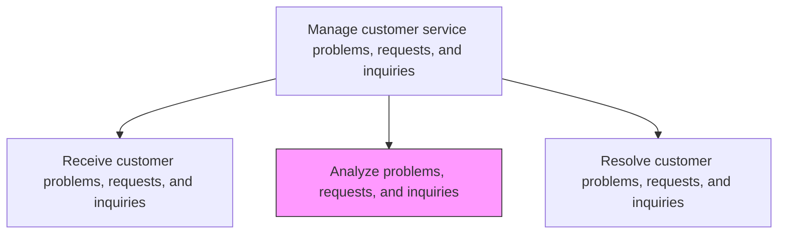
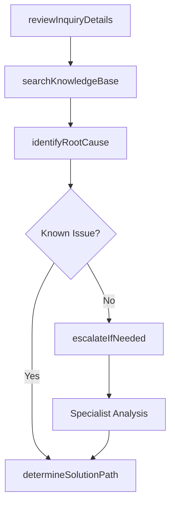

# Analyze problems, requests, and inquiries

> Business-as-Code definition for customer inquiry analysis and diagnosis. Models the evaluation, categorization, root cause identification, and solution determination for customer problems, requests, and inquiries.

## Overview

Analyzing various requests and inquiries from customers regarding products/services. Provide answers and offerings to satisfy the customer's needs.

## Process Hierarchy



## GraphDL

```yaml
analyze:
  object: Problems, Requests, And Inquiries
  actor: CustomerServiceAgent
  result: InquiryAnalysis
```

## Actions

| Action | Description |
|--------|-------------|
| reviewInquiryDetails | Examine the customer inquiry details and supporting documentation |
| identifyRootCause | Diagnose the underlying cause of the customer problem |
| searchKnowledgeBase | Query knowledge base for known solutions and prior resolutions |
| determineSolutionPath | Identify the most appropriate resolution approach |
| escalateIfNeeded | Escalate complex issues to specialized support tiers |

## Events

| Event | Description |
|-------|-------------|
| inquiryDetailsReviewed | Customer inquiry documentation examined and understood |
| rootCauseIdentified | Underlying cause of customer issue determined |
| knowledgeBaseSearched | Knowledge base queried for applicable solutions |
| solutionPathDetermined | Resolution approach selected and documented |
| inquiryEscalated | Complex inquiry escalated to specialized support |

## Searches

| Search | Description |
|--------|-------------|
| findSimilarCases | Retrieve previously resolved cases with similar characteristics |
| getKnowledgeArticles | Query knowledge base articles by product, issue type, or keyword |
| getEscalationPath | Retrieve escalation routing rules for the inquiry type |
| getProductDocumentation | Access product documentation relevant to the reported issue |

## Process Flow



## RACI Matrix

| Activity | Responsible | Accountable | Consulted | Informed |
|----------|-------------|-------------|-----------|----------|
| reviewInquiryDetails | Customer Service Agent | Team Lead | Knowledge Base | Quality |
| identifyRootCause | Customer Service Agent | Team Lead | Product Specialists | Service Operations |
| searchKnowledgeBase | Customer Service Agent | Team Lead | Knowledge Management | IT |
| determineSolutionPath | Customer Service Agent | Team Lead | Subject Matter Experts | Customer |
| escalateIfNeeded | Customer Service Agent | Team Lead | Tier-2 Support | Service Operations |

## Related Processes

| Process | Relationship |
|---------|-------------|
| 6.2.2.1 Receive customer problems, requests, and inquiries | Upstream - received inquiries are analyzed |
| 6.2.2.3 Resolve customer problems, requests, and inquiries | Downstream - analysis informs resolution approach |
| 6.2.3.2 Route customer complaints | Parallel - analysis may identify complaints requiring routing |

## Related Departments

| Department | Role |
|-----------|------|
| Customer Service | Performs inquiry analysis and diagnosis |
| Knowledge Management | Maintains knowledge base used for solution identification |
| Product Support | Provides expertise for complex product-related inquiries |

## Related Occupations

| Occupation | Involvement |
|-----------|-------------|
| Customer Service Representative | Performs initial inquiry analysis |
| Technical Support Specialist | Analyzes complex technical issues |
| Knowledge Base Administrator | Curates solution content used during analysis |

## KPIs

| KPI | Description | Unit |
|-----|-------------|------|
| Analysis Accuracy | Percentage of inquiries correctly diagnosed on first analysis | % |
| Escalation Rate | Percentage of inquiries requiring escalation to higher tiers | % |
| Knowledge Base Hit Rate | Percentage of inquiries with matching knowledge base articles | % |
| Average Analysis Time | Mean time spent analyzing an inquiry before resolution begins | Minutes |

## Usage

```typescript
import { analyzeProblemsRequestsAndInquiries } from '@headlessly/analyze-problems-requests-and-inquiries'

const analysis = analyzeProblemsRequestsAndInquiries()

// Review and analyze an inquiry
const result = await analysis.reviewInquiryDetails({
  inquiryId: 'INQ-2025-5678',
  includeCustomerHistory: true
})

// Search knowledge base for solutions
const articles = await analysis.searchKnowledgeBase({
  product: 'industrial-pump-X200',
  issueType: 'malfunction',
  keywords: ['overheating', 'shutdown']
})
```
