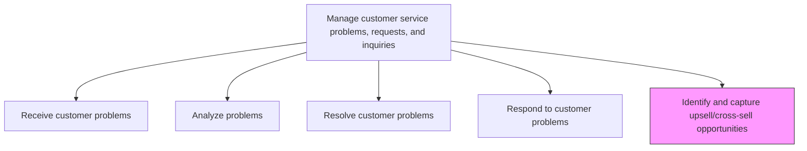
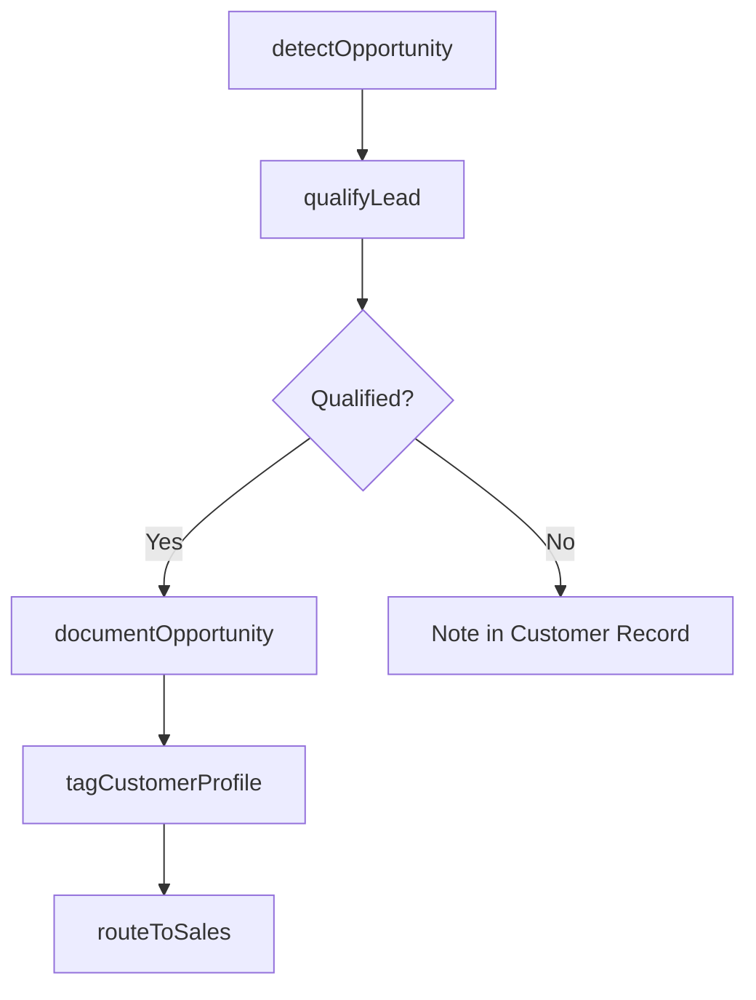

# Identify and capture upsell/cross-sell opportunities

> Business-as-Code definition for identifying revenue opportunities during service interactions. Models the recognition, qualification, and capture of upsell and cross-sell leads from customer service engagements.

## Overview

Utilizing customer inquiries as opportunities to either provide a comparable service to the one in question, offer additional complimentary service, or suggest a service that is better than what was initially offered.

## Process Hierarchy



## GraphDL

```yaml
identify:
  object: And Capture Upsell/cross-sell Opportunities
  actor: CustomerServiceAgent
  result: SalesOpportunity
```

## Actions

| Action | Description |
|--------|-------------|
| detectOpportunity | Recognize upsell or cross-sell signals during customer interactions |
| qualifyLead | Assess the customer interest level, budget, and fit for additional offerings |
| documentOpportunity | Record the sales opportunity details including product recommendations |
| tagCustomerProfile | Update the customer profile with identified preferences and interests |
| routeToSales | Transfer the qualified opportunity to the appropriate sales representative |

## Events

| Event | Description |
|-------|-------------|
| opportunityDetected | Upsell or cross-sell signal identified during service interaction |
| leadQualified | Customer interest and fit assessed for additional offerings |
| opportunityDocumented | Sales opportunity details recorded in CRM |
| customerProfileTagged | Customer profile updated with purchase interest signals |
| opportunityRoutedToSales | Qualified lead forwarded to sales team for follow-up |

## Searches

| Search | Description |
|--------|-------------|
| getOpenOpportunities | List identified upsell/cross-sell opportunities by status or value |
| getCustomerPurchaseHistory | Retrieve customer purchase history to inform recommendations |
| getProductRecommendations | Query product recommendation engine for relevant offerings |
| getConversionMetrics | Retrieve upsell/cross-sell conversion rates by agent or product |

## Process Flow



## RACI Matrix

| Activity | Responsible | Accountable | Consulted | Informed |
|----------|-------------|-------------|-----------|----------|
| detectOpportunity | Customer Service Agent | Team Lead | Sales Liaison | Marketing |
| qualifyLead | Customer Service Agent | Team Lead | Sales Team | Service Operations |
| documentOpportunity | Customer Service Agent | Team Lead | CRM Administration | Sales |
| tagCustomerProfile | Customer Service Agent | Team Lead | Data Analytics | Marketing |
| routeToSales | Customer Service Agent | Sales Liaison | Sales Manager | Service Operations |

## Related Processes

| Process | Relationship |
|---------|-------------|
| 6.2.2.4 Respond to customer problems, requests, and inquiries | Upstream - response interactions reveal sales signals |
| 6.2.2.6 Deliver opportunity to sales team | Downstream - captured opportunities are delivered to sales |
| 3.3.3 Manage sales pipeline | Downstream - qualified leads enter the sales pipeline |

## Related Departments

| Department | Role |
|-----------|------|
| Customer Service | Identifies and captures sales opportunities during service interactions |
| Sales | Receives and follows up on service-generated leads |
| Marketing | Provides product positioning and recommendation criteria |
| Data Analytics | Develops propensity models to improve opportunity detection |

## Related Occupations

| Occupation | Involvement |
|-----------|-------------|
| Customer Service Representative | Detects and captures upsell opportunities |
| Sales Development Representative | Follows up on service-generated leads |
| CRM Analyst | Analyzes opportunity data and conversion patterns |

## KPIs

| KPI | Description | Unit |
|-----|-------------|------|
| Opportunity Capture Rate | Number of opportunities identified per 100 service interactions | Count |
| Lead Qualification Rate | Percentage of detected opportunities that qualify for sales handoff | % |
| Upsell Conversion Rate | Percentage of handed-off opportunities that convert to revenue | % |
| Average Opportunity Value | Mean estimated value of captured upsell/cross-sell opportunities | USD |

## Usage

```typescript
import { identifyAndCaptureUpsellCrossSellOpportunities } from '@headlessly/identify-and-capture-upsell-cross-sell-opportunities'

const upsell = identifyAndCaptureUpsellCrossSellOpportunities()

// Document an upsell opportunity
const opportunity = await upsell.documentOpportunity({
  caseId: 'CS-2025-5678',
  customerId: 'cust_12345',
  recommendedProduct: 'premium-maintenance-plan',
  estimatedValue: 2500,
  customerInterestLevel: 'high'
})

// Route to sales team
await upsell.routeToSales({
  opportunityId: opportunity.id,
  salesTeam: 'account-management',
  urgency: 'warm-lead'
})
```
