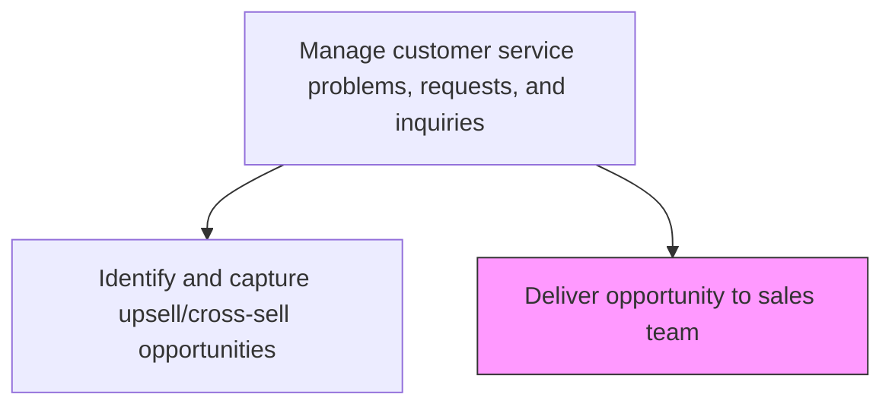
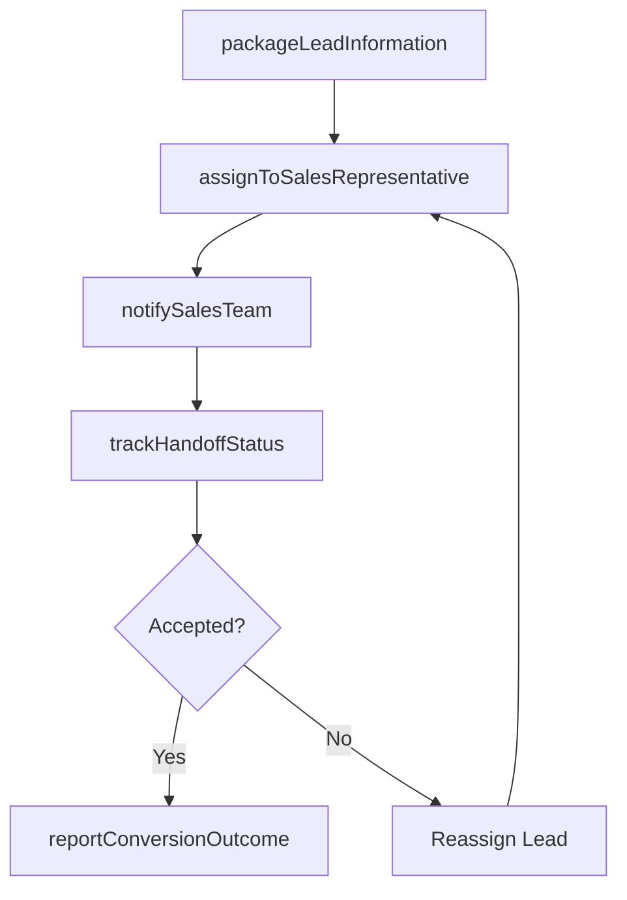

# Deliver opportunity to sales team

> Business-as-Code definition for handoff of service-generated sales opportunities to the sales team. Models the packaging, transfer, and tracking of qualified leads from customer service to sales for follow-up.

## Overview

Providing possible sales leads to the sales team in an effort to garner more business opportunities.

## Process Hierarchy



## GraphDL

```yaml
deliver:
  object: Opportunity To Sales Team
  actor: SalesLiaison
  result: SalesHandoffRecord
```

## Actions

| Action | Description |
|--------|-------------|
| packageLeadInformation | Compile customer context, interaction history, and product interest into a lead package |
| assignToSalesRepresentative | Route the lead to the appropriate sales representative based on territory or account |
| notifySalesTeam | Alert the assigned sales representative of the new qualified lead |
| trackHandoffStatus | Monitor whether the sales team has accepted and acted on the lead |
| reportConversionOutcome | Record whether the handed-off opportunity converted to a sale |

## Events

| Event | Description |
|-------|-------------|
| leadInformationPackaged | Lead details compiled and ready for sales handoff |
| salesRepresentativeAssigned | Lead assigned to specific sales representative |
| salesTeamNotified | Sales representative alerted to new qualified lead |
| handoffStatusTracked | Lead acceptance and follow-up status updated |
| conversionOutcomeReported | Opportunity conversion result recorded in CRM |

## Searches

| Search | Description |
|--------|-------------|
| getHandedOffLeads | List leads delivered to sales by status, date, or value |
| getSalesRepAssignment | Query sales representative assignment for a specific lead |
| getConversionTracking | Retrieve conversion tracking data for service-generated leads |
| getHandoffMetrics | Query lead handoff volume and acceptance rates by period |

## Process Flow



## RACI Matrix

| Activity | Responsible | Accountable | Consulted | Informed |
|----------|-------------|-------------|-----------|----------|
| packageLeadInformation | Sales Liaison | Team Lead | Customer Service Agent | Sales Manager |
| assignToSalesRepresentative | Sales Liaison | Sales Manager | Territory Manager | Service Operations |
| notifySalesTeam | CRM System | Sales Liaison | IT | Sales Manager |
| trackHandoffStatus | Sales Liaison | Sales Manager | Sales Representative | Service Operations |
| reportConversionOutcome | Sales Representative | Sales Manager | Finance | Customer Service |

## Related Processes

| Process | Relationship |
|---------|-------------|
| 6.2.2.5 Identify and capture upsell/cross-sell opportunities | Upstream - captured opportunities are delivered to sales |
| 3.3.3 Manage sales pipeline | Downstream - delivered leads enter the sales pipeline |
| 3.3.4 Manage sales orders | Downstream - converted leads become sales orders |

## Related Departments

| Department | Role |
|-----------|------|
| Customer Service | Packages and initiates the lead handoff |
| Sales | Receives, follows up, and converts service-generated leads |
| CRM Administration | Maintains the lead management and handoff workflows |

## Related Occupations

| Occupation | Involvement |
|-----------|-------------|
| Sales Liaison | Coordinates lead handoff between service and sales |
| Sales Development Representative | Receives and follows up on handed-off leads |
| Sales Manager | Oversees lead assignment and conversion tracking |

## KPIs

| KPI | Description | Unit |
|-----|-------------|------|
| Lead Acceptance Rate | Percentage of handed-off leads accepted by sales within SLA | % |
| Handoff-to-Contact Time | Average time from lead handoff to first sales contact | Hours |
| Service-to-Sale Conversion Rate | Percentage of service-generated leads that convert to revenue | % |
| Revenue from Service Leads | Total revenue attributed to service-generated leads | USD |

## Usage

```typescript
import { deliverOpportunityToSalesTeam } from '@headlessly/deliver-opportunity-to-sales-team'

const handoff = deliverOpportunityToSalesTeam()

// Package and deliver a lead to sales
const lead = await handoff.packageLeadInformation({
  opportunityId: 'OPP-2025-1234',
  customerId: 'cust_12345',
  product: 'premium-maintenance-plan',
  estimatedValue: 2500,
  interactionContext: 'Customer expressed interest during repair inquiry'
})

// Assign to the appropriate sales representative
await handoff.assignToSalesRepresentative({
  leadId: lead.id,
  territory: 'northeast',
  accountType: 'enterprise'
})
```
