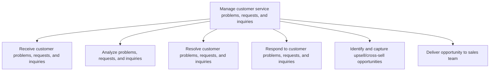
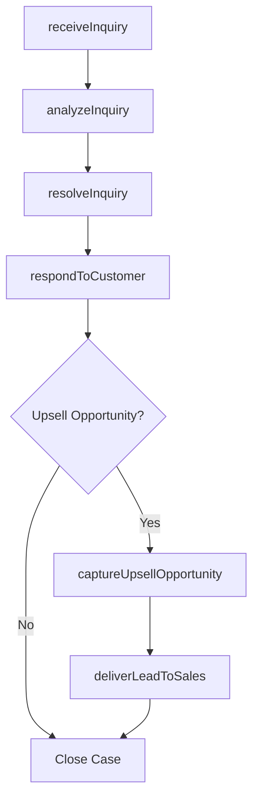

# Manage customer service problems, requests, and inquiries

> Business-as-Code definition for customer inquiry and request management. Models the intake, analysis, resolution, response, and upsell identification across all customer service interactions.

## Overview

Handling the requests and inquiries from customers that seek information regarding the organization's products/services. Obtain the customer requests online and by phone. Direct these requests to higher-level representatives. Approve requests, and respond to customers.

## Process Hierarchy



## GraphDL

```yaml
manage:
  object: Customer Service Problems, Requests, And Inquiries
  actor: CustomerServiceAgent
  result: CaseResolution
```

## Actions

| Action | Description |
|--------|-------------|
| receiveInquiry | Accept customer problems, requests, and inquiries across channels |
| analyzeInquiry | Categorize and assess the nature and priority of the inquiry |
| resolveInquiry | Investigate and deliver resolution to the customer issue |
| respondToCustomer | Communicate resolution or status update to the customer |
| captureUpsellOpportunity | Identify cross-sell or upsell potential during interaction |
| deliverLeadToSales | Hand off qualified sales opportunities to the sales team |

## Events

| Event | Description |
|-------|-------------|
| inquiryReceived | Customer inquiry logged and assigned to agent |
| inquiryAnalyzed | Inquiry categorized and priority determined |
| inquiryResolved | Customer issue investigated and resolution delivered |
| customerResponded | Resolution or update communicated to customer |
| upsellOpportunityCaptured | Sales opportunity identified during service interaction |
| leadDeliveredToSales | Qualified sales lead handed to sales team |

## Searches

| Search | Description |
|--------|-------------|
| findOpenInquiries | List open inquiries by channel, priority, agent, or category |
| getInquiryHistory | Retrieve inquiry history for a specific customer |
| getResolutionMetrics | Query resolution rates, times, and outcomes by period |
| getUpsellLeads | List captured upsell opportunities by status or value |

## Process Flow



## RACI Matrix

| Activity | Responsible | Accountable | Consulted | Informed |
|----------|-------------|-------------|-----------|----------|
| receiveInquiry | Customer Service Agent | Team Lead | Knowledge Base | Quality |
| analyzeInquiry | Customer Service Agent | Team Lead | Product Specialists | Service Operations |
| resolveInquiry | Customer Service Agent | Team Lead | Subject Matter Experts | Customer |
| respondToCustomer | Customer Service Agent | Team Lead | Compliance | Quality |
| captureUpsellOpportunity | Customer Service Agent | Sales Liaison | Sales Team | Marketing |

## Sub-Processes

| ID | Name | Description |
|----|------|-------------|
| 6.2.2.1 | Receive customer problems, requests, and inquiries | Receiving requests for information from customers over multiple channels. Receive various requests a |
| 6.2.2.2 | Analyze problems, requests, and inquiries | Analyzing various requests and inquiries from customers regarding products/services. Provide answers |
| 6.2.2.3 | Resolve customer problems, requests, and inquiries | Routing customer inquiries in order to service them with the most apposite response. Direct customer |
| 6.2.2.4 | Respond to customer problems, requests, and inquiries | Responding to customer requests by email, conversation, interactive voice response, mail, etc. with  |
| 6.2.2.5 | Identify and capture upsell/cross-sell opportunities | Utilizing customer inquiries as opportunities to either provide a comparable service to the one in q |
| 6.2.2.6 | Deliver opportunity to sales team | Providing possible sales leads to the sales team in an effort to garner more business opportunities. |

## Related Processes

| Process | Relationship |
|---------|-------------|
| 6.2.3 Manage customer complaints | Parallel - escalated inquiries may become complaints |
| 6.2.1 Plan and manage customer service work force | Upstream - workforce enables inquiry handling |
| 6.5.3 Measure customer satisfaction with customer problems, requests, and inquiries handling | Downstream - inquiry outcomes feed satisfaction measurement |

## Related Departments

| Department | Role |
|-----------|------|
| Customer Service | Receives and resolves customer inquiries |
| Sales | Receives upsell and cross-sell leads from service interactions |
| Product Management | Provides product expertise for complex inquiries |
| Knowledge Management | Maintains knowledge base for agent reference |

## Related Occupations

| Occupation | Involvement |
|-----------|-------------|
| Customer Service Representative | Handles frontline customer inquiries |
| Technical Support Specialist | Resolves complex product or technical issues |
| Sales Development Representative | Follows up on service-generated leads |

## KPIs

| KPI | Description | Unit |
|-----|-------------|------|
| First Contact Resolution Rate | Percentage of inquiries resolved on first interaction | % |
| Average Handle Time | Mean duration of customer interactions | Minutes |
| Inquiry Volume by Channel | Number of inquiries received per channel per period | Count |
| Upsell Conversion Rate | Percentage of identified opportunities converted to sales | % |

## Usage

```typescript
import { manageCustomerServiceProblemsRequestsAndInquiries } from '@headlessly/manage-customer-service-problems-requests-and-inquiries'

const inquiries = manageCustomerServiceProblemsRequestsAndInquiries()

// Receive and analyze an inquiry
const inquiry = await inquiries.receiveInquiry({
  customerId: 'cust_12345',
  channel: 'chat',
  subject: 'Billing discrepancy on last invoice',
  priority: 'medium'
})

// Resolve the inquiry
const resolution = await inquiries.resolveInquiry({
  inquiryId: inquiry.id,
  resolution: 'credit-applied',
  amount: 49.99
})
```
