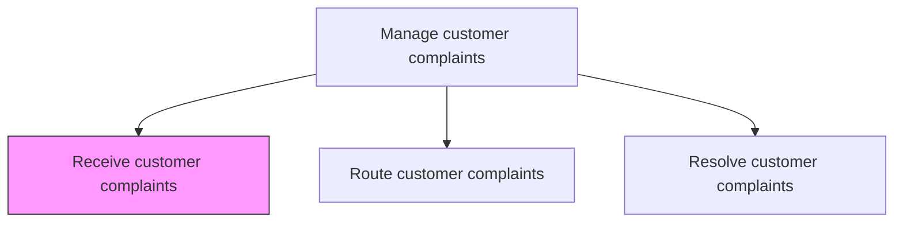
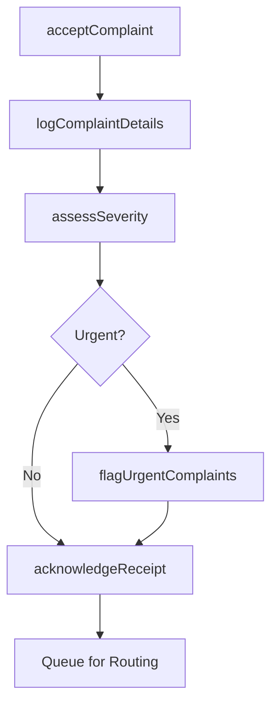

# Receive customer complaints

> Business-as-Code definition for multi-channel complaint intake. Models the receipt, logging, severity assessment, and initial acknowledgment of customer complaints across all service channels.

## Overview

Receiving any complaints or grievances from customers for the organization's products/services. Receive objections, complaints, and criticism from customers regarding products/services through email, telephone, online forms, text messages, social media, in person, etc. Dedicate equipment, systems, and personnel.

## Process Hierarchy



## GraphDL

```yaml
receive:
  object: Customer Complaints
  actor: CustomerServiceAgent
  result: ComplaintRecord
```

## Actions

| Action | Description |
|--------|-------------|
| acceptComplaint | Receive the customer complaint through any supported service channel |
| logComplaintDetails | Record complaint details including customer identity, product, and issue description |
| assessSeverity | Evaluate the complaint severity and potential business impact |
| acknowledgeReceipt | Send an acknowledgment to the customer confirming complaint receipt |
| flagUrgentComplaints | Identify and fast-track complaints involving safety, legal, or high-value concerns |

## Events

| Event | Description |
|-------|-------------|
| complaintAccepted | Customer complaint received through a service channel |
| complaintDetailsLogged | Complaint details recorded in the complaint management system |
| severityAssessed | Complaint severity level determined and assigned |
| receiptAcknowledged | Customer notified that complaint has been received |
| urgentComplaintFlagged | High-priority complaint identified and escalated for immediate attention |

## Searches

| Search | Description |
|--------|-------------|
| getIncomingComplaints | List incoming complaints by channel, date, or severity |
| getCustomerComplaintHistory | Retrieve prior complaints from the same customer |
| getComplaintVolume | Query complaint volumes by channel and time period |
| getUrgentComplaints | List flagged urgent complaints requiring immediate attention |

## Process Flow



## RACI Matrix

| Activity | Responsible | Accountable | Consulted | Informed |
|----------|-------------|-------------|-----------|----------|
| acceptComplaint | Customer Service Agent | Complaint Coordinator | IT Systems | Quality |
| logComplaintDetails | Customer Service Agent | Complaint Coordinator | Knowledge Base | Data Analytics |
| assessSeverity | Customer Service Agent | Complaint Coordinator | Policy Team | Service Operations |
| acknowledgeReceipt | Customer Service Agent | Complaint Coordinator | Communications | Customer |
| flagUrgentComplaints | Customer Service Agent | Complaint Coordinator | Legal | VP Customer Service |

## Related Processes

| Process | Relationship |
|---------|-------------|
| 6.2.3.2 Route customer complaints | Downstream - received complaints are routed for resolution |
| 6.2.2.1 Receive customer problems, requests, and inquiries | Parallel - shared intake channel infrastructure |
| 6.2.5.1 Identify incidents and adverse events | Downstream - complaints may indicate incidents or adverse events |

## Related Departments

| Department | Role |
|-----------|------|
| Customer Service | Operates complaint intake channels and logs complaints |
| Quality Assurance | Monitors complaint severity assessment consistency |
| Legal | Reviews complaints with regulatory or legal implications |

## Related Occupations

| Occupation | Involvement |
|-----------|-------------|
| Customer Service Representative | Receives and logs customer complaints |
| Complaint Coordinator | Oversees intake process and severity assessment |
| Contact Center Agent | Handles phone and chat complaint intake |

## KPIs

| KPI | Description | Unit |
|-----|-------------|------|
| Complaint Acknowledgment Time | Average time from complaint receipt to customer acknowledgment | Minutes |
| Intake Accuracy | Percentage of complaints correctly logged and categorized at intake | % |
| Channel Distribution | Breakdown of complaints received by service channel | % |
| Urgent Flag Accuracy | Percentage of urgent complaints correctly identified at intake | % |

## Usage

```typescript
import { receiveCustomerComplaints } from '@headlessly/receive-customer-complaints'

const intake = receiveCustomerComplaints()

// Accept a customer complaint
const complaint = await intake.acceptComplaint({
  customerId: 'cust_67890',
  channel: 'email',
  product: 'industrial-pump-X200',
  description: 'Unit failed after 3 months of normal use, causing production downtime'
})

// Assess severity
await intake.assessSeverity({
  complaintId: complaint.id,
  severity: 'high',
  businessImpact: 'production-downtime',
  safetyRelated: false
})
```
