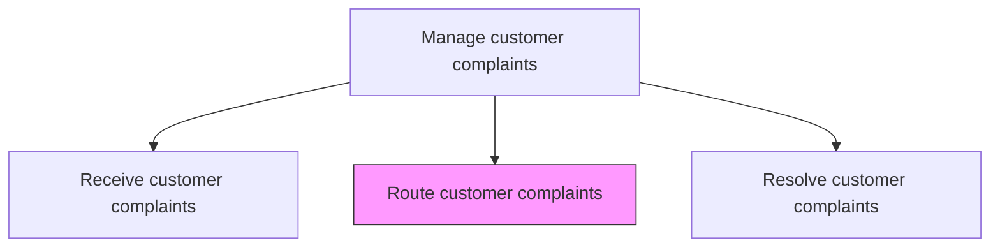
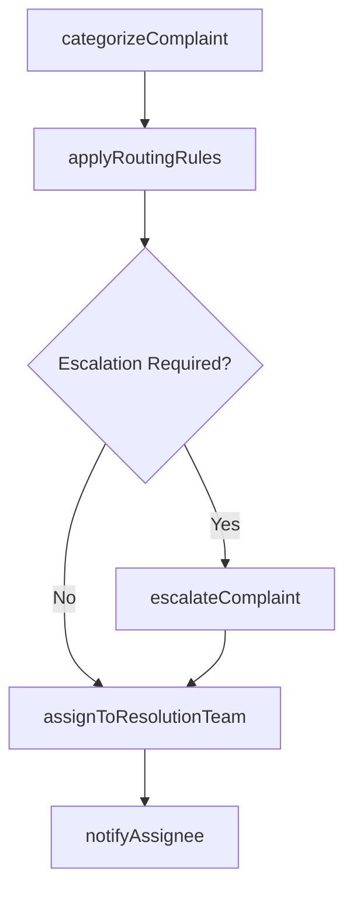

# Route customer complaints

> Business-as-Code definition for complaint routing and assignment. Models the categorization, skill-based routing, escalation, and assignment of customer complaints to the appropriate resolution teams or specialists.

## Overview

Routing any complaints or grievances received from customers in order to address them in the most appropriate manner. Direct complaints to the best suited personnel or system. Implement a system or procedure capable of efficiently channeling the various objections, complaints, and criticism from customers over the offerings provided by the organization.

## Process Hierarchy



## GraphDL

```yaml
route:
  object: Customer Complaints
  actor: ComplaintCoordinator
  result: ComplaintAssignment
```

## Actions

| Action | Description |
|--------|-------------|
| categorizeComplaint | Classify the complaint by type, product area, and required expertise |
| applyRoutingRules | Match the complaint to routing rules based on category, severity, and SLA |
| assignToResolutionTeam | Assign the complaint to the appropriate team or specialist |
| escalateComplaint | Escalate high-severity or unresolved complaints to management |
| notifyAssignee | Alert the assigned team or individual of the new complaint |

## Events

| Event | Description |
|-------|-------------|
| complaintCategorized | Complaint classified by type and product area |
| routingRulesApplied | Routing rules matched and target team identified |
| complaintAssigned | Complaint assigned to resolution team or specialist |
| complaintEscalated | High-severity complaint escalated to management |
| assigneeNotified | Assigned team or individual alerted of complaint responsibility |

## Searches

| Search | Description |
|--------|-------------|
| getRoutingRules | Retrieve complaint routing rules by category or severity |
| getTeamCapacity | Query resolution team workload and availability |
| getEscalationPath | Retrieve escalation chain for a specific complaint type |
| getAssignmentHistory | Review previous routing assignments for similar complaints |

## Process Flow



## RACI Matrix

| Activity | Responsible | Accountable | Consulted | Informed |
|----------|-------------|-------------|-----------|----------|
| categorizeComplaint | Complaint Coordinator | Service Operations Manager | Knowledge Base | Quality |
| applyRoutingRules | Complaint Coordinator | Service Operations Manager | IT | Team Leads |
| assignToResolutionTeam | Complaint Coordinator | Service Operations Manager | Team Leads | Customer |
| escalateComplaint | Complaint Coordinator | Service Operations Manager | Legal | VP Customer Service |
| notifyAssignee | CRM System | Complaint Coordinator | IT | Service Operations |

## Related Processes

| Process | Relationship |
|---------|-------------|
| 6.2.3.1 Receive customer complaints | Upstream - received complaints require routing |
| 6.2.3.3 Resolve customer complaints | Downstream - routed complaints are resolved by assigned teams |
| 6.2.2.3 Resolve customer problems, requests, and inquiries | Parallel - similar routing logic for inquiry resolution |

## Related Departments

| Department | Role |
|-----------|------|
| Customer Service | Performs complaint categorization and initial routing |
| Quality Assurance | Provides expertise for product quality-related complaints |
| Legal | Receives escalated complaints with legal or regulatory implications |
| Product Management | Handles product-specific complaint investigations |

## Related Occupations

| Occupation | Involvement |
|-----------|-------------|
| Complaint Coordinator | Manages complaint categorization and routing |
| Service Operations Manager | Oversees routing efficiency and escalation processes |
| Team Lead | Receives and distributes complaints within resolution teams |

## KPIs

| KPI | Description | Unit |
|-----|-------------|------|
| Routing Accuracy | Percentage of complaints correctly routed on first assignment | % |
| Time to Assignment | Average time from complaint receipt to team assignment | Minutes |
| Escalation Rate | Percentage of complaints requiring management escalation | % |
| Reassignment Rate | Percentage of complaints rerouted after initial assignment | % |

## Usage

```typescript
import { routeCustomerComplaints } from '@headlessly/route-customer-complaints'

const router = routeCustomerComplaints()

// Categorize and route a complaint
const assignment = await router.categorizeComplaint({
  complaintId: 'CMP-2025-1234',
  category: 'product-quality',
  subCategory: 'premature-failure',
  severity: 'high'
})

// Assign to resolution team
await router.assignToResolutionTeam({
  complaintId: 'CMP-2025-1234',
  team: 'product-quality-specialists',
  slaTarget: { hours: 24 }
})
```
