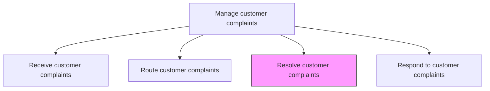
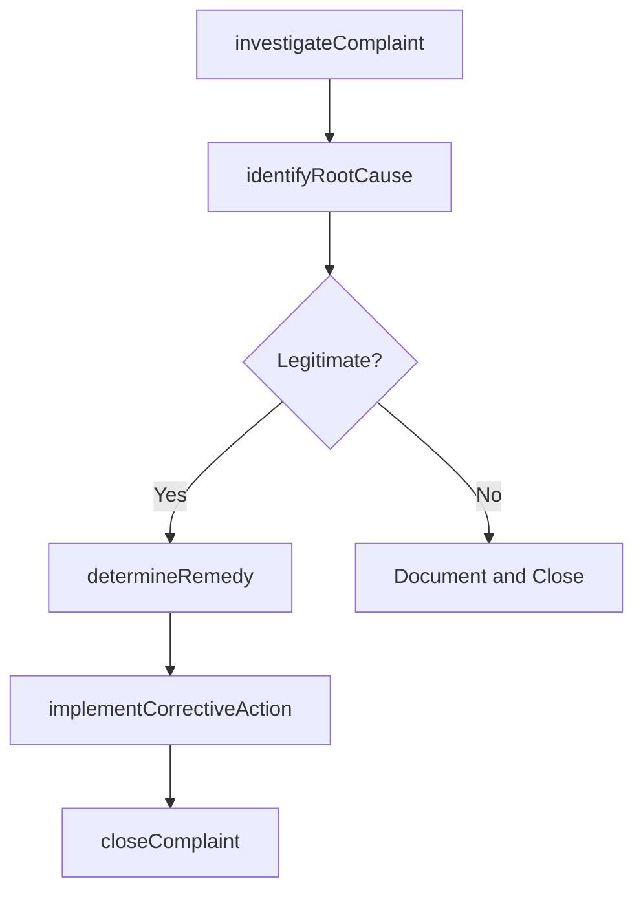

# Resolve customer complaints

> Business-as-Code definition for complaint investigation and resolution. Models the root cause analysis, corrective action implementation, remedy delivery, and closure of customer complaints.

## Overview

Resolving any customer complaints that are deemed to be sound and reasonable. Redress any objections, grievances, and complaints received from customers regarding the offerings provided by the organization. Identify the legitimate complaints, where the situation needs to be appropriately corrected. Deploy personnel who can rectify the issue within a stipulated time frame.

## Process Hierarchy



## GraphDL

```yaml
resolve:
  object: Customer Complaints
  actor: ComplaintResolutionSpecialist
  result: ComplaintResolution
```

## Actions

| Action | Description |
|--------|-------------|
| investigateComplaint | Gather evidence and analyze the complaint to determine validity and root cause |
| identifyRootCause | Determine the underlying cause of the customer issue |
| determineRemedy | Select the appropriate corrective action such as refund, replacement, or repair |
| implementCorrectiveAction | Execute the agreed remedy and document the resolution |
| closeComplaint | Finalize the complaint record and trigger follow-up satisfaction survey |

## Events

| Event | Description |
|-------|-------------|
| complaintInvestigated | Complaint evidence gathered and validity assessed |
| rootCauseIdentified | Underlying cause of customer complaint determined |
| remedyDetermined | Corrective action selected and approved |
| correctiveActionImplemented | Remedy executed and outcome documented |
| complaintClosed | Complaint record finalized and archived |

## Searches

| Search | Description |
|--------|-------------|
| getPendingComplaints | List complaints awaiting resolution by priority, age, or team |
| getComplaintInvestigation | Retrieve investigation details and evidence for a complaint |
| getRemedyOptions | Query available remedy options by complaint type and policy |
| getResolutionHistory | Retrieve resolution outcomes for similar past complaints |

## Process Flow



## RACI Matrix

| Activity | Responsible | Accountable | Consulted | Informed |
|----------|-------------|-------------|-----------|----------|
| investigateComplaint | Complaint Resolution Specialist | Complaint Coordinator | Product Team | Customer |
| identifyRootCause | Complaint Resolution Specialist | Complaint Coordinator | Engineering, Quality | Service Operations |
| determineRemedy | Complaint Resolution Specialist | Complaint Coordinator | Finance, Legal | Customer |
| implementCorrectiveAction | Complaint Resolution Specialist | Complaint Coordinator | Logistics | Finance |
| closeComplaint | Complaint Resolution Specialist | Complaint Coordinator | Quality | Data Analytics |

## Related Processes

| Process | Relationship |
|---------|-------------|
| 6.2.3.2 Route customer complaints | Upstream - routed complaints are investigated and resolved |
| 6.2.3.4 Respond to customer complaints | Downstream - resolution outcome is communicated to customer |
| 6.2.5 Report incidents, adverse events and CAPA | Downstream - systemic issues trigger incident reporting |

## Related Departments

| Department | Role |
|-----------|------|
| Customer Service | Investigates and resolves customer complaints |
| Quality Assurance | Provides root cause analysis for product-related complaints |
| Finance | Approves refunds and financial remedies |
| Legal | Advises on complaints with regulatory or liability implications |

## Related Occupations

| Occupation | Involvement |
|-----------|-------------|
| Complaint Resolution Specialist | Investigates and resolves complex complaints |
| Quality Engineer | Performs root cause analysis for product defects |
| Customer Service Manager | Approves remedies exceeding standard authority levels |

## KPIs

| KPI | Description | Unit |
|-----|-------------|------|
| Complaint Resolution Time | Average days from complaint receipt to resolution | Days |
| Resolution Satisfaction Rate | Percentage of customers satisfied with complaint resolution | % |
| Remedy Accuracy | Percentage of remedies that fully address the customer issue | % |
| Reopen Rate | Percentage of resolved complaints reopened by customers | % |

## Usage

```typescript
import { resolveCustomerComplaints } from '@headlessly/resolve-customer-complaints'

const resolver = resolveCustomerComplaints()

// Investigate a complaint
const investigation = await resolver.investigateComplaint({
  complaintId: 'CMP-2025-1234',
  gatherEvidence: true,
  checkWarrantyStatus: true
})

// Determine and implement remedy
const remedy = await resolver.determineRemedy({
  complaintId: 'CMP-2025-1234',
  rootCause: 'manufacturing-defect',
  remedyType: 'replacement',
  expedited: true
})
```
