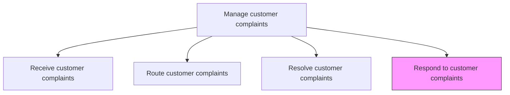
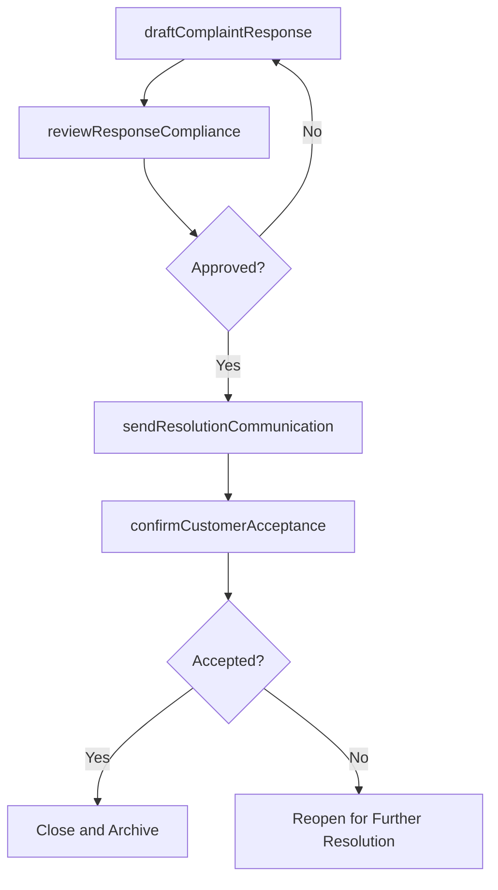

# Respond to customer complaints

> Business-as-Code definition for customer complaint response delivery. Models the preparation, review, and communication of resolution outcomes and follow-up actions to complainants through appropriate channels.

## Overview

Responding to customer complaints including all activities necessitated to service any objections, complaints, or grievances with the most appropriate reply. Source the right information to formulate a response that eases the discomfort being experienced by the customer. (Closely coordinate with Resolve customer complaints [10399].)

## Process Hierarchy



## GraphDL

```yaml
respond:
  object: To Customer Complaints
  actor: CustomerServiceAgent
  result: ComplaintResponse
```

## Actions

| Action | Description |
|--------|-------------|
| draftComplaintResponse | Prepare a response addressing the customer complaint and resolution outcome |
| reviewResponseCompliance | Ensure the response adheres to company policy and regulatory requirements |
| sendResolutionCommunication | Deliver the resolution response to the customer via their preferred channel |
| provideInterimUpdate | Send status updates to customers during extended resolution periods |
| confirmCustomerAcceptance | Verify the customer has accepted the resolution and is satisfied |

## Events

| Event | Description |
|-------|-------------|
| complaintResponseDrafted | Complaint resolution response prepared for review |
| responseComplianceReviewed | Response checked for policy and regulatory adherence |
| resolutionCommunicationSent | Resolution response delivered to the customer |
| interimUpdateProvided | Status update communicated during extended resolution |
| customerAcceptanceConfirmed | Customer acknowledged and accepted the resolution outcome |

## Searches

| Search | Description |
|--------|-------------|
| getResponseTemplates | Retrieve complaint response templates by category and resolution type |
| getPendingResponses | List complaints with completed resolutions awaiting customer communication |
| getResponseHistory | Retrieve all communications sent for a specific complaint |
| getCustomerPreferences | Query customer preferred communication channel and language |

## Process Flow



## RACI Matrix

| Activity | Responsible | Accountable | Consulted | Informed |
|----------|-------------|-------------|-----------|----------|
| draftComplaintResponse | Customer Service Agent | Complaint Coordinator | Knowledge Base | Quality |
| reviewResponseCompliance | Quality Analyst | Complaint Coordinator | Legal, Compliance | Service Operations |
| sendResolutionCommunication | Customer Service Agent | Complaint Coordinator | Channel Manager | Customer |
| provideInterimUpdate | Customer Service Agent | Complaint Coordinator | Resolution Team | Customer |
| confirmCustomerAcceptance | Customer Service Agent | Complaint Coordinator | Quality | Data Analytics |

## Related Processes

| Process | Relationship |
|---------|-------------|
| 6.2.3.3 Resolve customer complaints | Upstream - resolution outcome informs the response |
| 6.2.3.5 Analyze customer complaints and response/redressal | Downstream - response data feeds complaint analysis |
| 6.5.4 Measure customer satisfaction with complaint handling | Downstream - response quality feeds satisfaction measurement |

## Related Departments

| Department | Role |
|-----------|------|
| Customer Service | Drafts and delivers complaint responses |
| Legal | Reviews responses for complaints with legal implications |
| Quality Assurance | Audits response quality and policy adherence |
| Communications | Provides response templates and tone guidelines |

## Related Occupations

| Occupation | Involvement |
|-----------|-------------|
| Customer Service Representative | Drafts and sends complaint responses |
| Quality Assurance Analyst | Reviews response quality and compliance |
| Complaint Coordinator | Oversees response process and escalations |

## KPIs

| KPI | Description | Unit |
|-----|-------------|------|
| Response Time | Average time from resolution to customer notification | Hours |
| Response Quality Score | Quality audit score for complaint response communications | Score (1-100) |
| Customer Acceptance Rate | Percentage of customers accepting the resolution on first response | % |
| Interim Update Compliance | Percentage of extended cases receiving timely status updates | % |

## Usage

```typescript
import { respondToCustomerComplaints } from '@headlessly/respond-to-customer-complaints'

const responder = respondToCustomerComplaints()

// Draft and send a complaint resolution response
const response = await responder.sendResolutionCommunication({
  complaintId: 'CMP-2025-1234',
  channel: 'email',
  template: 'complaint-resolution',
  remedy: 'Replacement unit shipped via express delivery',
  trackingNumber: 'TRK-98765',
  apologyIncluded: true
})

// Confirm customer acceptance
await responder.confirmCustomerAcceptance({
  complaintId: 'CMP-2025-1234',
  responseId: response.id,
  followUpDays: 7
})
```
