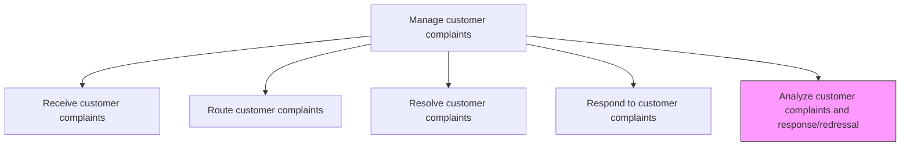
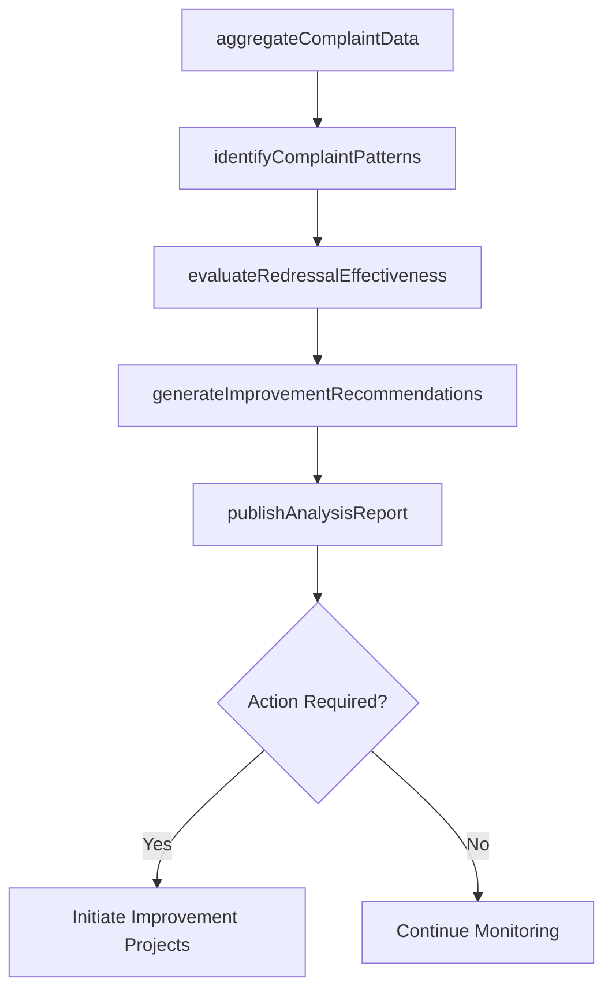

# Analyze customer complaints and response/redressal

> Business-as-Code definition for complaint trend analysis and redressal evaluation. Models the aggregation, pattern identification, root cause trending, and improvement recommendation processes for customer complaint data.

## Overview

Analyzing complaint logs to provide input for continuous service improvement and customer profiling.

## Process Hierarchy



## GraphDL

```yaml
analyze:
  object: Customer Complaints And Response/redressal
  actor: DataAnalyst
  result: ComplaintAnalysisReport
```

## Actions

| Action | Description |
|--------|-------------|
| aggregateComplaintData | Consolidate complaint records across channels and time periods for analysis |
| identifyComplaintPatterns | Detect recurring themes, root causes, and seasonal trends in complaint data |
| evaluateRedressalEffectiveness | Assess whether complaint resolutions are effective and satisfactory |
| generateImprovementRecommendations | Develop actionable recommendations based on complaint trend findings |
| publishAnalysisReport | Distribute complaint analysis findings to stakeholders and decision makers |

## Events

| Event | Description |
|-------|-------------|
| complaintDataAggregated | Complaint records consolidated for analysis period |
| complaintPatternsIdentified | Recurring themes and trends detected in complaint data |
| redressalEffectivenessEvaluated | Resolution effectiveness assessment completed |
| improvementRecommendationsGenerated | Actionable improvement recommendations developed |
| analysisReportPublished | Complaint analysis report distributed to stakeholders |

## Searches

| Search | Description |
|--------|-------------|
| getComplaintTrends | Query complaint volume and category trends by period |
| getTopComplaintCategories | Retrieve most frequent complaint categories with counts |
| getRedressalMetrics | Query resolution effectiveness metrics by category or team |
| getImprovementActions | List recommended improvement actions by priority and status |

## Process Flow



## RACI Matrix

| Activity | Responsible | Accountable | Consulted | Informed |
|----------|-------------|-------------|-----------|----------|
| aggregateComplaintData | Data Analyst | Service Operations Manager | IT | Quality |
| identifyComplaintPatterns | Data Analyst | Service Operations Manager | Quality | Product Management |
| evaluateRedressalEffectiveness | Quality Analyst | Service Operations Manager | Complaint Team | VP Customer Service |
| generateImprovementRecommendations | Continuous Improvement Manager | VP Customer Service | All Service Teams | Executive Team |
| publishAnalysisReport | Data Analyst | Service Operations Manager | Communications | All Stakeholders |

## Related Processes

| Process | Relationship |
|---------|-------------|
| 6.2.3.4 Respond to customer complaints | Upstream - response data feeds analysis |
| 6.5.4 Measure customer satisfaction with complaint handling | Parallel - complaint analysis complements satisfaction measurement |
| 6.4 Manage product recalls and regulatory audits | Downstream - systemic complaint patterns may trigger recall investigation |

## Related Departments

| Department | Role |
|-----------|------|
| Data Analytics | Performs complaint data analysis and trend identification |
| Quality Assurance | Evaluates redressal effectiveness and systemic issues |
| Product Management | Receives product-related complaint insights |
| Continuous Improvement | Implements improvement initiatives based on findings |

## Related Occupations

| Occupation | Involvement |
|-----------|-------------|
| Data Analyst | Performs complaint data aggregation and trend analysis |
| Quality Analyst | Evaluates complaint resolution effectiveness |
| Continuous Improvement Manager | Leads improvement initiatives from complaint insights |

## KPIs

| KPI | Description | Unit |
|-----|-------------|------|
| Complaint Trend Detection Rate | Percentage of systemic issues identified through complaint analysis | % |
| Improvement Implementation Rate | Percentage of recommendations that result in implemented changes | % |
| Repeat Complaint Reduction | Percentage decrease in repeat complaints after improvements | % |
| Analysis Report Frequency | Number of complaint analysis reports published per quarter | Count |

## Usage

```typescript
import { analyzeCustomerComplaintsAndResponseRedressal } from '@headlessly/analyze-customer-complaints-and-response-redressal'

const analysis = analyzeCustomerComplaintsAndResponseRedressal()

// Identify complaint patterns
const patterns = await analysis.identifyComplaintPatterns({
  period: '2025-Q4',
  groupBy: ['category', 'product', 'region'],
  minOccurrences: 5
})

// Evaluate redressal effectiveness
const effectiveness = await analysis.evaluateRedressalEffectiveness({
  period: '2025-Q4',
  metrics: ['resolution-time', 'customer-satisfaction', 'reopen-rate']
})
```
