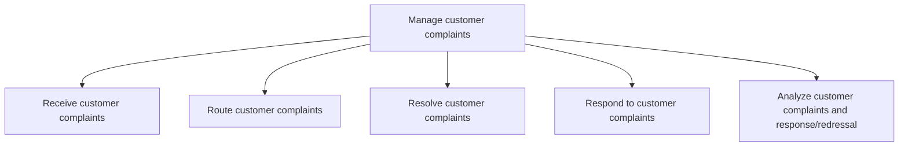
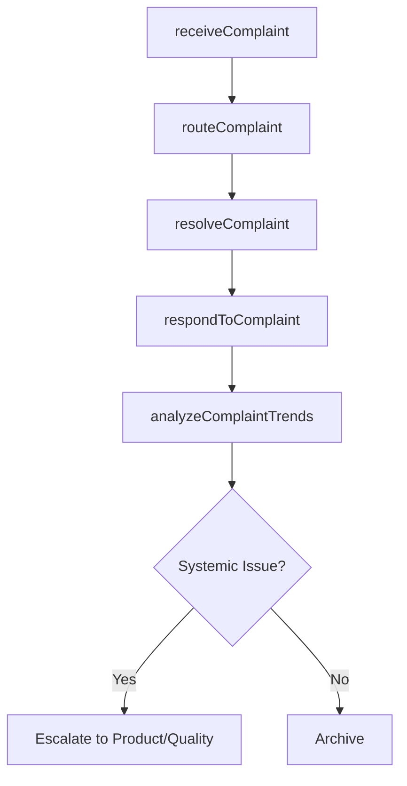

# Manage customer complaints

> Business-as-Code definition for customer complaint management. Models complaint intake, routing, investigation, resolution, response, and trend analysis for continuous improvement.

## Overview

Obtaining customer complaints online or by phone. Direct these complaints to higher-level representatives as appropriate. Resolve them. Respond to customers.

## Process Hierarchy



## GraphDL

```yaml
manage:
  object: Customer Complaints
  actor: ComplaintCoordinator
  result: ComplaintResolution
```

## Actions

| Action | Description |
|--------|-------------|
| receiveComplaint | Accept and log customer complaints from all channels |
| routeComplaint | Assign complaint to appropriate resolution team based on type and severity |
| resolveComplaint | Investigate root cause and implement corrective action |
| respondToComplaint | Communicate resolution or interim update to the customer |
| analyzeComplaintTrends | Review complaint data to identify systemic issues and improvement areas |

## Events

| Event | Description |
|-------|-------------|
| complaintReceived | Customer complaint formally logged in the system |
| complaintRouted | Complaint assigned to resolution team |
| complaintResolved | Root cause addressed and corrective action implemented |
| complaintResponded | Resolution communicated to customer |
| complaintTrendsAnalyzed | Complaint pattern analysis completed with recommendations |

## Searches

| Search | Description |
|--------|-------------|
| getOpenComplaints | List open complaints by severity, category, or age |
| getComplaintHistory | Retrieve complaint history for a customer or product |
| getComplaintTrends | Query complaint volume and category trends by period |
| getResolutionMetrics | Retrieve complaint resolution time and outcome statistics |

## Process Flow



## RACI Matrix

| Activity | Responsible | Accountable | Consulted | Informed |
|----------|-------------|-------------|-----------|----------|
| receiveComplaint | Customer Service Agent | Complaint Coordinator | Knowledge Base | Team Lead |
| routeComplaint | Complaint Coordinator | Service Operations Manager | Subject Matter Experts | Agent |
| resolveComplaint | Resolution Specialist | Complaint Coordinator | Product, Legal | Customer |
| respondToComplaint | Customer Service Agent | Complaint Coordinator | Compliance | Quality |
| analyzeComplaintTrends | Data Analyst | Service Operations Manager | Quality | VP Customer Service |

## Sub-Processes

| ID | Name | Description |
|----|------|-------------|
| 6.2.3.1 | Receive customer complaints | Receiving any complaints or grievances from customers for the organization's products/services. Rece |
| 6.2.3.2 | Route customer complaints | Routing any complaints or grievances received from customers in order to address them in the most ap |
| 6.2.3.3 | Resolve customer complaints | Resolving any customer complaints that are deemed to be sound and reasonable. Redress any objections |
| 6.2.3.4 | Respond to customer complaints | Responding to customer complaints including all activities necessitated to service any objections, c |
| 6.2.3.5 | Analyze customer complaints and response/redressal | Analyzing complaint logs to provide input for continuous service improvement and customer profiling. |

## Related Processes

| Process | Relationship |
|---------|-------------|
| 6.2.2 Manage customer service problems, requests, and inquiries | Upstream - unresolved inquiries escalate to complaints |
| 6.4 Manage product recalls and regulatory audits | Downstream - complaint patterns may trigger recalls |
| 6.5.4 Measure customer satisfaction with complaint handling | Downstream - complaint outcomes feed satisfaction measurement |

## Related Departments

| Department | Role |
|-----------|------|
| Customer Service | Receives and manages complaint resolution |
| Quality Assurance | Investigates systemic issues identified through complaints |
| Legal | Reviews complaints with legal or regulatory implications |
| Product Management | Addresses product-related complaint root causes |

## Related Occupations

| Occupation | Involvement |
|-----------|-------------|
| Customer Complaint Specialist | Investigates and resolves complex complaints |
| Quality Analyst | Analyzes complaint trends for systemic improvement |

## KPIs

| KPI | Description | Unit |
|-----|-------------|------|
| Complaint Resolution Time | Average days from complaint receipt to resolution | Days |
| Complaint Escalation Rate | Percentage of complaints requiring escalation | % |
| Repeat Complaint Rate | Percentage of complaints from repeat complainants | % |
| Customer Retention Post-Complaint | Percentage of complaining customers retained | % |

## Usage

```typescript
import { manageCustomerComplaints } from '@headlessly/manage-customer-complaints'

const complaints = manageCustomerComplaints()

// Receive and route a complaint
const complaint = await complaints.receiveComplaint({
  customerId: 'cust_67890',
  channel: 'email',
  category: 'product-quality',
  severity: 'high',
  description: 'Product arrived damaged despite careful packaging'
})

// Resolve the complaint
const resolution = await complaints.resolveComplaint({
  complaintId: complaint.id,
  action: 'replacement-shipped',
  rootCause: 'shipping-damage',
  preventiveAction: 'Updated packaging specifications'
})
```
