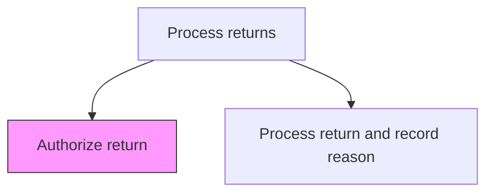
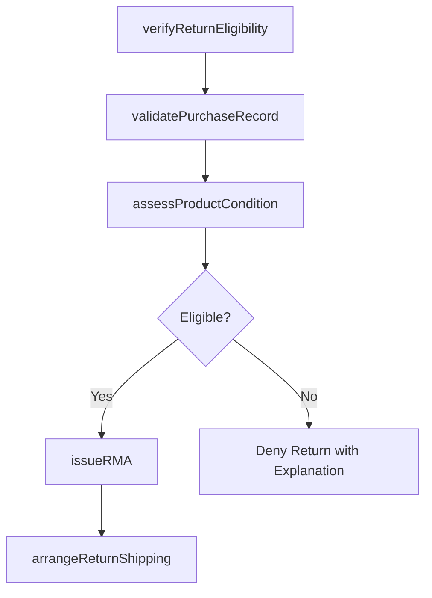

# Authorize return

> Business-as-Code definition for product return authorization. Models the evaluation of return eligibility, policy verification, RMA issuance, and return shipping coordination.

## Overview

Approving and carrying forward the requests by the customers to return the product. This is part of the process of returning a product in order to receive a refund, replacement, or repair during the product's warranty period.

## Process Hierarchy



## GraphDL

```yaml
authorize:
  object: Return
  actor: ReturnsSpecialist
  result: ReturnMerchandiseAuthorization
```

## Actions

| Action | Description |
|--------|-------------|
| verifyReturnEligibility | Check that the product and reason qualify under the return policy |
| validatePurchaseRecord | Confirm the original purchase details and warranty status |
| assessProductCondition | Evaluate the reported product condition against return acceptance criteria |
| issueRMA | Generate a return merchandise authorization number and shipping instructions |
| arrangeReturnShipping | Coordinate return shipping label or pickup logistics |

## Events

| Event | Description |
|-------|-------------|
| returnEligibilityVerified | Product return eligibility confirmed against policy |
| purchaseRecordValidated | Original purchase details and warranty status verified |
| productConditionAssessed | Reported product condition evaluated against return criteria |
| rmaIssued | Return merchandise authorization number generated and sent to customer |
| returnShippingArranged | Return shipping label or pickup logistics coordinated |

## Searches

| Search | Description |
|--------|-------------|
| getReturnPolicy | Retrieve return policy terms by product type and purchase channel |
| getPurchaseRecord | Query original purchase details by order number or customer |
| getPendingAuthorizations | List return authorization requests by status or date |
| getRMAHistory | Retrieve RMA history for a customer or product |

## Process Flow



## RACI Matrix

| Activity | Responsible | Accountable | Consulted | Informed |
|----------|-------------|-------------|-----------|----------|
| verifyReturnEligibility | Returns Specialist | Returns Manager | Policy Team | Customer |
| validatePurchaseRecord | Returns Specialist | Returns Manager | Finance | Order Management |
| assessProductCondition | Returns Specialist | Returns Manager | Quality | Warehouse |
| issueRMA | Returns Specialist | Returns Manager | IT Systems | Customer |
| arrangeReturnShipping | Logistics Coordinator | Returns Manager | Shipping Carrier | Customer |

## Related Processes

| Process | Relationship |
|---------|-------------|
| 6.2.4.2 Process return and record reason | Downstream - authorized returns proceed to processing |
| 6.2.3.3 Resolve customer complaints | Upstream - complaint resolutions may trigger return authorization |
| 6.3.2 Process warranty claims | Parallel - warranty returns follow additional claim validation |

## Related Departments

| Department | Role |
|-----------|------|
| Customer Service | Evaluates return eligibility and issues RMAs |
| Logistics | Coordinates return shipping and product pickup |
| Finance | Tracks return authorization costs and refund liability |
| Warehouse | Receives and inspects returned products |

## Related Occupations

| Occupation | Involvement |
|-----------|-------------|
| Returns Specialist | Evaluates return requests and issues authorizations |
| Logistics Coordinator | Arranges return shipping and pickup |
| Customer Service Agent | Communicates authorization status to customers |

## KPIs

| KPI | Description | Unit |
|-----|-------------|------|
| Authorization Processing Time | Average time from return request to RMA issuance | Hours |
| Authorization Approval Rate | Percentage of return requests approved | % |
| Return Denial Rate | Percentage of return requests denied due to policy non-compliance | % |
| RMA Utilization Rate | Percentage of issued RMAs that result in actual product returns | % |

## Usage

```typescript
import { authorizeReturn } from '@headlessly/authorize-return'

const returns = authorizeReturn()

// Verify return eligibility
const eligibility = await returns.verifyReturnEligibility({
  orderId: 'ORD-2025-45678',
  productId: 'PROD-001',
  reason: 'defective',
  daysSincePurchase: 45
})

// Issue RMA
const rma = await returns.issueRMA({
  orderId: 'ORD-2025-45678',
  returnType: 'replacement',
  shippingMethod: 'prepaid-label'
})
```
