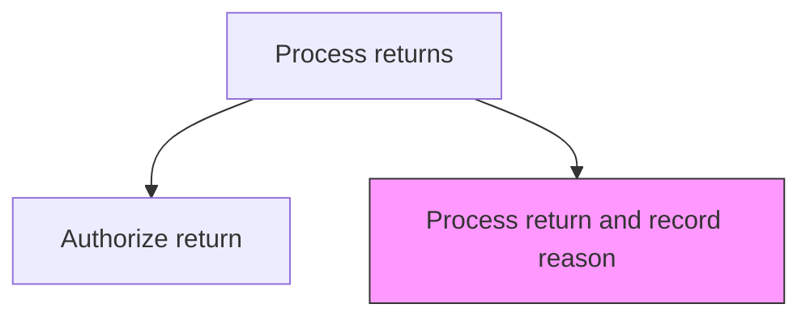
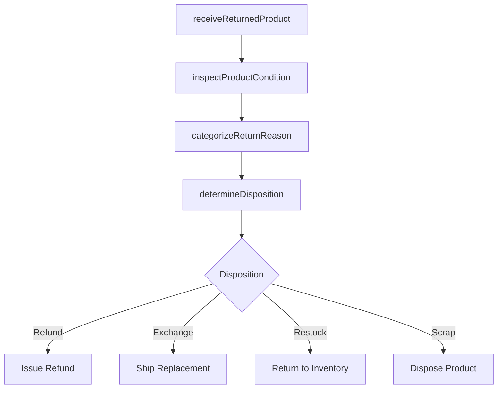

# Process return and record reason

> Business-as-Code definition for return processing and reason documentation. Models the receipt, inspection, reason categorization, disposition determination, and refund or replacement execution for returned products.

## Overview

Notating the reason for the return of the product.

## Process Hierarchy



## GraphDL

```yaml
process:
  object: Return And Record Reason
  actor: ReturnsSpecialist
  result: ReturnProcessingRecord
```

## Actions

| Action | Description |
|--------|-------------|
| receiveReturnedProduct | Accept the returned product at the warehouse and verify against the RMA |
| inspectProductCondition | Physically examine the returned item for damage, defects, or wear |
| categorizeReturnReason | Classify the return reason using standardized codes for analysis |
| determineDisposition | Decide whether to refund, exchange, repair, restock, or scrap the item |
| executeDisposition | Process the refund, ship replacement, or route for repair or disposal |

## Events

| Event | Description |
|-------|-------------|
| returnedProductReceived | Returned product received at warehouse and matched to RMA |
| productConditionInspected | Physical inspection of returned product completed |
| returnReasonCategorized | Return reason classified and recorded in the system |
| dispositionDetermined | Return disposition decision finalized |
| dispositionExecuted | Refund, replacement, or other disposition action completed |

## Searches

| Search | Description |
|--------|-------------|
| getReturnsByReason | Query returns by reason code, product, or time period |
| getDispositionSummary | Retrieve return disposition breakdown by category |
| getReturnTrends | Analyze return volumes and reason trends over time |
| getPendingReturns | List returns received but awaiting inspection or disposition |

## Process Flow



## RACI Matrix

| Activity | Responsible | Accountable | Consulted | Informed |
|----------|-------------|-------------|-----------|----------|
| receiveReturnedProduct | Warehouse Associate | Returns Manager | Quality | Returns Specialist |
| inspectProductCondition | Quality Inspector | Returns Manager | Engineering | Warehouse |
| categorizeReturnReason | Returns Specialist | Returns Manager | Data Analytics | Product Management |
| determineDisposition | Returns Specialist | Returns Manager | Finance, Quality | Warehouse |
| executeDisposition | Returns Specialist | Returns Manager | Finance, Logistics | Customer |

## Related Processes

| Process | Relationship |
|---------|-------------|
| 6.2.4.1 Authorize return | Upstream - authorized returns proceed to processing |
| 6.2.3.5 Analyze customer complaints and response/redressal | Downstream - return reason data feeds complaint trend analysis |
| 6.5.5 Measure customer satisfaction with products and services | Downstream - return data informs product satisfaction assessment |

## Related Departments

| Department | Role |
|-----------|------|
| Warehouse | Receives and inspects returned products |
| Customer Service | Manages customer communication during return processing |
| Finance | Processes refunds and tracks return-related costs |
| Quality Assurance | Analyzes defective returns for product improvement insights |

## Related Occupations

| Occupation | Involvement |
|-----------|-------------|
| Returns Processing Specialist | Manages return inspection and disposition |
| Warehouse Associate | Receives and physically handles returned goods |
| Quality Inspector | Examines returned products for defects |

## KPIs

| KPI | Description | Unit |
|-----|-------------|------|
| Return Processing Time | Average days from product receipt to disposition execution | Days |
| Inspection Accuracy | Percentage of returns correctly assessed on first inspection | % |
| Restock Rate | Percentage of returned products returned to sellable inventory | % |
| Reason Code Accuracy | Percentage of returns with correctly assigned reason codes | % |

## Usage

```typescript
import { processReturnAndRecordReason } from '@headlessly/process-return-and-record-reason'

const processor = processReturnAndRecordReason()

// Receive and inspect a returned product
const inspection = await processor.inspectProductCondition({
  rmaNumber: 'RMA-2025-5678',
  condition: 'defective',
  defectDescription: 'Motor bearing failure after 90 days of normal use'
})

// Categorize and determine disposition
const disposition = await processor.determineDisposition({
  rmaNumber: 'RMA-2025-5678',
  reasonCode: 'manufacturing-defect',
  action: 'refund',
  restockable: false
})
```
