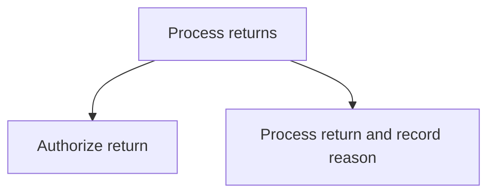
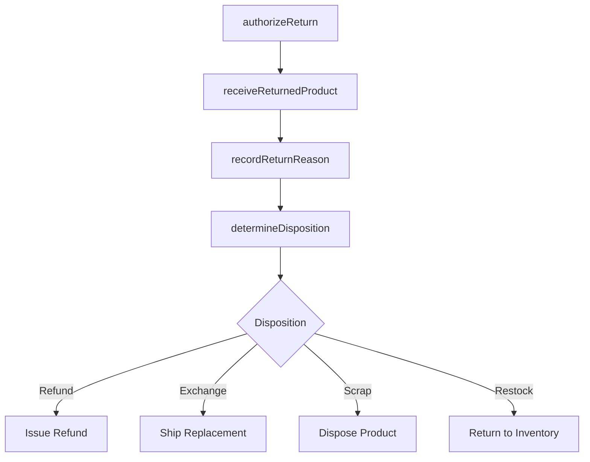

# Process returns

> Business-as-Code definition for product return processing. Models return authorization, receipt, reason recording, disposition determination, and refund or replacement execution.

## Overview

Acquiring returns and identify if the returns are scraped or salvaged.

## Process Hierarchy



## GraphDL

```yaml
process:
  object: Returns
  actor: ReturnsSpecialist
  result: ReturnDisposition
```

## Actions

| Action | Description |
|--------|-------------|
| authorizeReturn | Evaluate return eligibility and issue return merchandise authorization |
| receiveReturnedProduct | Accept returned product and verify condition |
| recordReturnReason | Document the reason for the return for analysis |
| determineDisposition | Decide whether to refund, exchange, repair, scrap, or restock |

## Events

| Event | Description |
|-------|-------------|
| returnAuthorized | Return merchandise authorization issued to customer |
| returnedProductReceived | Returned product received and inspected at warehouse |
| returnReasonRecorded | Return reason documented in the system |
| dispositionDetermined | Return disposition decision finalized and executed |

## Searches

| Search | Description |
|--------|-------------|
| getReturnRequests | List return requests by status, product, or date range |
| getReturnReasons | Query return reason data for trend analysis |
| getDispositionSummary | Retrieve return disposition breakdown by category |

## Process Flow



## RACI Matrix

| Activity | Responsible | Accountable | Consulted | Informed |
|----------|-------------|-------------|-----------|----------|
| authorizeReturn | Customer Service Agent | Returns Manager | Policy Team | Customer |
| receiveReturnedProduct | Warehouse Associate | Returns Manager | Quality | Inventory |
| recordReturnReason | Returns Specialist | Returns Manager | Data Analytics | Product |
| determineDisposition | Returns Specialist | Returns Manager | Finance, Quality | Warehouse |

## Sub-Processes

| ID | Name | Description |
|----|------|-------------|
| 6.2.4.1 | Authorize return | Approving and carrying forward the requests by the customers to return the product. This is part of  |
| 6.2.4.2 | Process return and record reason | Notating the reason for the return of the product. |

## Related Processes

| Process | Relationship |
|---------|-------------|
| 6.2.3 Manage customer complaints | Upstream - complaints may result in return requests |
| 6.3.2 Process warranty claims | Parallel - warranty-related returns follow warranty claim process |
| 4.4 Deliver products and services | Upstream - delivery issues drive returns |

## Related Departments

| Department | Role |
|-----------|------|
| Customer Service | Authorizes returns and communicates with customers |
| Warehouse/Logistics | Receives, inspects, and processes returned goods |
| Finance | Processes refunds and return-related accounting |
| Quality | Analyzes returned products for defect patterns |

## Related Occupations

| Occupation | Involvement |
|-----------|-------------|
| Returns Processing Specialist | Handles return authorization and disposition |
| Warehouse Associate | Receives and inspects returned products |

## KPIs

| KPI | Description | Unit |
|-----|-------------|------|
| Return Processing Time | Average days from return request to refund or exchange | Days |
| Return Rate | Percentage of sold products returned | % |
| Restock Rate | Percentage of returns that are restocked for resale | % |

## Usage

```typescript
import { processReturns } from '@headlessly/process-returns'

const returns = processReturns()

// Authorize a return
const rma = await returns.authorizeReturn({
  orderId: 'ORD-2025-45678',
  productId: 'PROD-001',
  reason: 'wrong-size',
  requestedAction: 'exchange'
})

// Record return reason
await returns.recordReturnReason({
  returnId: rma.id,
  category: 'customer-preference',
  detail: 'Size did not match product description'
})
```
