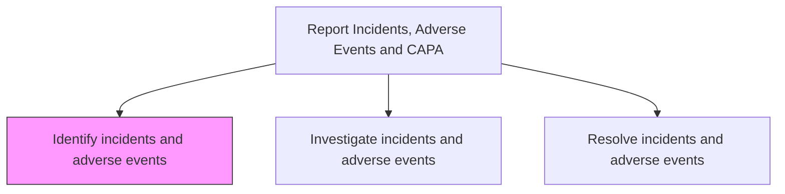
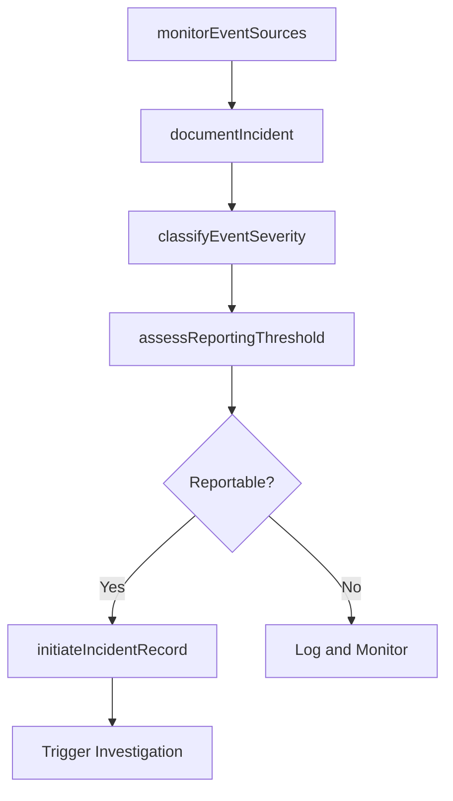

# Identify incidents and adverse events

> Business-as-Code definition for incident and adverse event identification. Models the detection, documentation, classification, and initial assessment of product or service incidents and adverse events from customer interactions, complaints, and field reports.

## Overview

Detecting and documenting product or service incidents and adverse events through monitoring of customer complaints, field reports, warranty claims, and regulatory notifications. Classify events by severity and determine whether they meet the threshold for formal investigation and reporting.

## Process Hierarchy



## GraphDL

```yaml
identify:
  object: Incidents And Adverse Events
  actor: QualitySpecialist
  result: IncidentReport
```

## Actions

| Action | Description |
|--------|-------------|
| monitorEventSources | Scan customer complaints, field reports, and claims for incident signals |
| documentIncident | Record incident details including product, circumstances, and impact |
| classifyEventSeverity | Categorize the event by severity level and potential harm |
| assessReportingThreshold | Determine if the event meets regulatory reporting thresholds |
| initiateIncidentRecord | Create a formal incident record and trigger the investigation workflow |

## Events

| Event | Description |
|-------|-------------|
| eventSourcesMonitored | Incident signal scanning completed across data sources |
| incidentDocumented | Incident details formally recorded in the quality system |
| eventSeverityClassified | Event categorized by severity and potential impact |
| reportingThresholdAssessed | Regulatory reporting requirement determination completed |
| incidentRecordInitiated | Formal incident record created and investigation triggered |

## Searches

| Search | Description |
|--------|-------------|
| getRecentIncidents | List newly identified incidents by severity, product, or date |
| getEventSignals | Query potential incident signals from complaints and field reports |
| getReportableEvents | List events meeting regulatory reporting thresholds |
| getIncidentsByProduct | Retrieve incidents filtered by product line or component |

## Process Flow



## RACI Matrix

| Activity | Responsible | Accountable | Consulted | Informed |
|----------|-------------|-------------|-----------|----------|
| monitorEventSources | Quality Specialist | Quality Manager | Customer Service | Regulatory Affairs |
| documentIncident | Quality Specialist | Quality Manager | Product Engineering | Legal |
| classifyEventSeverity | Quality Specialist | Quality Manager | Safety Team | VP Quality |
| assessReportingThreshold | Regulatory Affairs Specialist | Quality Manager | Legal | Executive Team |
| initiateIncidentRecord | Quality Specialist | Quality Manager | IT Systems | Investigation Team |

## Related Processes

| Process | Relationship |
|---------|-------------|
| 6.2.5.2 Investigate incidents and adverse events | Downstream - identified incidents are investigated |
| 6.2.3 Manage customer complaints | Upstream - complaints may reveal incidents |
| 6.3.2 Process warranty claims | Upstream - warranty claims may indicate product incidents |

## Related Departments

| Department | Role |
|-----------|------|
| Quality Assurance | Monitors for incidents and classifies severity |
| Customer Service | Provides complaint and inquiry data as incident signals |
| Regulatory Affairs | Advises on reporting thresholds and requirements |
| Legal | Assesses liability implications of identified incidents |

## Related Occupations

| Occupation | Involvement |
|-----------|-------------|
| Quality Specialist | Identifies and documents incidents from multiple data sources |
| Regulatory Affairs Specialist | Determines regulatory reporting requirements |
| Safety Engineer | Assesses safety implications of identified events |

## KPIs

| KPI | Description | Unit |
|-----|-------------|------|
| Incident Detection Time | Average time from event occurrence to formal identification | Days |
| Classification Accuracy | Percentage of incidents correctly classified by severity on first assessment | % |
| Reporting Threshold Compliance | Percentage of reportable events identified within required timeframes | % |
| Incident Signal Coverage | Percentage of data sources actively monitored for incident signals | % |

## Usage

```typescript
import { identifyIncidentsAndAdverseEvents } from '@headlessly/identify-incidents-and-adverse-events'

const identifier = identifyIncidentsAndAdverseEvents()

// Document an identified incident
const incident = await identifier.documentIncident({
  productId: 'PROD-500',
  source: 'customer-complaint',
  description: 'Overheating reported during normal operation in 3 separate cases',
  affectedUnits: 150,
  dateFirstReported: '2025-03-01'
})

// Classify severity and assess reporting threshold
await identifier.classifyEventSeverity({
  incidentId: incident.id,
  severity: 'critical',
  potentialHarm: 'fire-risk',
  regulatoryJurisdiction: 'US-CPSC'
})
```
