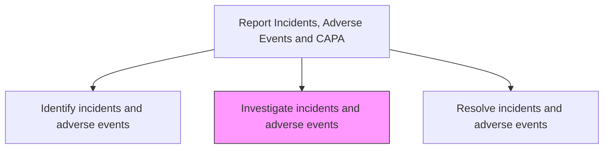
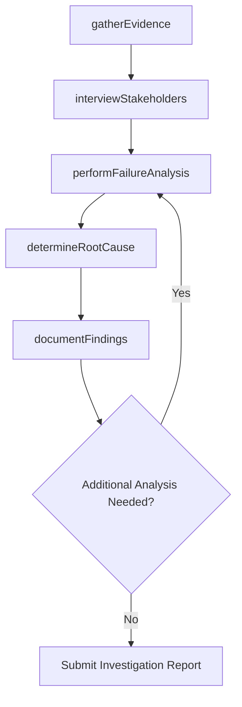

# Investigate incidents and adverse events

> Business-as-Code definition for incident investigation and root cause analysis. Models the evidence collection, root cause determination, impact assessment, and findings documentation for product or service incidents and adverse events.

## Overview

Conducting thorough investigations of identified incidents and adverse events to determine root cause, scope of impact, and contributing factors. Gather physical evidence, interview stakeholders, review manufacturing and quality records, and perform failure analysis to support corrective action planning.

## Process Hierarchy



## GraphDL

```yaml
investigate:
  object: Incidents And Adverse Events
  actor: QualityEngineer
  result: InvestigationReport
```

## Actions

| Action | Description |
|--------|-------------|
| gatherEvidence | Collect physical evidence, records, and samples related to the incident |
| interviewStakeholders | Conduct interviews with affected customers, operators, and technical staff |
| performFailureAnalysis | Execute technical failure analysis on defective components or products |
| determineRootCause | Identify the fundamental cause of the incident through analytical methods |
| documentFindings | Compile investigation findings, root cause, and recommendations into a report |

## Events

| Event | Description |
|-------|-------------|
| evidenceGathered | Physical evidence and documentation collected for investigation |
| stakeholdersInterviewed | Relevant parties interviewed and statements documented |
| failureAnalysisPerformed | Technical failure analysis completed on affected components |
| rootCauseDetermined | Fundamental cause of the incident identified and validated |
| findingsDocumented | Investigation report compiled with findings and recommendations |

## Searches

| Search | Description |
|--------|-------------|
| getActiveInvestigations | List open investigations by product, severity, or investigator |
| getEvidenceLog | Retrieve evidence items collected for a specific investigation |
| getSimilarIncidents | Query historical incidents with similar characteristics or root causes |
| getInvestigationTimeline | Retrieve chronological timeline of investigation activities |

## Process Flow



## RACI Matrix

| Activity | Responsible | Accountable | Consulted | Informed |
|----------|-------------|-------------|-----------|----------|
| gatherEvidence | Quality Engineer | Quality Manager | Field Service | Legal |
| interviewStakeholders | Quality Engineer | Quality Manager | Customer Service | HR |
| performFailureAnalysis | Quality Engineer | Quality Manager | Product Engineering | Manufacturing |
| determineRootCause | Quality Engineer | Quality Manager | Engineering, Safety | VP Quality |
| documentFindings | Quality Engineer | Quality Manager | Regulatory Affairs | Executive Team |

## Related Processes

| Process | Relationship |
|---------|-------------|
| 6.2.5.1 Identify incidents and adverse events | Upstream - identified incidents trigger investigation |
| 6.2.5.3 Resolve incidents and adverse events | Downstream - investigation findings guide resolution |
| 6.2.5.4 Report Corrective Action Preventive Action (CAPA) | Downstream - investigation supports CAPA reporting |

## Related Departments

| Department | Role |
|-----------|------|
| Quality Assurance | Leads incident investigation and root cause analysis |
| Engineering | Provides technical expertise for failure analysis |
| Manufacturing | Supplies production records and process information |
| Legal | Manages litigation risk and evidence preservation |

## Related Occupations

| Occupation | Involvement |
|-----------|-------------|
| Quality Engineer | Conducts root cause analysis and failure investigation |
| Failure Analysis Technician | Performs technical testing on defective components |
| Safety Engineer | Assesses safety implications of investigation findings |

## KPIs

| KPI | Description | Unit |
|-----|-------------|------|
| Investigation Cycle Time | Average days from investigation start to findings report | Days |
| Root Cause Identification Rate | Percentage of investigations that conclusively identify root cause | % |
| Evidence Collection Completeness | Percentage of required evidence items collected per investigation | % |
| Investigation Backlog | Number of incidents awaiting investigation | Count |

## Usage

```typescript
import { investigateIncidentsAndAdverseEvents } from '@headlessly/investigate-incidents-and-adverse-events'

const investigator = investigateIncidentsAndAdverseEvents()

// Perform failure analysis on a reported incident
const analysis = await investigator.performFailureAnalysis({
  incidentId: 'INC-2025-0042',
  analysisType: 'metallurgical',
  sampleIds: ['SAMP-001', 'SAMP-002'],
  testProtocol: 'thermal-stress-analysis'
})

// Determine and document root cause
const findings = await investigator.determineRootCause({
  incidentId: 'INC-2025-0042',
  method: 'fishbone-analysis',
  rootCause: 'Material fatigue due to insufficient heat treatment',
  contributingFactors: ['supplier-process-change', 'inadequate-incoming-inspection']
})
```
