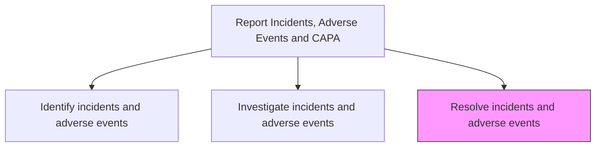
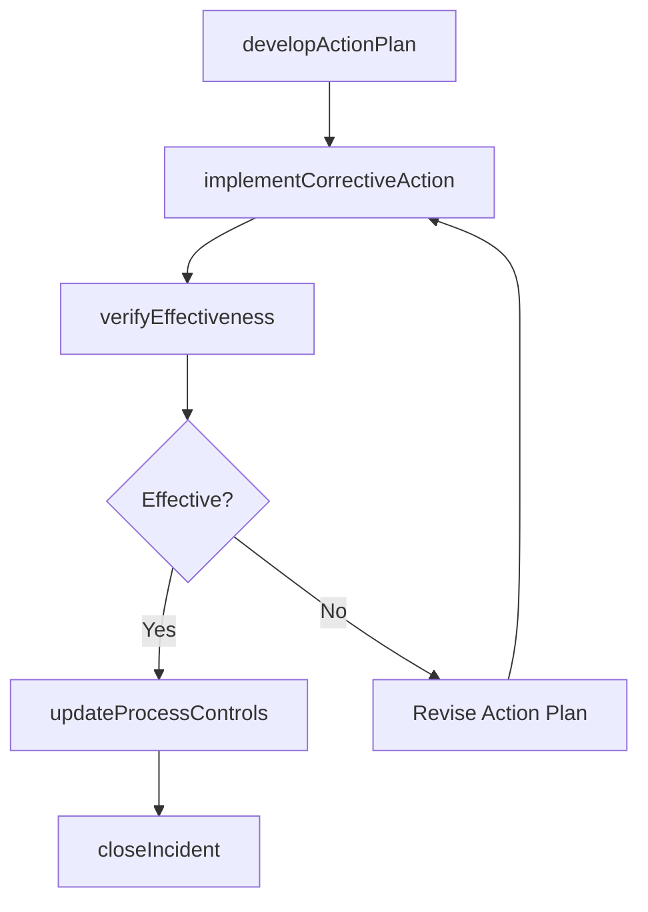

# Resolve incidents and adverse events

> Business-as-Code definition for incident resolution and corrective action implementation. Models the planning, execution, verification, and closure of corrective actions to address the root causes of identified incidents and adverse events.

## Overview

Implementing corrective actions to address the root causes of identified incidents and adverse events. Develop action plans, assign responsibilities, execute remediation activities, verify effectiveness of corrective actions, and formally close the incident when the risk has been adequately mitigated.

## Process Hierarchy



## GraphDL

```yaml
resolve:
  object: Incidents And Adverse Events
  actor: QualityEngineer
  result: IncidentResolution
```

## Actions

| Action | Description |
|--------|-------------|
| developActionPlan | Create a corrective action plan with tasks, owners, and timelines |
| implementCorrectiveAction | Execute the corrective measures to address the incident root cause |
| verifyEffectiveness | Confirm that corrective actions have effectively eliminated the root cause |
| updateProcessControls | Modify process controls and documentation to prevent recurrence |
| closeIncident | Formally close the incident record after verification of resolution |

## Events

| Event | Description |
|-------|-------------|
| actionPlanDeveloped | Corrective action plan created and approved |
| correctiveActionImplemented | Corrective measures executed as planned |
| effectivenessVerified | Corrective action effectiveness confirmed through testing or monitoring |
| processControlsUpdated | Process documentation and controls modified to prevent recurrence |
| incidentClosed | Incident record formally closed after successful resolution |

## Searches

| Search | Description |
|--------|-------------|
| getPendingActions | List corrective actions awaiting implementation by priority or deadline |
| getActionPlanStatus | Query corrective action plan progress by incident or owner |
| getVerificationResults | Retrieve effectiveness verification outcomes by incident |
| getClosedIncidents | List resolved and closed incidents by product, cause, or period |

## Process Flow



## RACI Matrix

| Activity | Responsible | Accountable | Consulted | Informed |
|----------|-------------|-------------|-----------|----------|
| developActionPlan | Quality Engineer | Quality Manager | Engineering, Manufacturing | VP Quality |
| implementCorrectiveAction | Action Owner | Quality Manager | Process Engineering | Production |
| verifyEffectiveness | Quality Engineer | Quality Manager | Testing Lab | Regulatory Affairs |
| updateProcessControls | Process Engineer | Quality Manager | Documentation | All Affected Teams |
| closeIncident | Quality Engineer | Quality Manager | Regulatory Affairs | Executive Team |

## Related Processes

| Process | Relationship |
|---------|-------------|
| 6.2.5.2 Investigate incidents and adverse events | Upstream - investigation findings guide corrective action planning |
| 6.2.5.4 Report Corrective Action Preventive Action (CAPA) | Downstream - resolution outcomes feed CAPA reporting |
| 6.4 Manage product recalls and regulatory audits | Downstream - unresolved incidents may trigger product recalls |

## Related Departments

| Department | Role |
|-----------|------|
| Quality Assurance | Leads corrective action planning and verification |
| Engineering | Implements technical corrections to product or process |
| Manufacturing | Executes process changes on the production floor |
| Regulatory Affairs | Ensures corrective actions meet regulatory requirements |

## Related Occupations

| Occupation | Involvement |
|-----------|-------------|
| Quality Engineer | Plans and verifies corrective actions |
| Process Engineer | Implements manufacturing process modifications |
| Production Manager | Executes corrective changes in production operations |

## KPIs

| KPI | Description | Unit |
|-----|-------------|------|
| Corrective Action Closure Rate | Percentage of corrective actions completed within target timeframe | % |
| Effectiveness Verification Rate | Percentage of corrective actions verified as effective | % |
| Recurrence Rate | Percentage of resolved incidents with similar recurrences within 12 months | % |
| Average Time to Resolution | Mean days from incident identification to formal closure | Days |

## Usage

```typescript
import { resolveIncidentsAndAdverseEvents } from '@headlessly/resolve-incidents-and-adverse-events'

const resolver = resolveIncidentsAndAdverseEvents()

// Develop a corrective action plan
const plan = await resolver.developActionPlan({
  incidentId: 'INC-2025-0042',
  actions: [
    { task: 'Update heat treatment parameters', owner: 'process-engineering', deadline: '2025-04-15' },
    { task: 'Implement incoming inspection for hardness', owner: 'quality', deadline: '2025-04-01' }
  ]
})

// Verify effectiveness after implementation
const verification = await resolver.verifyEffectiveness({
  incidentId: 'INC-2025-0042',
  method: 'statistical-process-control',
  sampleSize: 50,
  acceptanceCriteria: 'zero-defects'
})
```
