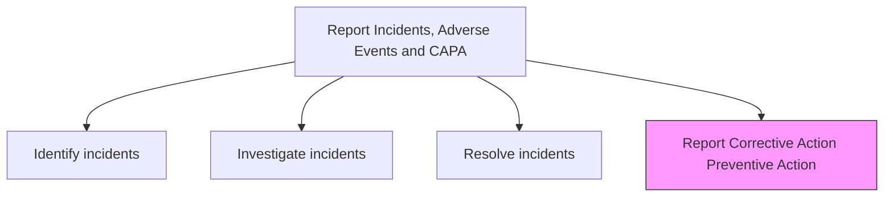
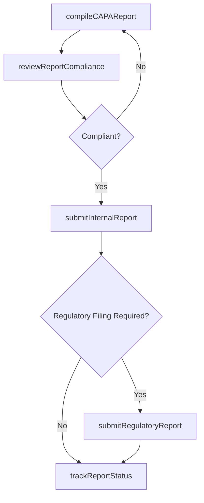

# Report Corrective Action Preventive Action (CAPA)

> Business-as-Code definition for CAPA reporting. Models the compilation, review, submission, and tracking of corrective action and preventive action reports for internal stakeholders and regulatory authorities.

## Overview

Compiling and filing corrective action/preventive action reports that document the incident, investigation findings, corrective measures taken, preventive measures implemented, and effectiveness verification results. Submit reports to internal quality management, executive leadership, and applicable regulatory bodies within required timeframes.

## Process Hierarchy



## GraphDL

```yaml
report:
  object: Corrective Action Preventive Action (CAPA)
  actor: RegulatoryAffairsSpecialist
  result: CAPAReport
```

## Actions

| Action | Description |
|--------|-------------|
| compileCAPAReport | Assemble investigation findings, corrective actions, and preventive measures into a report |
| reviewReportCompliance | Verify the CAPA report meets internal and regulatory formatting and content requirements |
| submitInternalReport | File the CAPA report with internal quality management and executive leadership |
| submitRegulatoryReport | Submit required CAPA documentation to applicable regulatory authorities |
| trackReportStatus | Monitor submission status, agency responses, and follow-up requirements |

## Events

| Event | Description |
|-------|-------------|
| capaReportCompiled | CAPA report assembled with all required documentation |
| reportComplianceReviewed | CAPA report verified for regulatory and internal compliance |
| internalReportSubmitted | CAPA report filed with internal stakeholders |
| regulatoryReportSubmitted | CAPA documentation submitted to regulatory authorities |
| reportStatusTracked | Report submission status and agency responses monitored |

## Searches

| Search | Description |
|--------|-------------|
| getCAPAReports | List CAPA reports by status, product, or submission date |
| getRegulatorySubmissions | Query regulatory submissions by jurisdiction, status, or deadline |
| getReportRequirements | Retrieve reporting requirements for a specific incident type and jurisdiction |
| getOpenFollowUps | List pending follow-up actions from regulatory agency responses |

## Process Flow



## RACI Matrix

| Activity | Responsible | Accountable | Consulted | Informed |
|----------|-------------|-------------|-----------|----------|
| compileCAPAReport | Quality Engineer | Quality Manager | Investigation Team | Regulatory Affairs |
| reviewReportCompliance | Regulatory Affairs Specialist | Quality Manager | Legal | VP Quality |
| submitInternalReport | Quality Engineer | Quality Manager | Documentation | Executive Team |
| submitRegulatoryReport | Regulatory Affairs Specialist | Quality Manager | Legal | CEO |
| trackReportStatus | Regulatory Affairs Specialist | Quality Manager | Quality Engineer | VP Quality |

## Related Processes

| Process | Relationship |
|---------|-------------|
| 6.2.5.3 Resolve incidents and adverse events | Upstream - resolution details feed CAPA report content |
| 6.2.5.5 Capture and report adverse events | Parallel - adverse event reporting may accompany CAPA |
| 6.4.5 Submit regulatory reports | Parallel - shared regulatory submission processes |

## Related Departments

| Department | Role |
|-----------|------|
| Quality Assurance | Compiles CAPA reports and tracks corrective action completion |
| Regulatory Affairs | Manages regulatory submissions and compliance |
| Legal | Reviews reports for liability implications and accuracy |
| Executive Management | Reviews CAPA reports for strategic risk assessment |

## Related Occupations

| Occupation | Involvement |
|-----------|-------------|
| Quality Engineer | Compiles CAPA report content from investigation findings |
| Regulatory Affairs Specialist | Manages regulatory submissions and compliance tracking |
| Technical Writer | Assists with report formatting and documentation standards |

## KPIs

| KPI | Description | Unit |
|-----|-------------|------|
| CAPA Report Timeliness | Percentage of CAPA reports completed within required deadlines | % |
| Regulatory Submission Compliance | Percentage of regulatory filings accepted without revisions | % |
| Report Completeness Score | Quality audit score for CAPA report content completeness | Score (1-100) |
| Follow-Up Closure Rate | Percentage of regulatory follow-up items resolved within target time | % |

## Usage

```typescript
import { reportCorrectiveActionPreventiveActionCapa } from '@headlessly/report-corrective-action-preventive-action-capa'

const capa = reportCorrectiveActionPreventiveActionCapa()

// Compile a CAPA report
const report = await capa.compileCAPAReport({
  incidentId: 'INC-2025-0042',
  correctiveActions: ['Updated heat treatment parameters', 'Added incoming inspection'],
  preventiveActions: ['Revised supplier quality requirements', 'Enhanced process monitoring'],
  effectivenessEvidence: 'Zero defects in 50-unit verification sample'
})

// Submit to regulatory authority
await capa.submitRegulatoryReport({
  reportId: report.id,
  authority: 'FDA',
  submissionType: 'MDR',
  deadline: '2025-05-01'
})
```
