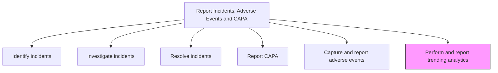
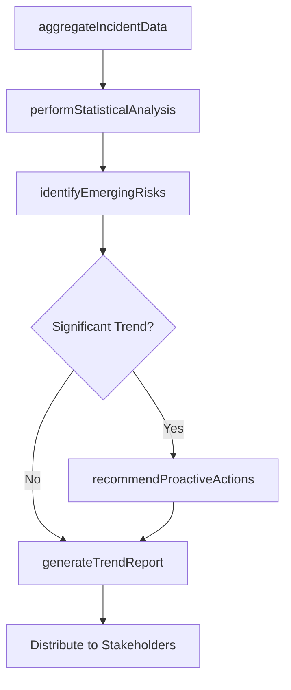

# Perform and report trending analytics

> Business-as-Code definition for incident trend analysis and reporting. Models the statistical analysis of incident data, pattern detection, risk signal identification, and trend reporting for proactive quality and safety management.

## Overview

Performing statistical analysis on incident and adverse event data to identify trends, emerging risk patterns, and recurring failure modes. Generate periodic trend reports that inform quality improvement initiatives, recall risk assessments, and regulatory compliance monitoring.

## Process Hierarchy



## GraphDL

```yaml
perform:
  object: And Report Trending Analytics
  actor: DataAnalyst
  result: TrendAnalysisReport
```

## Actions

| Action | Description |
|--------|-------------|
| aggregateIncidentData | Consolidate incident records across products, time periods, and categories |
| performStatisticalAnalysis | Apply statistical methods to detect trends and anomalies in incident data |
| identifyEmergingRisks | Detect early warning signals of emerging product or process risks |
| generateTrendReport | Compile trend findings into periodic reports for stakeholders |
| recommendProactiveActions | Propose preventive actions based on trend analysis findings |

## Events

| Event | Description |
|-------|-------------|
| incidentDataAggregated | Incident records consolidated for trend analysis period |
| statisticalAnalysisPerformed | Statistical trend and anomaly analysis completed |
| emergingRisksIdentified | Early warning risk signals detected from trend data |
| trendReportGenerated | Periodic trend analysis report compiled and distributed |
| proactiveActionsRecommended | Preventive action recommendations developed from trend findings |

## Searches

| Search | Description |
|--------|-------------|
| getIncidentTrends | Query incident volume and category trends by period |
| getFailureModeTrends | Retrieve failure mode frequency trends by product or component |
| getRiskSignals | List emerging risk signals detected through trend analysis |
| getTrendReports | Retrieve published trend analysis reports by period or product |

## Process Flow



## RACI Matrix

| Activity | Responsible | Accountable | Consulted | Informed |
|----------|-------------|-------------|-----------|----------|
| aggregateIncidentData | Data Analyst | Quality Manager | IT | Quality Engineering |
| performStatisticalAnalysis | Data Analyst | Quality Manager | Statistician | Product Engineering |
| identifyEmergingRisks | Risk Analyst | Quality Manager | Safety, Engineering | VP Quality |
| generateTrendReport | Data Analyst | Quality Manager | Regulatory Affairs | Executive Team |
| recommendProactiveActions | Quality Engineer | Quality Manager | Engineering, Manufacturing | VP Quality |

## Related Processes

| Process | Relationship |
|---------|-------------|
| 6.2.5.1 Identify incidents and adverse events | Upstream - incident identification data feeds trend analysis |
| 6.4.1 Develop a recall strategy | Downstream - trend findings inform recall risk assessment |
| 6.5.6 Evaluate and manage warranty performance | Parallel - incident trends complement warranty performance data |

## Related Departments

| Department | Role |
|-----------|------|
| Quality Assurance | Leads trend analysis and risk identification |
| Data Analytics | Performs statistical analysis and data visualization |
| Product Engineering | Interprets technical trends and failure mode patterns |
| Regulatory Affairs | Monitors trends for regulatory reporting implications |

## Related Occupations

| Occupation | Involvement |
|-----------|-------------|
| Data Analyst | Performs statistical trend analysis and creates dashboards |
| Risk Analyst | Identifies emerging risks from incident patterns |
| Quality Engineer | Interprets trends and recommends preventive actions |

## KPIs

| KPI | Description | Unit |
|-----|-------------|------|
| Trend Report Frequency | Number of trend analysis reports published per period | Count |
| Early Warning Detection Rate | Percentage of significant trends identified before reaching critical levels | % |
| Preventive Action Implementation Rate | Percentage of recommended proactive actions implemented | % |
| Trend Analysis Coverage | Percentage of product lines included in periodic trend analysis | % |

## Usage

```typescript
import { performAndReportTrendingAnalytics } from '@headlessly/perform-and-report-trending-analytics'

const trending = performAndReportTrendingAnalytics()

// Perform statistical analysis on incident data
const analysis = await trending.performStatisticalAnalysis({
  period: '2025-Q1',
  products: ['industrial-pumps', 'industrial-motors'],
  methods: ['control-chart', 'pareto-analysis'],
  significanceLevel: 0.05
})

// Generate and distribute trend report
const report = await trending.generateTrendReport({
  period: '2025-Q1',
  analysisId: analysis.id,
  distribution: ['quality-team', 'engineering', 'executive-leadership']
})
```
