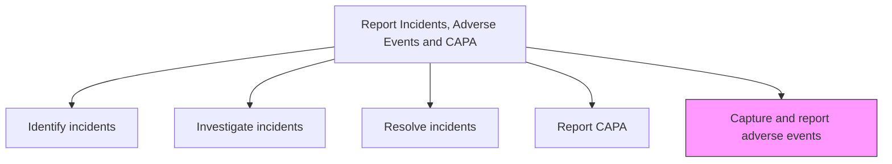
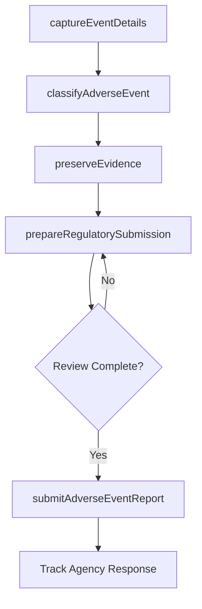

# Capture and report adverse events

> Business-as-Code definition for adverse event capture and regulatory reporting. Models the documentation, classification, and mandatory submission of adverse event reports to regulatory authorities within required timeframes.

## Overview

Documenting and submitting adverse event reports to regulatory authorities when products cause or contribute to serious injury, harm, or death. Ensure timely capture of event details, maintain chain-of-custody for evidence, classify events according to regulatory frameworks, and file mandatory reports within required deadlines.

## Process Hierarchy



## GraphDL

```yaml
capture:
  object: And Report Adverse Events
  actor: RegulatoryAffairsSpecialist
  result: AdverseEventReport
```

## Actions

| Action | Description |
|--------|-------------|
| captureEventDetails | Document adverse event circumstances, patient or customer impact, and product information |
| classifyAdverseEvent | Categorize the event according to regulatory classification frameworks |
| preserveEvidence | Secure and maintain chain-of-custody for physical evidence and documentation |
| prepareRegulatorySubmission | Compile the adverse event report in the format required by the applicable authority |
| submitAdverseEventReport | File the adverse event report with the regulatory body within the required timeframe |

## Events

| Event | Description |
|-------|-------------|
| eventDetailsCaptured | Adverse event circumstances and impact documented |
| adverseEventClassified | Event categorized according to regulatory framework |
| evidencePreserved | Physical evidence and documentation secured with chain of custody |
| regulatorySubmissionPrepared | Adverse event report compiled in required format |
| adverseEventReportSubmitted | Report filed with regulatory authority within required deadline |

## Searches

| Search | Description |
|--------|-------------|
| getAdverseEvents | List adverse events by severity, product, or reporting status |
| getRegulatoryDeadlines | Query upcoming regulatory reporting deadlines by jurisdiction |
| getSubmissionHistory | Retrieve adverse event submission history by authority or product |
| getEvidenceInventory | List preserved evidence items for a specific adverse event |

## Process Flow



## RACI Matrix

| Activity | Responsible | Accountable | Consulted | Informed |
|----------|-------------|-------------|-----------|----------|
| captureEventDetails | Quality Specialist | Quality Manager | Customer Service | Regulatory Affairs |
| classifyAdverseEvent | Regulatory Affairs Specialist | Quality Manager | Medical Affairs | Legal |
| preserveEvidence | Quality Specialist | Quality Manager | Legal | Investigation Team |
| prepareRegulatorySubmission | Regulatory Affairs Specialist | Quality Manager | Legal | VP Quality |
| submitAdverseEventReport | Regulatory Affairs Specialist | Quality Manager | Legal | CEO |

## Related Processes

| Process | Relationship |
|---------|-------------|
| 6.2.5.1 Identify incidents and adverse events | Upstream - identified events requiring regulatory reporting |
| 6.2.5.4 Report Corrective Action Preventive Action (CAPA) | Parallel - CAPA reporting may accompany adverse event submissions |
| 6.4.5 Submit regulatory reports | Parallel - shared regulatory submission infrastructure |

## Related Departments

| Department | Role |
|-----------|------|
| Regulatory Affairs | Prepares and submits adverse event reports to authorities |
| Quality Assurance | Captures event details and preserves evidence |
| Legal | Reviews submissions for liability implications |
| Medical Affairs | Provides clinical assessment for health-related adverse events |

## Related Occupations

| Occupation | Involvement |
|-----------|-------------|
| Regulatory Affairs Specialist | Prepares and files regulatory adverse event reports |
| Quality Specialist | Documents adverse event details and manages evidence |
| Legal Counsel | Reviews reports for legal accuracy and exposure |

## KPIs

| KPI | Description | Unit |
|-----|-------------|------|
| Reporting Timeliness | Percentage of adverse event reports filed within regulatory deadlines | % |
| Report Acceptance Rate | Percentage of reports accepted by regulatory authorities without revision | % |
| Event Capture Completeness | Percentage of adverse events with complete documentation at first capture | % |
| Time to Report | Average days from adverse event discovery to regulatory submission | Days |

## Usage

```typescript
import { captureAndReportAdverseEvents } from '@headlessly/capture-and-report-adverse-events'

const adverse = captureAndReportAdverseEvents()

// Capture adverse event details
const event = await adverse.captureEventDetails({
  productId: 'PROD-500',
  eventDate: '2025-03-15',
  severity: 'serious-injury',
  description: 'Device overheating caused second-degree burn during normal use',
  patientOutcome: 'treated-and-released'
})

// Submit regulatory report
await adverse.submitAdverseEventReport({
  eventId: event.id,
  authority: 'FDA',
  reportType: 'MDR-initial',
  deadline: '2025-04-14'
})
```
