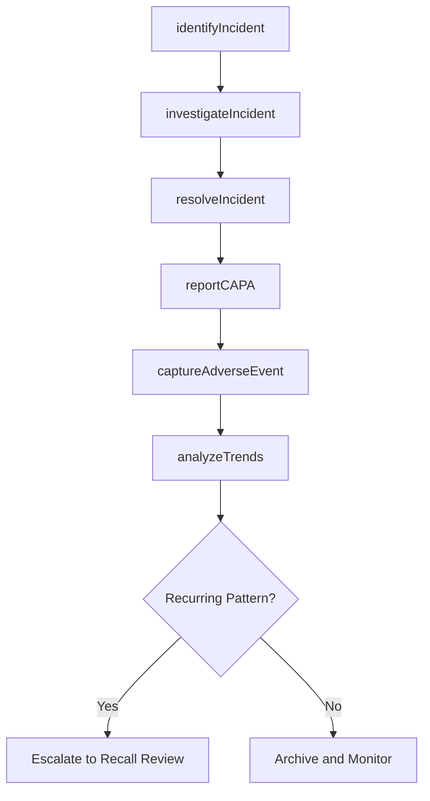

# Report Incidents, Adverse Events and Corrective Action Preventive Action (CAPA)

> Business-as-Code definition for incident and adverse event reporting with CAPA. Models incident identification, investigation, resolution, corrective/preventive action reporting, adverse event capture, and trend analytics.

## Overview

Notifying all stakeholders, legal, and industry regulatory bodies of the incidents and risks related to a return or recall, if needed.

## Process Hierarchy

```mermaid
graph TD
    A[Report Incidents, Adverse Events and Corrective Action Preventive Action (CAPA)]
    A --> B[Identify incidents and adverse events]
    A --> C[Investigate incidents and adverse events]
    A --> D[Resolve incidents and adverse events]
    A --> E[Report Corrective Action Preventive Action (CAPA)]
    A --> F[Capture and report adverse events]
    A --> G[Perform and report trending analytics]
```

## GraphDL

```yaml
report:
  object: Incidents, Adverse Events And Corrective Action Preventive Action (CAPA)
  actor: QualityAndSafetyManager
  result: CAPAReport
```

## Actions

| Action | Description |
|--------|-------------|
| identifyIncident | Detect and document product or service incidents and adverse events |
| investigateIncident | Conduct root cause analysis of reported incidents |
| resolveIncident | Implement corrective actions to address incident root cause |
| reportCAPA | File corrective action/preventive action reports with stakeholders |
| captureAdverseEvent | Document and submit adverse event reports to regulatory bodies |
| analyzeTrends | Perform trend analytics on incident data for risk identification |

## Events

| Event | Description |
|-------|-------------|
| incidentIdentified | Product or service incident detected and documented |
| incidentInvestigated | Root cause analysis completed for reported incident |
| incidentResolved | Corrective action implemented and incident closed |
| capaReported | CAPA report filed with internal and regulatory stakeholders |
| adverseEventCaptured | Adverse event documented and submitted to authorities |
| trendsAnalyzed | Incident trend analysis completed with risk findings |

## Searches

| Search | Description |
|--------|-------------|
| getOpenIncidents | List open incidents by severity, product, or date |
| getCAPAReports | Retrieve CAPA reports by status, type, or product |
| getAdverseEvents | Query adverse event reports by regulatory body or date |
| getTrendAnalytics | Retrieve incident trend data by category and period |

## Process Flow



## RACI Matrix

| Activity | Responsible | Accountable | Consulted | Informed |
|----------|-------------|-------------|-----------|----------|
| identifyIncident | Quality Specialist | Quality Manager | Customer Service | Regulatory |
| investigateIncident | Quality Engineer | Quality Manager | Engineering, Manufacturing | Legal |
| resolveIncident | Quality Engineer | Quality Manager | Product Team | VP Quality |
| reportCAPA | Regulatory Affairs Specialist | Quality Manager | Legal | Executive Team |
| analyzeTrends | Data Analyst | Quality Manager | Product, Engineering | VP Quality |

## Sub-Processes

| ID | Name | Description |
|----|------|-------------|
| 6.2.5.1 | Identify incidents and adverse events | Detecting and logging product incidents and adverse events from customer reports, surveillance systems, and internal monitoring channels. |
| 6.2.5.2 | Investigate incidents and adverse events | Conducting thorough investigations into reported incidents including evidence gathering, root cause analysis, and impact assessment. |
| 6.2.5.3 | Resolve incidents and adverse events | Implementing corrective actions, remediation plans, and preventive measures to address identified incidents and prevent recurrence. |
| 6.2.5.4 | Report Corrective Action Preventive Action (CAPA) | Documenting and communicating corrective and preventive actions taken in response to incidents, ensuring regulatory compliance and organizational learning. |
| 6.2.5.5 | Capture and report adverse events | Recording adverse event details per regulatory requirements and submitting mandatory reports to health authorities and safety agencies. |
| 6.2.5.6 | Perform and report trending analytics | Analyzing incident data over time to identify patterns, emerging risks, and systemic issues requiring proactive intervention. |

## Related Processes

| Process | Relationship |
|---------|-------------|
| 6.4 Manage product recalls and regulatory audits | Downstream - incident patterns may trigger recalls |
| 6.2.3 Manage customer complaints | Upstream - complaints may reveal incidents |
| 6.5.6 Evaluate and manage warranty performance | Parallel - incident data feeds warranty analysis |

## Related Departments

| Department | Role |
|-----------|------|
| Quality Assurance | Leads incident investigation and CAPA processes |
| Regulatory Affairs | Files adverse event reports with regulatory authorities |
| Engineering | Provides technical root cause analysis |
| Legal | Assesses liability and compliance requirements |

## Related Occupations

| Occupation | Involvement |
|-----------|-------------|
| Quality Engineer | Investigates incidents and implements corrective actions |
| Regulatory Affairs Specialist | Manages adverse event reporting and compliance |
| Risk Analyst | Performs trend analysis and risk assessments |

## KPIs

| KPI | Description | Unit |
|-----|-------------|------|
| CAPA Closure Rate | Percentage of CAPA actions completed within target timeframe | % |
| Incident Investigation Time | Average days from incident identification to root cause determination | Days |
| Adverse Event Reporting Timeliness | Percentage of adverse events reported within regulatory deadlines | % |
| Recurrence Rate | Percentage of incidents with similar prior occurrences | % |

## Usage

```typescript
import { reportIncidentsAdverseEventsAndCorrectiveActionPreventiveActionCapa } from '@headlessly/report-incidents-adverse-events-and-corrective-action-preventive-action-capa'

const capa = reportIncidentsAdverseEventsAndCorrectiveActionPreventiveActionCapa()

// Identify an incident
const incident = await capa.identifyIncident({
  productId: 'PROD-500',
  type: 'safety-concern',
  severity: 'critical',
  description: 'Overheating reported during normal operation'
})

// Report CAPA
const report = await capa.reportCAPA({
  incidentId: incident.id,
  correctiveAction: 'Firmware update to improve thermal management',
  preventiveAction: 'Enhanced thermal testing in QA protocol',
  targetCompletion: '2025-05-01'
})
```
