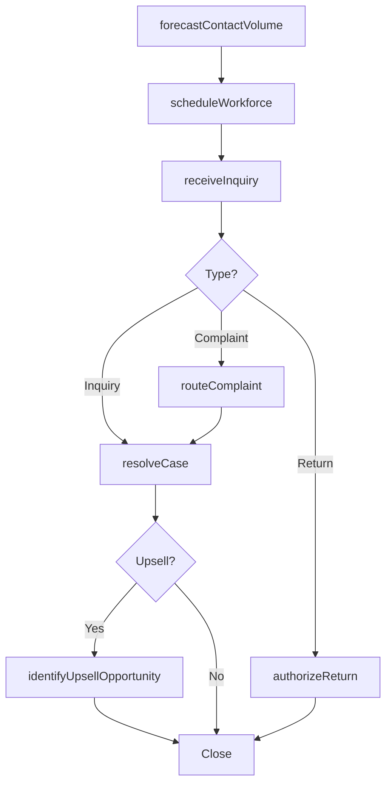

# Plan and manage customer service operations

> Business-as-Code definition for customer service operations planning and management. Models workforce planning, case management, complaint handling, returns processing, and incident reporting.

## Overview

Planning and executing day-to-day customer service operations including workforce scheduling, handling customer inquiries and complaints, processing returns, and reporting incidents. Ensures operational readiness and consistent service delivery across all customer touchpoints.

## Process Hierarchy

```mermaid
graph TD
    A[Plan and manage customer service operations]
    A --> B[Plan and manage customer service work force]
    A --> C[Manage customer service problems, requests, and inquiries]
    A --> D[Manage customer complaints]
    A --> E[Process returns]
    A --> F[Report Incidents, Adverse Events and Corrective Action Preventive Action (CAPA)]
```

## GraphDL

```yaml
plan:
  object: And Manage Customer Service Operations
  actor: ServiceOperationsManager
  result: OperationalReadinessReport
```

## Actions

| Action | Description |
|--------|-------------|
| forecastContactVolume | Predict incoming customer service contact volumes by channel |
| scheduleWorkforce | Assign agents to shifts based on forecasted demand |
| receiveInquiry | Accept customer problems, requests, and inquiries across channels |
| resolveCase | Investigate and resolve customer service cases |
| routeComplaint | Direct customer complaints to appropriate resolution teams |
| authorizeReturn | Evaluate and approve product return requests |
| reportIncident | Document and report adverse events or safety incidents |
| identifyUpsellOpportunity | Recognize cross-sell or upsell opportunities during service interactions |

## Events

| Event | Description |
|-------|-------------|
| contactVolumeForecasted | Service contact volume predictions generated for planning period |
| workforceScheduled | Agent schedules published for the upcoming period |
| inquiryReceived | Customer inquiry or request logged in the system |
| caseResolved | Customer case investigated and resolution delivered |
| complaintRouted | Customer complaint assigned to resolution team |
| returnAuthorized | Product return request approved and RMA issued |
| incidentReported | Adverse event or incident documented and submitted |
| upsellOpportunityIdentified | Cross-sell or upsell lead captured and forwarded to sales |

## Searches

| Search | Description |
|--------|-------------|
| findOpenCases | Retrieve open service cases filtered by priority, channel, or agent |
| getAgentSchedule | Query workforce schedules by team, shift, or date range |
| getComplaintQueue | List pending complaints by category, severity, or age |
| getReturnRequests | Retrieve return requests filtered by status, product, or reason |
| getIncidentLog | Query reported incidents by type, severity, or date |

## Process Flow



## RACI Matrix

| Activity | Responsible | Accountable | Consulted | Informed |
|----------|-------------|-------------|-----------|----------|
| forecastContactVolume | Workforce Planner | Service Operations Manager | IT, Finance | VP Customer Service |
| scheduleWorkforce | Workforce Planner | Service Operations Manager | Team Leads | Agents |
| receiveInquiry | Customer Service Agent | Team Lead | Knowledge Base | Quality Assurance |
| resolveCase | Customer Service Agent | Team Lead | Product Specialists | Customer |
| routeComplaint | Complaint Coordinator | Service Operations Manager | Legal | VP Customer Service |

## Sub-Processes

| ID | Name | Description |
|----|------|-------------|
| 6.2.1 | Plan and manage customer service work force | Creating and administering the work force deployed for the customer service process. Forecast the cu |
| 6.2.2 | Manage customer service problems, requests, and inquiries | Handling the requests and inquiries from customers that seek information regarding the organization' |
| 6.2.3 | Manage customer complaints | Obtaining customer complaints online or by phone. Direct these complaints to higher-level representa |
| 6.2.4 | Process returns | Acquiring returns and identify if the returns are scraped or salvaged. |
| 6.2.5 | Report Incidents, Adverse Events and Corrective Action Preventive Action (CAPA) | Notifying all stakeholders, legal, and industry regulatory bodies of the incidents and risks related |

## Related Processes

| Process | Relationship |
|---------|-------------|
| 6.1 Develop customer care/customer service strategy | Upstream - strategy defines operational parameters |
| 6.3 Service products after sales | Parallel - post-sales service delivery |
| 6.5 Evaluate customer service operations and customer satisfaction | Downstream - operations data feeds evaluation |

## Related Departments

| Department | Role |
|-----------|------|
| Customer Service | Executes daily service operations and case management |
| Human Resources | Supports workforce planning and agent training |
| Quality Assurance | Monitors interaction quality and compliance |
| Sales | Receives upsell and cross-sell opportunities |
| Logistics | Coordinates product returns and replacements |

## Related Occupations

| Occupation | Involvement |
|-----------|-------------|
| Customer Service Representative | Handles inquiries, complaints, and requests |
| Workforce Planner | Forecasts volume and schedules agents |
| Team Lead | Supervises daily operations and escalations |
| Quality Assurance Analyst | Monitors and evaluates service quality |

## KPIs

| KPI | Description | Unit |
|-----|-------------|------|
| First Contact Resolution | Percentage of cases resolved on first interaction | % |
| Average Handle Time | Mean time to process a customer interaction | Minutes |
| Agent Utilization Rate | Percentage of agent time spent on productive work | % |
| Complaint Resolution Time | Average days to resolve a customer complaint | Days |
| Return Processing Time | Average time from return request to completion | Hours |

## Usage

```typescript
import { planAndManageCustomerServiceOperations } from '@headlessly/plan-and-manage-customer-service-operations'

const ops = planAndManageCustomerServiceOperations()

// Forecast contact volume
const forecast = await ops.forecastContactVolume({
  channel: 'phone',
  period: '2025-Q4',
  granularity: 'daily'
})

// Resolve a customer case
const resolution = await ops.resolveCase({
  caseId: 'CS-78901',
  resolution: 'refund',
  rootCause: 'shipping-delay'
})
```
