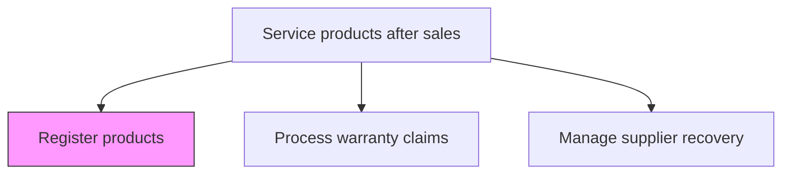
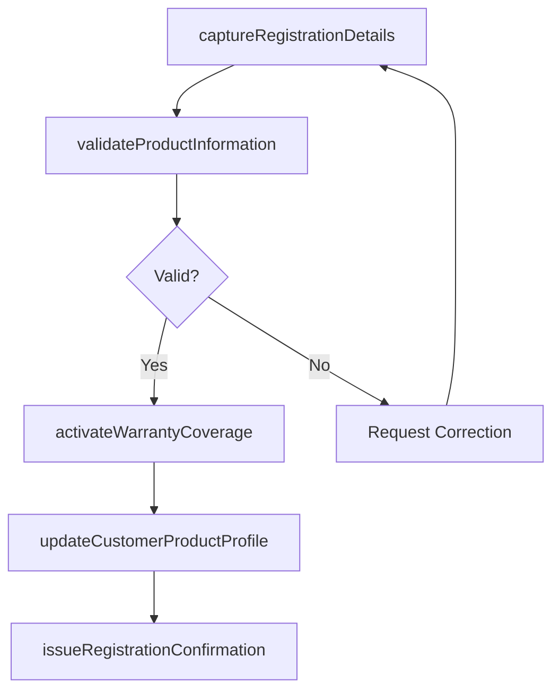

# Register products

> Business-as-Code definition for product registration. Models the capture, validation, and storage of product ownership records including serial numbers, purchase details, and warranty activation for after-sales service eligibility.

## Overview

Filing product registrations.

## Process Hierarchy



## GraphDL

```yaml
register:
  object: Products
  actor: CustomerServiceAgent
  result: ProductRegistration
```

## Actions

| Action | Description |
|--------|-------------|
| captureRegistrationDetails | Record product serial number, model, purchase date, and customer information |
| validateProductInformation | Verify the product details against the master product catalog and purchase records |
| activateWarrantyCoverage | Initiate warranty coverage based on registration date and product terms |
| issueRegistrationConfirmation | Send confirmation of successful registration to the customer |
| updateCustomerProductProfile | Link the registered product to the customer's service profile |

## Events

| Event | Description |
|-------|-------------|
| registrationDetailsCaptured | Product registration information submitted and recorded |
| productInformationValidated | Product details verified against catalog and purchase records |
| warrantyCoverageActivated | Warranty coverage initiated for the registered product |
| registrationConfirmationIssued | Registration confirmation sent to customer |
| customerProductProfileUpdated | Product linked to customer profile for future service |

## Searches

| Search | Description |
|--------|-------------|
| getRegisteredProducts | Retrieve registered products by customer, serial number, or product line |
| getRegistrationStatus | Query registration and warranty activation status for a product |
| getUnregisteredProducts | List sold products that have not yet been registered |
| getRegistrationTrends | Query product registration rates by product line or time period |

## Process Flow



## RACI Matrix

| Activity | Responsible | Accountable | Consulted | Informed |
|----------|-------------|-------------|-----------|----------|
| captureRegistrationDetails | Customer Service Agent | After-Sales Manager | IT | Product Management |
| validateProductInformation | Customer Service Agent | After-Sales Manager | Product Catalog Team | Quality |
| activateWarrantyCoverage | Warranty Specialist | After-Sales Manager | Warranty Administration | Finance |
| issueRegistrationConfirmation | CRM System | After-Sales Manager | IT | Customer |
| updateCustomerProductProfile | Customer Service Agent | After-Sales Manager | CRM Administration | Sales |

## Related Processes

| Process | Relationship |
|---------|-------------|
| 6.3.2 Process warranty claims | Downstream - registration enables warranty claim eligibility |
| 6.1.6 Define and manage warranty offering | Upstream - warranty terms define registration requirements |
| 4.4 Deliver products and services | Upstream - product delivery triggers registration opportunity |

## Related Departments

| Department | Role |
|-----------|------|
| Customer Service | Processes product registrations and validates information |
| Warranty Administration | Activates warranty coverage upon registration |
| Information Technology | Maintains product registration systems and databases |
| Marketing | Uses registration data for customer engagement campaigns |

## Related Occupations

| Occupation | Involvement |
|-----------|-------------|
| Customer Service Agent | Assists customers with product registration |
| Systems Administrator | Maintains product registration platform |
| Data Analyst | Analyzes registration rates and customer demographics |

## KPIs

| KPI | Description | Unit |
|-----|-------------|------|
| Product Registration Rate | Percentage of sold products registered by customers | % |
| Registration Processing Time | Average time from submission to confirmed registration | Minutes |
| Warranty Activation Rate | Percentage of registered products with active warranty coverage | % |
| Registration Data Accuracy | Percentage of registrations with complete and accurate information | % |

## Usage

```typescript
import { registerProducts } from '@headlessly/register-products'

const registration = registerProducts()

// Register a product
const record = await registration.captureRegistrationDetails({
  serialNumber: 'SN-2025-98765',
  model: 'industrial-pump-X200',
  customerId: 'cust_12345',
  purchaseDate: '2025-03-15',
  retailer: 'authorized-dealer-001'
})

// Activate warranty coverage
await registration.activateWarrantyCoverage({
  registrationId: record.id,
  warrantyType: 'standard',
  coveragePeriod: { months: 24 }
})
```
