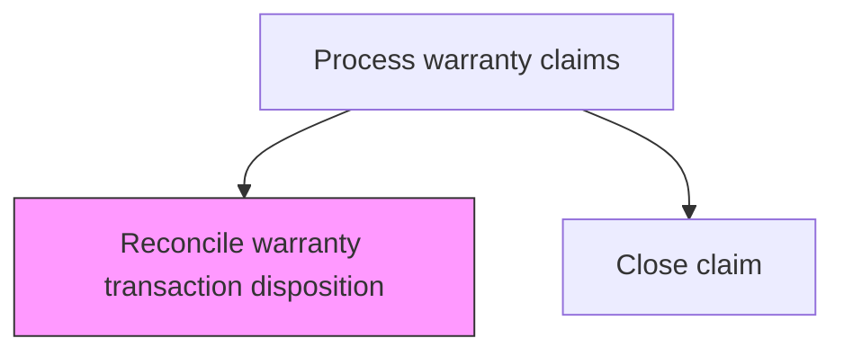
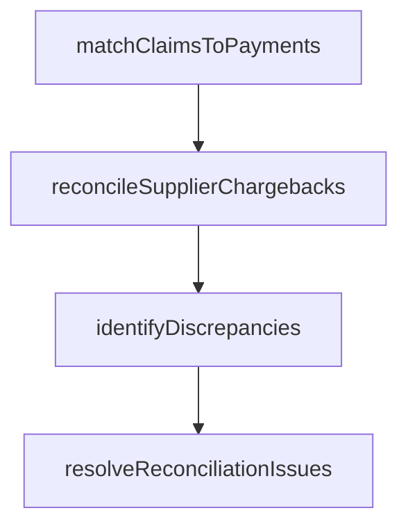

# Reconcile warranty transaction disposition

> Business-as-Code definition for warranty transaction reconciliation. Models the verification and balancing of warranty claim settlements against financial records and supplier agreements.

## Overview

Assuring that the warranty transaction has been completed.

## Process Hierarchy



## GraphDL

```yaml
reconcile:
  object: Warranty Transaction Disposition
  actor: WarrantyReconciliationAnalyst
  result: ReconciliationReport
```

## Actions

| Action | Description |
|--------|-------------|
| matchClaimsToPayments | Verify that each settled claim has a corresponding payment record |
| reconcileSupplierChargebacks | Balance supplier-liable claims against recovery amounts |
| identifyDiscrepancies | Detect mismatches between claim settlements and financial records |
| resolveReconciliationIssues | Investigate and correct identified discrepancies |
| generateReconciliationReport | Produce period-end reconciliation report for warranty transactions |

## Events

| Event | Description |
|-------|-------------|
| matchedClaimsToPayments | verify that each settled claim has a corresponding payment record completed |
| reconciledSupplierChargebacks | balance supplier-liable claims against recovery amounts completed |
| identifiedDiscrepancies | detect mismatches between claim settlements and financial records completed |
| resolvedReconciliationIssues | investigate and correct identified discrepancies completed |
| generatedReconciliationReport | produce period-end reconciliation report for warranty transactions completed |

## Searches

| Search | Description |
|--------|-------------|
| getUnreconciledClaims | List claims with unmatched payment or settlement records |
| getReconciliationStatus | Query reconciliation progress by period or claim batch |
| getDiscrepancyDetails | Retrieve details of identified reconciliation discrepancies |

## Process Flow



## RACI Matrix

| Activity | Responsible | Accountable | Consulted | Informed |
|----------|-------------|-------------|-----------|----------|
| matchClaimsToPayments | Warranty Reconciliation Analyst | Manager | Quality | Customer Service |
| reconcileSupplierChargebacks | Warranty Reconciliation Analyst | Manager | Finance | Operations |
| identifyDiscrepancies | Warranty Reconciliation Analyst | VP Customer Service | Legal | Executive Team |

## Related Processes

| Process | Relationship |
|---------|-------------|
| 6.3.2.9 Close claim | Upstream - closed claims are reconciled |
| 6.3.3 Manage supplier recovery | Related - supplier chargebacks are reconciled |

## Related Departments

| Department | Role |
|-----------|------|
| Finance | Performs warranty transaction reconciliation |
| Warranty Administration | Provides claim settlement data for reconciliation |

## Related Occupations

| Occupation | Involvement |
|-----------|-------------|
| Warranty Reconciliation Analyst | Performs claim-to-payment matching |
| Financial Controller | Reviews reconciliation reports and approves adjustments |

## KPIs

| KPI | Description | Unit |
|-----|-------------|------|
| Reconciliation Accuracy | Percentage of claims reconciled without discrepancy | % |
| Reconciliation Cycle Time | Days to complete period-end warranty reconciliation | Days |
| Discrepancy Rate | Percentage of transactions with identified mismatches | % |

## Usage

```typescript
import { reconcileWarrantyTransactionDisposition } from '@headlessly/reconcile-warranty-transaction-disposition'

const client = reconcileWarrantyTransactionDisposition()

// Verify that each settled claim has a corresponding payment record
const result = await client.matchClaimsToPayments({
  claimId: 'WC-2025-001',
  productId: 'PRD-X200'
})

// Balance supplier-liable claims against recovery amounts
await client.reconcileSupplierChargebacks({
  id: result.id
})
```
