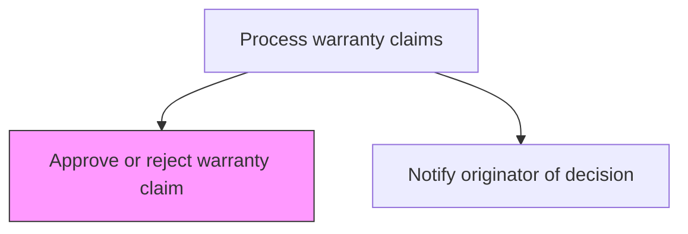
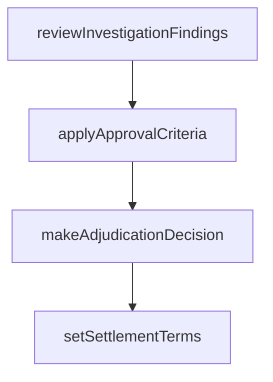

# Approve or reject warranty claim

> Business-as-Code definition for warranty claim adjudication. Models the approval or rejection decision-making process for validated warranty claims based on investigation findings and policy criteria.

## Overview

Following Defining issue [20098], an approval or rejection with be made against the warranty claim. If it is deemed that the claim falls within the warranty parameters, the claim will be approved. If the claim is deemed to fall outside warranty parameters, the claim with be rejected.

## Process Hierarchy



## GraphDL

```yaml
approve:
  object: Or Reject Warranty Claim
  actor: ClaimsAdjudicator
  result: AdjudicationDecision
```

## Actions

| Action | Description |
|--------|-------------|
| reviewInvestigationFindings | Examine root cause analysis and investigation results for the claim |
| applyApprovalCriteria | Evaluate the claim against warranty policy approval rules and thresholds |
| makeAdjudicationDecision | Render an approve or reject decision with documented rationale |
| setSettlementTerms | Define the settlement type, amount, and terms for approved claims |

## Events

| Event | Description |
|-------|-------------|
| reviewedInvestigationFindings | examine root cause analysis and investigation results for the claim completed |
| appliedApprovalCriteria | evaluate the claim against warranty policy approval rules and thresholds completed |
| makedAdjudicationDecision | render an approve or reject decision with documented rationale completed |
| setedSettlementTerms | define the settlement type, amount, and terms for approved claims completed |

## Searches

| Search | Description |
|--------|-------------|
| getClaimsForAdjudication | List validated claims ready for approval decision |
| getApprovalCriteria | Retrieve warranty claim approval rules by product and defect type |
| getAdjudicationHistory | Query past adjudication decisions for similar claims |

## Process Flow



## RACI Matrix

| Activity | Responsible | Accountable | Consulted | Informed |
|----------|-------------|-------------|-----------|----------|
| reviewInvestigationFindings | Claims Adjudicator | Manager | Quality | Customer Service |
| applyApprovalCriteria | Claims Adjudicator | Manager | Finance | Operations |
| makeAdjudicationDecision | Claims Adjudicator | VP Customer Service | Legal | Executive Team |

## Related Processes

| Process | Relationship |
|---------|-------------|
| 6.3.2.3 Investigate warranty issues | Upstream - investigation results inform adjudication |
| 6.3.2.7 Notify originator of approve/reject decision | Downstream - decision communicated to claimant |

## Related Departments

| Department | Role |
|-----------|------|
| Warranty Administration | Makes claim approval and rejection decisions |
| Finance | Reviews settlement terms for approved claims |

## Related Occupations

| Occupation | Involvement |
|-----------|-------------|
| Claims Adjudicator | Reviews findings and renders approval decisions |
| Warranty Manager | Approves high-value or escalated claims |

## KPIs

| KPI | Description | Unit |
|-----|-------------|------|
| Adjudication Cycle Time | Average hours from investigation to decision | Hours |
| Approval Rate | Percentage of validated claims approved | % |
| Settlement Accuracy | Percentage of settlements matching policy guidelines | % |

## Usage

```typescript
import { approveOrRejectWarrantyClaim } from '@headlessly/approve-or-reject-warranty-claim'

const client = approveOrRejectWarrantyClaim()

// Examine root cause analysis and investigation results for the claim
const result = await client.reviewInvestigationFindings({
  claimId: 'WC-2025-001',
  productId: 'PRD-X200'
})

// Evaluate the claim against warranty policy approval rules and thresholds
await client.applyApprovalCriteria({
  id: result.id
})
```
