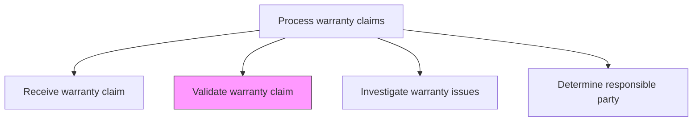
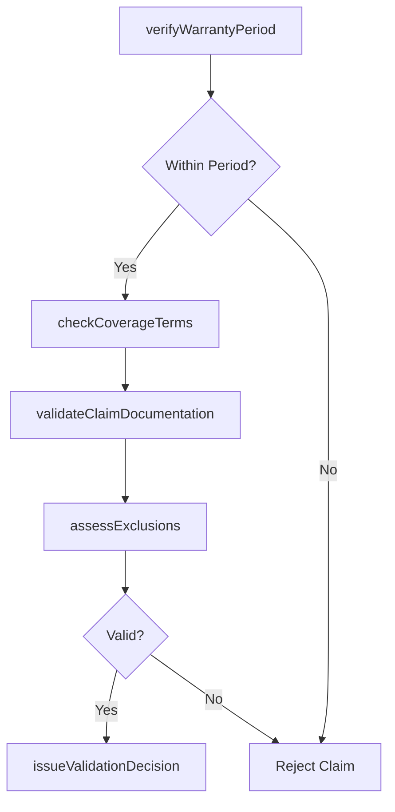

# Validate warranty claim

> Business-as-Code definition for warranty claim validation. Models the verification of warranty eligibility, coverage terms, and claim legitimacy before investigation.

## Overview

Ensuring that the claim falls within the parameters of the warranty in question. After validation is made, the claim must be investigated.

## Process Hierarchy



## GraphDL

```yaml
validate:
  object: Warranty Claim
  actor: WarrantySpecialist
  result: ClaimValidationResult
```

## Actions

| Action | Description |
|--------|-------------|
| verifyWarrantyPeriod | Confirm the product is within the warranty coverage period |
| checkCoverageTerms | Verify the reported issue falls within warranty coverage scope |
| validateClaimDocumentation | Review supporting documentation for completeness and accuracy |
| assessExclusions | Determine whether any exclusion conditions apply to the claim |
| issueValidationDecision | Approve or reject the claim for further investigation |

## Events

| Event | Description |
|-------|-------------|
| warrantyPeriodVerified | Product warranty period confirmed as active or expired |
| coverageTermsChecked | Issue verified against warranty coverage scope |
| claimDocumentationValidated | Supporting documentation reviewed and accepted |
| exclusionsAssessed | Warranty exclusion conditions evaluated |
| validationDecisionIssued | Claim approved or rejected for investigation |

## Searches

| Search | Description |
|--------|-------------|
| getWarrantyCoverage | Retrieve warranty coverage details for a specific product |
| getClaimValidationStatus | Query validation status for pending warranty claims |
| getExclusionCriteria | List warranty exclusion conditions by product or policy |
| getValidationHistory | Retrieve prior validation decisions for similar claims |

## Process Flow



## RACI Matrix

| Activity | Responsible | Accountable | Consulted | Informed |
|----------|-------------|-------------|-----------|----------|
| verifyWarrantyPeriod | Warranty Specialist | Warranty Manager | Registration Database | Customer |
| checkCoverageTerms | Warranty Specialist | Warranty Manager | Policy Team | Claims Agent |
| validateClaimDocumentation | Warranty Specialist | Warranty Manager | Quality | Customer |
| assessExclusions | Warranty Specialist | Warranty Manager | Legal | After-Sales Manager |

## Related Processes

| Process | Relationship |
|---------|-------------|
| 6.3.2.1 Receive warranty claim | Upstream - received claims proceed to validation |
| 6.3.2.3 Investigate warranty issues | Downstream - validated claims are investigated |
| 6.1.6.1 Determine and document warranty policies | Reference - policies define validation criteria |

## Related Departments

| Department | Role |
|-----------|------|
| Warranty Administration | Performs claim validation against policy terms |
| Legal | Advises on exclusion determinations and policy interpretation |
| Quality Assurance | Provides product defect data supporting claim validation |

## Related Occupations

| Occupation | Involvement |
|-----------|-------------|
| Warranty Claims Specialist | Validates claims against warranty terms and conditions |
| Warranty Administrator | Maintains validation rules and policy reference data |

## KPIs

| KPI | Description | Unit |
|-----|-------------|------|
| Validation Processing Time | Average time from claim receipt to validation decision | Hours |
| Validation Accuracy | Percentage of validation decisions upheld on review | % |
| Rejection Rate | Percentage of claims rejected during validation | % |

## Usage

```typescript
import { validateWarrantyClaim } from '@headlessly/validate-warranty-claim'

const validator = validateWarrantyClaim()

// Validate a warranty claim
const result = await validator.verifyWarrantyPeriod({
  claimId: 'WC-2025-1234',
  serialNumber: 'SN-2025-98765',
  purchaseDate: '2024-01-15',
  claimDate: '2025-03-20'
})

// Check coverage terms
await validator.checkCoverageTerms({
  claimId: 'WC-2025-1234',
  issueType: 'motor-overheating',
  coverageType: 'parts-and-labor'
})
```
