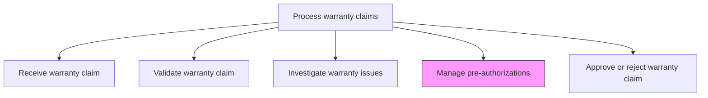
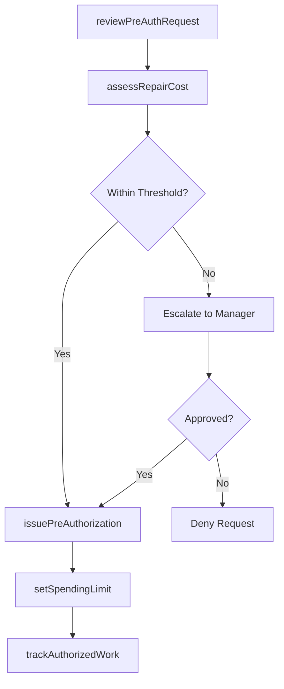

# Manage pre-authorizations

> Business-as-Code definition for warranty pre-authorization management. Models the review, approval, and tracking of pre-authorized repairs and replacements before warranty work is performed.

## Overview

Managing the pre-authorization process for warranty service activities. Evaluate repair or replacement requests against warranty coverage and cost thresholds, issue pre-authorization numbers, set spending limits, and track authorized work against approved amounts before service is performed.

## Process Hierarchy



## GraphDL

```yaml
manage:
  object: Pre-authorizations
  actor: WarrantyManager
  result: PreAuthorizationRecord
```

## Actions

| Action | Description |
|--------|-------------|
| reviewPreAuthRequest | Evaluate the pre-authorization request against warranty terms and coverage limits |
| assessRepairCost | Estimate repair or replacement cost and compare against authorization thresholds |
| issuePreAuthorization | Grant pre-authorization with approved scope and spending limit |
| setSpendingLimit | Define the maximum reimbursable amount for the pre-authorized warranty work |
| trackAuthorizedWork | Monitor work performed against the pre-authorized scope and budget |

## Events

| Event | Description |
|-------|-------------|
| preAuthRequestReviewed | Pre-authorization request evaluated against warranty terms |
| repairCostAssessed | Estimated repair cost calculated and compared to thresholds |
| preAuthorizationIssued | Pre-authorization number granted with approved scope |
| spendingLimitSet | Maximum reimbursable amount defined for warranty work |
| authorizedWorkTracked | Work progress monitored against pre-authorized scope |

## Searches

| Search | Description |
|--------|-------------|
| getPendingPreAuths | List pre-authorization requests awaiting review |
| getPreAuthByNumber | Retrieve pre-authorization details by authorization number |
| getAuthorizationHistory | Query historical pre-authorizations by dealer, product, or time period |
| getSpendingAgainstAuth | Retrieve spending to date against a pre-authorization limit |

## Process Flow



## RACI Matrix

| Activity | Responsible | Accountable | Consulted | Informed |
|----------|-------------|-------------|-----------|----------|
| reviewPreAuthRequest | Warranty Claims Agent | Warranty Manager | Service Center | Customer |
| assessRepairCost | Service Technician | Warranty Manager | Parts Department | Finance |
| issuePreAuthorization | Warranty Manager | After-Sales Director | Legal | Service Provider |
| setSpendingLimit | Warranty Manager | After-Sales Director | Finance | Claims Agent |
| trackAuthorizedWork | Warranty Claims Agent | Warranty Manager | Service Center | Finance |

## Related Processes

| Process | Relationship |
|---------|-------------|
| 6.3.2.2 Validate warranty claim | Upstream - validated claims may require pre-authorization |
| 6.3.2.6 Approve or reject warranty claim | Downstream - pre-authorization informs claim decision |
| 6.3.2.8 Authorize payment | Downstream - pre-authorized amounts set payment limits |

## Related Departments

| Department | Role |
|-----------|------|
| Warranty Administration | Reviews and issues pre-authorizations |
| Service Operations | Provides repair cost estimates and performs authorized work |
| Finance | Monitors pre-authorization spending and budget impact |

## Related Occupations

| Occupation | Involvement |
|-----------|-------------|
| Warranty Manager | Approves pre-authorization requests and sets spending limits |
| Service Coordinator | Submits pre-authorization requests and tracks authorized work |
| Financial Analyst | Monitors warranty pre-authorization spending trends |

## KPIs

| KPI | Description | Unit |
|-----|-------------|------|
| Pre-Auth Turnaround Time | Average time from request to pre-authorization decision | Hours |
| Pre-Auth Utilization Rate | Percentage of pre-authorized amount actually spent | % |
| Pre-Auth Approval Rate | Percentage of pre-authorization requests approved | % |
| Threshold Escalation Rate | Percentage of requests exceeding auto-approval thresholds | % |

## Usage

```typescript
import { managePreAuthorizations } from '@headlessly/manage-pre-authorizations'

const preAuth = managePreAuthorizations()

// Review a pre-authorization request
const review = await preAuth.reviewPreAuthRequest({
  claimId: 'WC-2025-1234',
  serviceCenter: 'SC-001',
  requestedRepair: 'motor-replacement',
  estimatedCost: 1250.00
})

// Issue pre-authorization
await preAuth.issuePreAuthorization({
  claimId: 'WC-2025-1234',
  approvedScope: 'motor-replacement',
  spendingLimit: 1500.00,
  validUntil: '2025-04-30'
})
```
