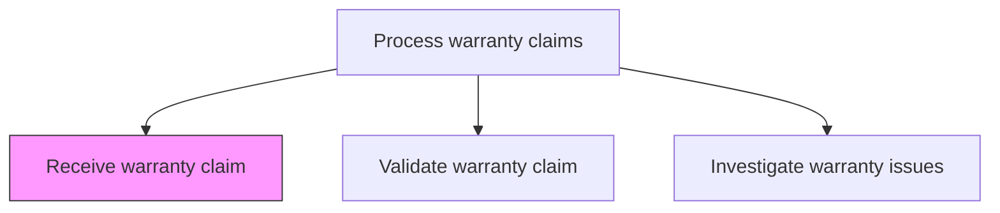
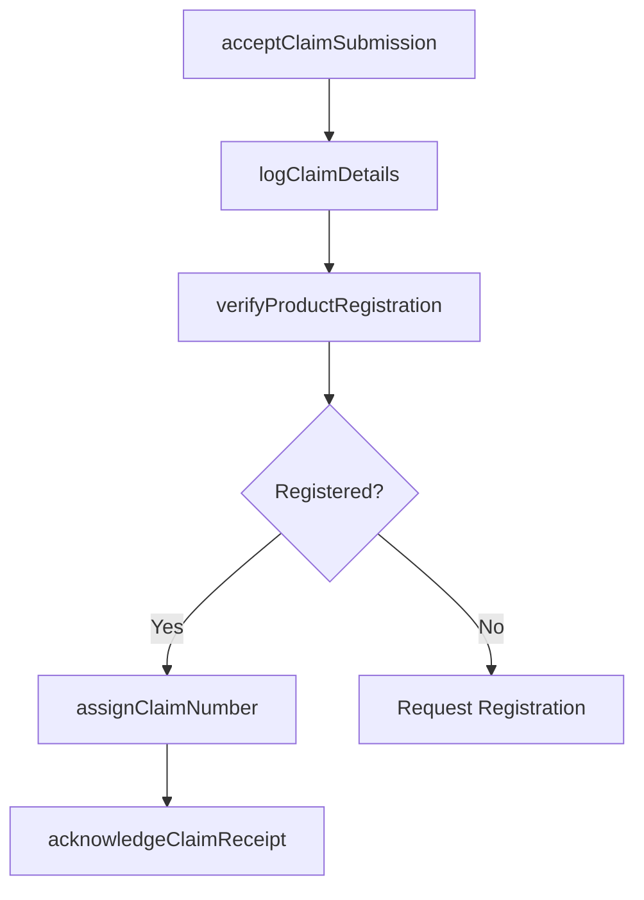

# Receive warranty claim

> Business-as-Code definition for warranty claim intake. Models the receipt, logging, initial review, and acknowledgment of warranty claims submitted by customers or authorized dealers.

## Overview

Accepting and logging warranty claims from customers or authorized service providers. Capture claim details including product information, defect description, purchase and warranty dates, and supporting documentation. Acknowledge receipt and initiate the validation process.

## Process Hierarchy



## GraphDL

```yaml
receive:
  object: Warranty Claim
  actor: WarrantyClaimsAgent
  result: WarrantyClaimRecord
```

## Actions

| Action | Description |
|--------|-------------|
| acceptClaimSubmission | Receive the warranty claim from the customer, dealer, or service provider |
| logClaimDetails | Record claim information including product, defect, and supporting documentation |
| verifyProductRegistration | Confirm the product is registered and warranty coverage is active |
| acknowledgeClaimReceipt | Notify the claimant that the warranty claim has been received |
| assignClaimNumber | Generate and assign a unique claim tracking number |

## Events

| Event | Description |
|-------|-------------|
| claimSubmissionAccepted | Warranty claim received from claimant |
| claimDetailsLogged | Claim details recorded in warranty management system |
| productRegistrationVerified | Product registration and warranty status confirmed |
| claimReceiptAcknowledged | Receipt acknowledgment sent to claimant |
| claimNumberAssigned | Unique claim tracking number generated |

## Searches

| Search | Description |
|--------|-------------|
| getIncomingClaims | List newly received warranty claims by date, product, or channel |
| getClaimByNumber | Retrieve claim details by claim tracking number |
| getProductWarrantyStatus | Query warranty coverage status for a specific product serial number |
| getClaimantHistory | Retrieve prior warranty claims from the same customer or dealer |

## Process Flow



## RACI Matrix

| Activity | Responsible | Accountable | Consulted | Informed |
|----------|-------------|-------------|-----------|----------|
| acceptClaimSubmission | Warranty Claims Agent | Warranty Manager | IT Systems | Customer |
| logClaimDetails | Warranty Claims Agent | Warranty Manager | Knowledge Base | Quality |
| verifyProductRegistration | Warranty Claims Agent | Warranty Manager | Registration Database | After-Sales Manager |
| acknowledgeClaimReceipt | Warranty Claims Agent | Warranty Manager | Communications | Customer |

## Related Processes

| Process | Relationship |
|---------|-------------|
| 6.3.2.2 Validate warranty claim | Downstream - received claims proceed to validation |
| 6.3.1 Register products | Upstream - registration enables warranty claim eligibility |
| 6.2.2.1 Receive customer problems, requests, and inquiries | Parallel - warranty claims may originate from service inquiries |

## Related Departments

| Department | Role |
|-----------|------|
| Warranty Administration | Receives and logs warranty claims |
| Customer Service | Assists customers with claim submission |
| Information Technology | Maintains warranty claim management systems |

## Related Occupations

| Occupation | Involvement |
|-----------|-------------|
| Warranty Claims Agent | Receives and logs incoming warranty claims |
| Customer Service Representative | Assists customers with warranty claim submission |

## KPIs

| KPI | Description | Unit |
|-----|-------------|------|
| Claim Receipt Time | Average time from claim submission to acknowledgment | Hours |
| Claim Logging Accuracy | Percentage of claims with complete and accurate details at intake | % |
| Claim Volume | Number of warranty claims received per period | Count |

## Usage

```typescript
import { receiveWarrantyClaim } from '@headlessly/receive-warranty-claim'

const claims = receiveWarrantyClaim()

// Accept a warranty claim
const claim = await claims.acceptClaimSubmission({
  serialNumber: 'SN-2025-98765',
  customerId: 'cust_12345',
  defectDescription: 'Motor overheating under normal operating conditions',
  claimType: 'manufacturer-defect',
  supportingDocs: ['photo-001.jpg', 'service-report.pdf']
})
```
