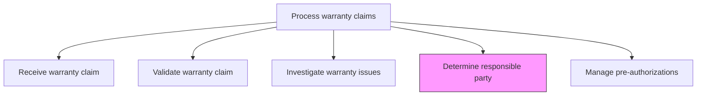
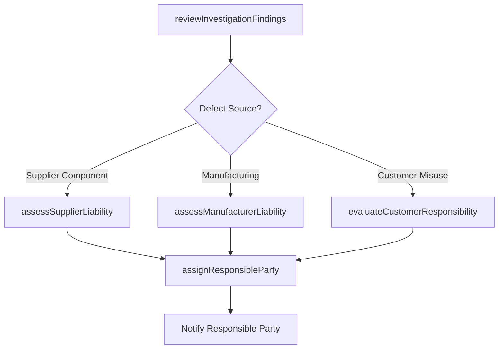

# Determine responsible party

> Business-as-Code definition for warranty liability assignment. Models the identification of the responsible party (manufacturer, supplier, dealer, or customer) for a warranty claim based on root cause analysis and contractual obligations.

## Overview

Identifying which party bears responsibility for the warranty issue based on investigation findings, contractual terms, and supply chain agreements. Evaluate whether the defect originated from manufacturing, supplier components, dealer handling, installation, or customer misuse to assign financial and remedial responsibility.

## Process Hierarchy



## GraphDL

```yaml
determine:
  object: Responsible Party
  actor: WarrantyAnalyst
  result: ResponsibilityAssignment
```

## Actions

| Action | Description |
|--------|-------------|
| reviewInvestigationFindings | Examine root cause analysis results to identify the source of the defect |
| assessSupplierLiability | Evaluate whether the defect originated from a supplier-provided component |
| assessManufacturerLiability | Determine whether the defect is attributable to manufacturing processes |
| evaluateCustomerResponsibility | Assess whether customer misuse or unauthorized modification caused the issue |
| assignResponsibleParty | Formally designate the party responsible for the warranty obligation |

## Events

| Event | Description |
|-------|-------------|
| investigationFindingsReviewed | Root cause analysis results examined for liability determination |
| supplierLiabilityAssessed | Supplier component responsibility evaluated |
| manufacturerLiabilityAssessed | Manufacturing process responsibility evaluated |
| customerResponsibilityEvaluated | Customer misuse or modification assessment completed |
| responsiblePartyAssigned | Responsible party formally designated for the claim |

## Searches

| Search | Description |
|--------|-------------|
| getResponsibilityAssignments | List responsibility assignments by party type, product, or period |
| getSupplierLiabilityHistory | Retrieve liability history for a specific supplier |
| getDefectSourceDistribution | Query distribution of defect sources across claims |
| getResponsiblePartyByClaimId | Retrieve the assigned responsible party for a specific claim |

## Process Flow



## RACI Matrix

| Activity | Responsible | Accountable | Consulted | Informed |
|----------|-------------|-------------|-----------|----------|
| reviewInvestigationFindings | Warranty Analyst | Warranty Manager | Quality Engineering | After-Sales Director |
| assessSupplierLiability | Warranty Analyst | Warranty Manager | Procurement | Supplier |
| assessManufacturerLiability | Quality Engineer | Warranty Manager | Manufacturing | VP Quality |
| evaluateCustomerResponsibility | Warranty Analyst | Warranty Manager | Service Technician | Customer |
| assignResponsibleParty | Warranty Manager | After-Sales Director | Legal | Finance |

## Related Processes

| Process | Relationship |
|---------|-------------|
| 6.3.2.3 Investigate warranty issues | Upstream - investigation findings inform responsibility determination |
| 6.3.2.6 Approve or reject warranty claim | Downstream - responsible party assignment informs claim decision |
| 6.3.3 Manage supplier recovery | Downstream - supplier-attributed claims trigger recovery process |

## Related Departments

| Department | Role |
|-----------|------|
| Warranty Administration | Conducts responsibility analysis and assigns liable party |
| Quality Engineering | Provides root cause analysis supporting responsibility determination |
| Procurement | Manages supplier agreements and liability terms |
| Legal | Advises on contractual liability and dispute resolution |

## Related Occupations

| Occupation | Involvement |
|-----------|-------------|
| Warranty Analyst | Analyzes investigation findings and recommends responsible party |
| Quality Engineer | Provides technical analysis of defect origin |
| Procurement Specialist | Interprets supplier contract terms for liability assessment |

## KPIs

| KPI | Description | Unit |
|-----|-------------|------|
| Responsibility Assignment Time | Average time from investigation completion to party assignment | Days |
| Supplier Attribution Rate | Percentage of claims attributed to supplier components | % |
| Responsibility Dispute Rate | Percentage of assignments contested by the designated party | % |
| Assignment Accuracy | Percentage of assignments upheld after dispute review | % |

## Usage

```typescript
import { determineResponsibleParty } from '@headlessly/determine-responsible-party'

const liability = determineResponsibleParty()

// Review investigation findings
const findings = await liability.reviewInvestigationFindings({
  claimId: 'WC-2025-1234',
  investigationId: 'INV-2025-567',
  rootCause: 'bearing-failure',
  defectSource: 'supplier-component'
})

// Assign responsible party
await liability.assignResponsibleParty({
  claimId: 'WC-2025-1234',
  responsibleParty: 'supplier',
  supplierId: 'SUP-200',
  liabilityBasis: 'component-defect-per-supply-agreement'
})
```
