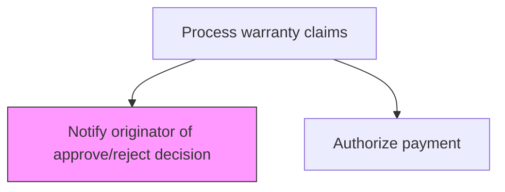
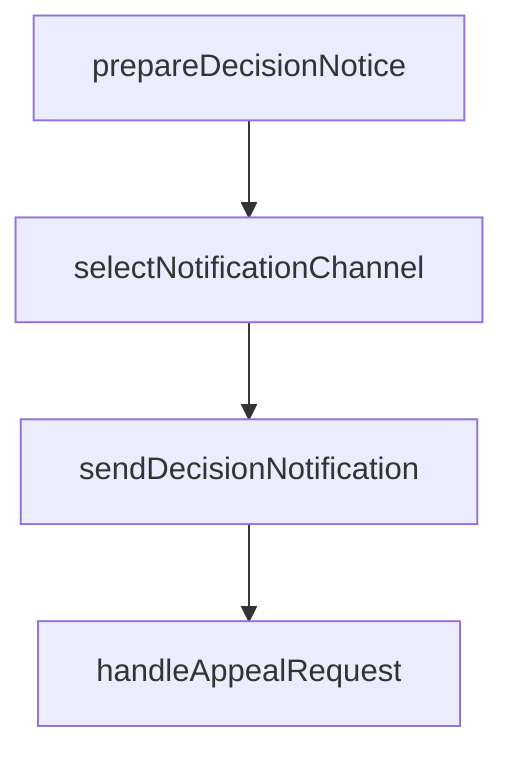

# Notify originator of approve/reject decision

> Business-as-Code definition for claim decision notification. Models the communication of warranty claim approval or rejection decisions to the originating customer or dealer.

## Overview

Communicating the warranty claim approval or rejection decision to the party that submitted the claim. Prepare the notification with decision reasoning, resolution details, and next steps. For approvals, provide information on authorized repairs or replacements. For rejections, include the basis for denial and available appeal or escalation options.

## Process Hierarchy



## GraphDL

```yaml
notify:
  object: Originator Of Approve/reject Decision
  actor: ClaimsNotificationSpecialist
  result: DecisionNotification
```

## Actions

| Action | Description |
|--------|-------------|
| prepareDecisionNotice | Draft the notification including decision rationale and next steps |
| selectNotificationChannel | Choose the appropriate communication channel for the claimant |
| sendDecisionNotification | Deliver the approval or rejection notice to the claim originator |
| handleAppealRequest | Process any appeals or disputes from claimants disagreeing with the decision |

## Events

| Event | Description |
|-------|-------------|
| preparedDecisionNotice | draft the notification including decision rationale and next steps completed |
| selectedNotificationChannel | choose the appropriate communication channel for the claimant completed |
| sendedDecisionNotification | deliver the approval or rejection notice to the claim originator completed |
| handledAppealRequest | process any appeals or disputes from claimants disagreeing with the decision completed |

## Searches

| Search | Description |
|--------|-------------|
| getPendingNotifications | List adjudicated claims awaiting customer notification |
| getNotificationTemplates | Retrieve notification templates by decision type |
| getAppealRequests | List appeals filed against claim decisions |

## Process Flow



## RACI Matrix

| Activity | Responsible | Accountable | Consulted | Informed |
|----------|-------------|-------------|-----------|----------|
| prepareDecisionNotice | Claims Notification Specialist | Manager | Quality | Customer Service |
| selectNotificationChannel | Claims Notification Specialist | Manager | Finance | Operations |
| sendDecisionNotification | Claims Notification Specialist | VP Customer Service | Legal | Executive Team |

## Related Processes

| Process | Relationship |
|---------|-------------|
| 6.3.2.6 Approve or reject warranty claim | Upstream - adjudication decision triggers notification |
| 6.3.2.8 Authorize payment | Downstream - approved claims proceed to payment |

## Related Departments

| Department | Role |
|-----------|------|
| Customer Service | Communicates claim decisions to customers |
| Warranty Administration | Manages notification processes and appeal handling |

## Related Occupations

| Occupation | Involvement |
|-----------|-------------|
| Claims Notification Specialist | Prepares and delivers decision notices |
| Customer Service Agent | Handles claimant inquiries about decisions |

## KPIs

| KPI | Description | Unit |
|-----|-------------|------|
| Notification Delivery Time | Average hours from decision to customer notification | Hours |
| Notification Accuracy | Percentage of notifications without errors | % |
| Appeal Rate | Percentage of decisions resulting in claimant appeals | % |

## Usage

```typescript
import { notifyOriginatorOfApproveRejectDecision } from '@headlessly/notify-originator-of-approve-reject-decision'

const client = notifyOriginatorOfApproveRejectDecision()

// Draft the notification including decision rationale and next steps
const result = await client.prepareDecisionNotice({
  claimId: 'WC-2025-001',
  productId: 'PRD-X200'
})

// Choose the appropriate communication channel for the claimant
await client.selectNotificationChannel({
  id: result.id
})
```
