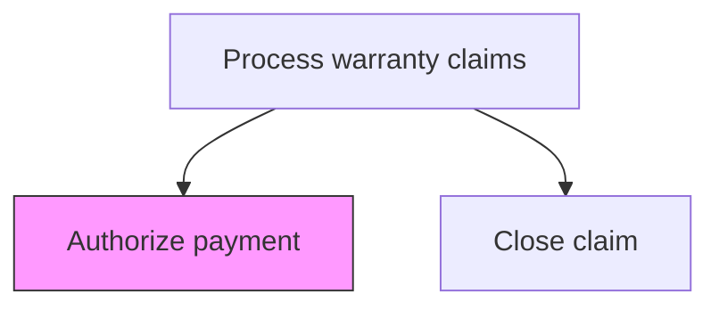
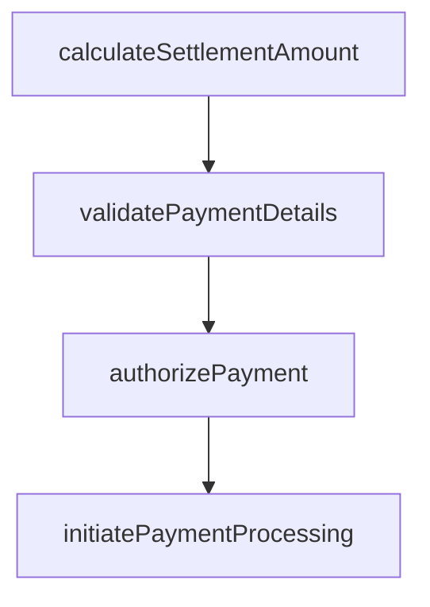

# Authorize payment

> Business-as-Code definition for warranty payment authorization. Models the approval and processing of financial settlements for approved warranty claims.

## Overview

Authorizing financial payments for approved warranty claims. Calculate the reimbursable amount based on warranty terms, pre-authorization limits, and actual repair or replacement costs. Verify payment details against the approved claim, obtain required approvals for payment release, and issue payment instructions to the accounts payable system.

## Process Hierarchy



## GraphDL

```yaml
authorize:
  object: Payment
  actor: PaymentAuthorizationSpecialist
  result: PaymentAuthorization
```

## Actions

| Action | Description |
|--------|-------------|
| calculateSettlementAmount | Determine the payment amount based on approved claim terms and coverage |
| validatePaymentDetails | Verify payee information, payment method, and financial coding |
| authorizePayment | Approve the payment for processing through accounts payable |
| initiatePaymentProcessing | Submit the authorized payment for disbursement |

## Events

| Event | Description |
|-------|-------------|
| calculatedSettlementAmount | determine the payment amount based on approved claim terms and coverage completed |
| validatedPaymentDetails | verify payee information, payment method, and financial coding completed |
| authorizedPayment | approve the payment for processing through accounts payable completed |
| initiatedPaymentProcessing | submit the authorized payment for disbursement completed |

## Searches

| Search | Description |
|--------|-------------|
| getPendingPayments | List approved claims awaiting payment authorization |
| getPaymentHistory | Retrieve payment records for a claimant or product line |
| getSettlementSummary | Query total settlement amounts by period or category |

## Process Flow



## RACI Matrix

| Activity | Responsible | Accountable | Consulted | Informed |
|----------|-------------|-------------|-----------|----------|
| calculateSettlementAmount | Payment Authorization Specialist | Manager | Quality | Customer Service |
| validatePaymentDetails | Payment Authorization Specialist | Manager | Finance | Operations |
| authorizePayment | Payment Authorization Specialist | VP Customer Service | Legal | Executive Team |

## Related Processes

| Process | Relationship |
|---------|-------------|
| 6.3.2.7 Notify originator of approve/reject decision | Upstream - approved claims proceed to payment |
| 6.3.2.9 Close claim | Downstream - payment triggers claim closure |

## Related Departments

| Department | Role |
|-----------|------|
| Finance | Authorizes and processes warranty claim payments |
| Warranty Administration | Validates settlement calculations |

## Related Occupations

| Occupation | Involvement |
|-----------|-------------|
| Payment Authorization Specialist | Reviews and approves warranty payments |
| Accounts Payable Analyst | Processes payment disbursements |

## KPIs

| KPI | Description | Unit |
|-----|-------------|------|
| Payment Processing Time | Average days from authorization to disbursement | Days |
| Payment Accuracy | Percentage of payments matching approved settlement terms | % |
| Cost Per Claim | Average payment amount per settled warranty claim | USD |

## Usage

```typescript
import { authorizePayment } from '@headlessly/authorize-payment'

const client = authorizePayment()

// Determine the payment amount based on approved claim terms and coverage
const result = await client.calculateSettlementAmount({
  claimId: 'WC-2025-001',
  productId: 'PRD-X200'
})

// Verify payee information, payment method, and financial coding
await client.validatePaymentDetails({
  id: result.id
})
```
