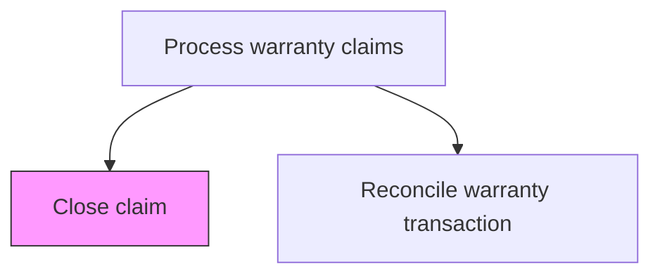
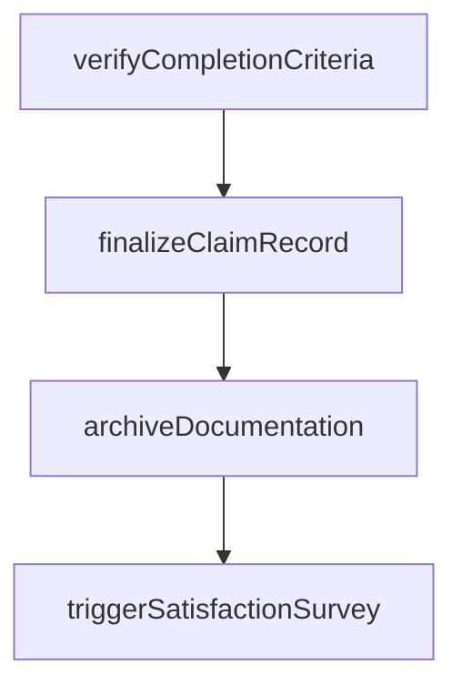

# Close claim

> Business-as-Code definition for warranty claim closure. Models the finalization, documentation, and archival of completed warranty claims.

## Overview

Finalizing and closing warranty claims after all remedial actions, payments, and notifications have been completed. Verify that all claim activities are resolved, confirm customer satisfaction, archive claim documentation, and update warranty records to reflect the completed claim.

## Process Hierarchy



## GraphDL

```yaml
close:
  object: Claim
  actor: ClaimsClosureSpecialist
  result: ClosedClaimRecord
```

## Actions

| Action | Description |
|--------|-------------|
| verifyCompletionCriteria | Confirm all claim activities, payments, and remedies are complete |
| finalizeClaimRecord | Update the claim record with final resolution details and outcomes |
| archiveDocumentation | Store all claim documentation and evidence for retention compliance |
| triggerSatisfactionSurvey | Initiate customer satisfaction survey for the warranty experience |

## Events

| Event | Description |
|-------|-------------|
| verifiedCompletionCriteria | confirm all claim activities, payments, and remedies are complete completed |
| finalizedClaimRecord | update the claim record with final resolution details and outcomes completed |
| archivedDocumentation | store all claim documentation and evidence for retention compliance completed |
| triggeredSatisfactionSurvey | initiate customer satisfaction survey for the warranty experience completed |

## Searches

| Search | Description |
|--------|-------------|
| getClaimsReadyForClosure | List claims with all activities completed awaiting closure |
| getClaimDocumentation | Retrieve complete documentation package for a claim |
| getClosureMetrics | Query claim closure rates and cycle times by period |

## Process Flow



## RACI Matrix

| Activity | Responsible | Accountable | Consulted | Informed |
|----------|-------------|-------------|-----------|----------|
| verifyCompletionCriteria | Claims Closure Specialist | Manager | Quality | Customer Service |
| finalizeClaimRecord | Claims Closure Specialist | Manager | Finance | Operations |
| archiveDocumentation | Claims Closure Specialist | VP Customer Service | Legal | Executive Team |

## Related Processes

| Process | Relationship |
|---------|-------------|
| 6.3.2.8 Authorize payment | Upstream - payment completion enables claim closure |
| 6.3.2.10 Reconcile warranty transaction disposition | Downstream - closed claims are reconciled |

## Related Departments

| Department | Role |
|-----------|------|
| Warranty Administration | Manages claim closure and record finalization |
| Quality Assurance | Reviews claim outcomes for quality trends |

## Related Occupations

| Occupation | Involvement |
|-----------|-------------|
| Claims Closure Specialist | Verifies completion and finalizes claim records |
| Quality Analyst | Reviews closed claims for improvement insights |

## KPIs

| KPI | Description | Unit |
|-----|-------------|------|
| Claim Closure Cycle Time | Average days from last activity to closure | Days |
| Closure Completeness | Percentage of claims closed with all documentation complete | % |
| Survey Response Rate | Percentage of closed claims generating satisfaction survey responses | % |

## Usage

```typescript
import { closeClaim } from '@headlessly/close-claim'

const client = closeClaim()

// Confirm all claim activities, payments, and remedies are complete
const result = await client.verifyCompletionCriteria({
  claimId: 'WC-2025-001',
  productId: 'PRD-X200'
})

// Update the claim record with final resolution details and outcomes
await client.finalizeClaimRecord({
  id: result.id
})
```
