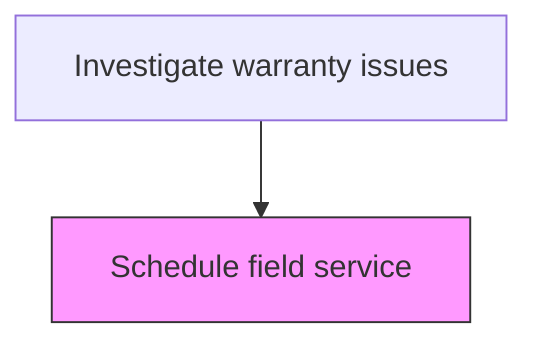
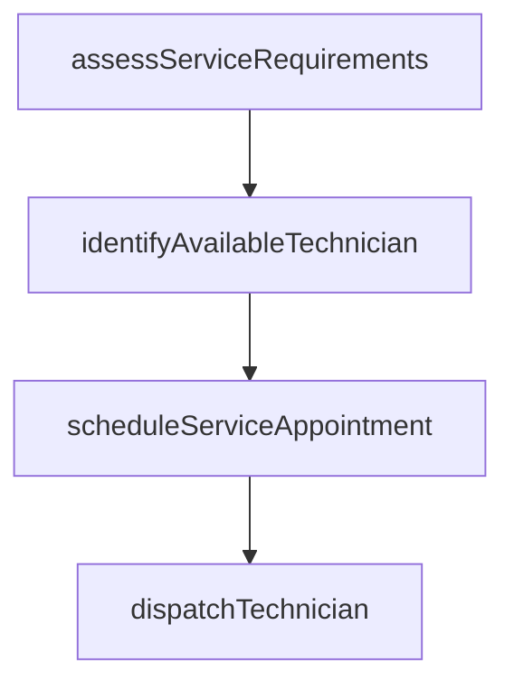

# Schedule field service

> Business-as-Code definition for warranty field service scheduling. Models the planning, assignment, and dispatch of field service technicians for on-site warranty investigations and repairs.

## Overview

Scheduling additional investigative field service. This is performed for high priority claims or claims that require additional investigation. Field service engineers will gather additional information, perform further investigation, and qualify the definition of the issue.

## Process Hierarchy



## GraphDL

```yaml
schedule:
  object: Field Service
  actor: FieldServiceScheduler
  result: FieldServiceAppointment
```

## Actions

| Action | Description |
|--------|-------------|
| assessServiceRequirements | Determine the type of field service needed based on claim details |
| identifyAvailableTechnician | Find a qualified technician with availability in the customer area |
| scheduleServiceAppointment | Book the on-site visit with the customer and assign the technician |
| dispatchTechnician | Confirm dispatch and provide the technician with case details and parts |

## Events

| Event | Description |
|-------|-------------|
| assessServiceRequirementsCompleted | determine the type of field service needed based on claim details completed |
| identifyAvailableTechnicianCompleted | find a qualified technician with availability in the customer area completed |
| scheduleServiceAppointmentCompleted | book the on-site visit with the customer and assign the technician completed |
| dispatchTechnicianCompleted | confirm dispatch and provide the technician with case details and parts completed |

## Searches

| Search | Description |
|--------|-------------|
| getOpenItems | List items in progress by status or priority |
| getItemDetails | Retrieve details for a specific record |
| getItemHistory | Query history for a product or claim |

## Process Flow



## RACI Matrix

| Activity | Responsible | Accountable | Consulted | Informed |
|----------|-------------|-------------|-----------|----------|
| assessServiceRequirements | Field Service Scheduler | Warranty Manager | Quality | Customer |
| scheduleServiceAppointment | Field Service Scheduler | Warranty Manager | Engineering | Finance |

## Related Processes

| Process | Relationship |
|---------|-------------|
| 6.3.2 Process warranty claims | Parent - part of warranty claims processing lifecycle |
| 6.3.2.4 Determine responsible party | Downstream - investigation results inform responsibility |

## Related Departments

| Department | Role |
|-----------|------|
| Warranty Administration | Coordinates warranty investigation activities |
| Quality Engineering | Provides technical investigation support |
| Field Service | Executes on-site service and part retrieval |

## Related Occupations

| Occupation | Involvement |
|-----------|-------------|
| Field Service Scheduler | Primary executor of this activity |
| Quality Engineer | Provides technical analysis support |

## KPIs

| KPI | Description | Unit |
|-----|-------------|------|
| Cycle Time | Average days to complete this activity | Days |
| Quality Score | Accuracy and completeness rating | % |
| Throughput | Number of items processed per period | Count |

## Usage

```typescript
import { scheduleFieldService } from '@headlessly/schedule-field-service'

const client = scheduleFieldService()

// Determine the type of field service needed based on claim details
const result = await client.assessServiceRequirements({
  claimId: 'WC-2025-001'
})

// Find a qualified technician with availability in the customer area
await client.identifyAvailableTechnician({
  id: result.id
})
```
