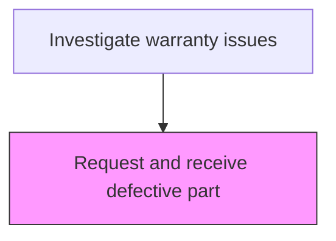
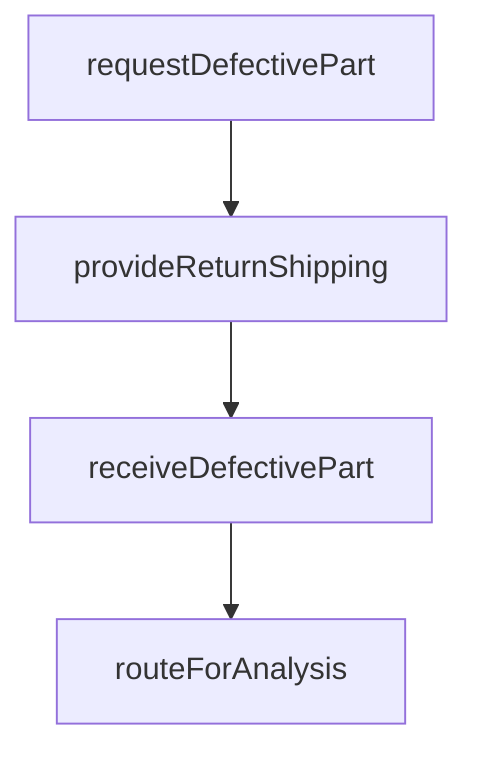

# Request and receive defective part

> Business-as-Code definition for defective part request and receipt. Models the process of requesting return of defective components from customers and receiving them for analysis.

## Overview

Requesting receipt of a defective part for further investigation.

## Process Hierarchy



## GraphDL

```yaml
request:
  object: And Receive Defective Part
  actor: PartsReturnCoordinator
  result: DefectivePartReceipt
```

## Actions

| Action | Description |
|--------|-------------|
| requestDefectivePart | Send instructions to the customer for returning the defective component |
| provideReturnShipping | Arrange prepaid shipping for the defective part return |
| receiveDefectivePart | Log receipt of the returned defective component at the analysis facility |
| routeForAnalysis | Send the received part to the appropriate laboratory or engineering team |

## Events

| Event | Description |
|-------|-------------|
| requestDefectivePartCompleted | send instructions to the customer for returning the defective component completed |
| provideReturnShippingCompleted | arrange prepaid shipping for the defective part return completed |
| receiveDefectivePartCompleted | log receipt of the returned defective component at the analysis facility completed |
| routeForAnalysisCompleted | send the received part to the appropriate laboratory or engineering team completed |

## Searches

| Search | Description |
|--------|-------------|
| getOpenItems | List items in progress by status or priority |
| getItemDetails | Retrieve details for a specific record |
| getItemHistory | Query history for a product or claim |

## Process Flow



## RACI Matrix

| Activity | Responsible | Accountable | Consulted | Informed |
|----------|-------------|-------------|-----------|----------|
| requestDefectivePart | Parts Return Coordinator | Warranty Manager | Quality | Customer |
| receiveDefectivePart | Parts Return Coordinator | Warranty Manager | Engineering | Finance |

## Related Processes

| Process | Relationship |
|---------|-------------|
| 6.3.2 Process warranty claims | Parent - part of warranty claims processing lifecycle |
| 6.3.2.4 Determine responsible party | Downstream - investigation results inform responsibility |

## Related Departments

| Department | Role |
|-----------|------|
| Warranty Administration | Coordinates warranty investigation activities |
| Quality Engineering | Provides technical investigation support |
| Field Service | Executes on-site service and part retrieval |

## Related Occupations

| Occupation | Involvement |
|-----------|-------------|
| Parts Return Coordinator | Primary executor of this activity |
| Quality Engineer | Provides technical analysis support |

## KPIs

| KPI | Description | Unit |
|-----|-------------|------|
| Cycle Time | Average days to complete this activity | Days |
| Quality Score | Accuracy and completeness rating | % |
| Throughput | Number of items processed per period | Count |

## Usage

```typescript
import { requestAndReceiveDefectivePart } from '@headlessly/request-and-receive-defective-part'

const client = requestAndReceiveDefectivePart()

// Send instructions to the customer for returning the defective component
const result = await client.requestDefectivePart({
  claimId: 'WC-2025-001'
})

// Arrange prepaid shipping for the defective part return
await client.provideReturnShipping({
  id: result.id
})
```
