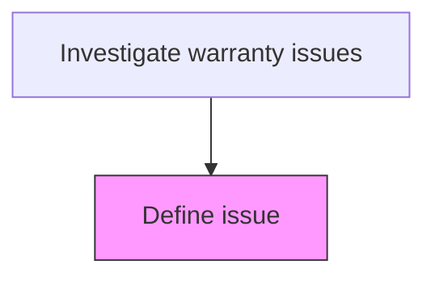
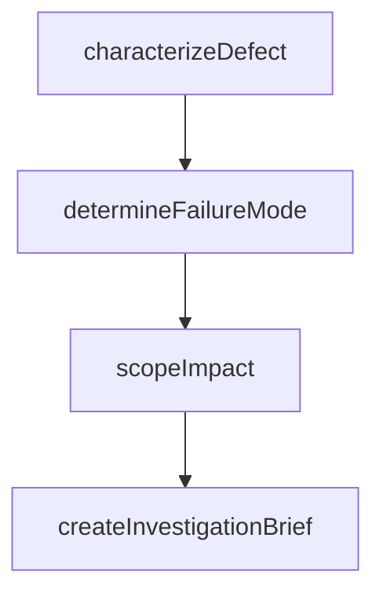

# Define issue

> Business-as-Code definition for warranty issue definition. Models the precise characterization and scoping of the warranty defect or failure for investigation.

## Overview

Precisely characterizing and scoping the warranty defect or failure to guide the investigation process. Document the specific symptoms, failure conditions, affected components, and scope of impact to create a structured investigation brief that enables efficient root cause analysis.

## Process Hierarchy



## GraphDL

```yaml
define:
  object: Issue
  actor: IssueDefinitionSpecialist
  result: IssueDefinitionDocument
```

## Actions

| Action | Description |
|--------|-------------|
| characterizeDefect | Document the specific nature, symptoms, and conditions of the reported defect |
| determineFailureMode | Identify the type of failure and affected components |
| scopeImpact | Assess whether the issue affects a single unit or broader product population |
| createInvestigationBrief | Compile the issue definition into a structured brief for investigators |

## Events

| Event | Description |
|-------|-------------|
| characterizeDefectCompleted | document the specific nature, symptoms, and conditions of the reported defect completed |
| determineFailureModeCompleted | identify the type of failure and affected components completed |
| scopeImpactCompleted | assess whether the issue affects a single unit or broader product population completed |
| createInvestigationBriefCompleted | compile the issue definition into a structured brief for investigators completed |

## Searches

| Search | Description |
|--------|-------------|
| getOpenItems | List items in progress by status or priority |
| getItemDetails | Retrieve details for a specific record |
| getItemHistory | Query history for a product or claim |

## Process Flow



## RACI Matrix

| Activity | Responsible | Accountable | Consulted | Informed |
|----------|-------------|-------------|-----------|----------|
| characterizeDefect | Issue Definition Specialist | Warranty Manager | Quality | Customer |
| scopeImpact | Issue Definition Specialist | Warranty Manager | Engineering | Finance |

## Related Processes

| Process | Relationship |
|---------|-------------|
| 6.3.2 Process warranty claims | Parent - part of warranty claims processing lifecycle |
| 6.3.2.4 Determine responsible party | Downstream - investigation results inform responsibility |

## Related Departments

| Department | Role |
|-----------|------|
| Warranty Administration | Coordinates warranty investigation activities |
| Quality Engineering | Provides technical investigation support |
| Field Service | Executes on-site service and part retrieval |

## Related Occupations

| Occupation | Involvement |
|-----------|-------------|
| Issue Definition Specialist | Primary executor of this activity |
| Quality Engineer | Provides technical analysis support |

## KPIs

| KPI | Description | Unit |
|-----|-------------|------|
| Cycle Time | Average days to complete this activity | Days |
| Quality Score | Accuracy and completeness rating | % |
| Throughput | Number of items processed per period | Count |

## Usage

```typescript
import { defineIssue } from '@headlessly/define-issue'

const client = defineIssue()

// Document the specific nature, symptoms, and conditions of the reported defect
const result = await client.characterizeDefect({
  claimId: 'WC-2025-001'
})

// Identify the type of failure and affected components
await client.determineFailureMode({
  id: result.id
})
```
