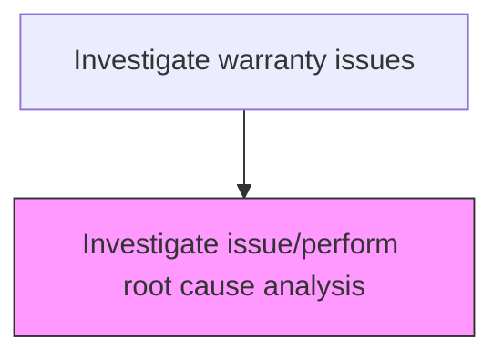
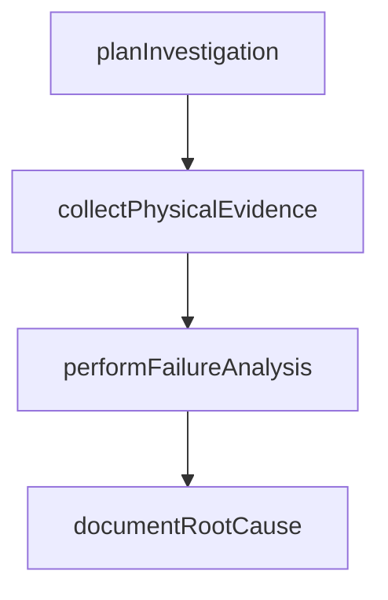

# Investigate issue/perform root cause analysis

> Business-as-Code definition for warranty root cause investigation. Models the systematic analysis of warranty defects to determine underlying causes and recommend corrective actions.

## Overview

Conducting systematic root cause analysis of warranty defects to identify the underlying cause of product failures. Plan the investigation scope and methodology, collect physical evidence including failed components and test data, apply engineering analysis methods such as fault tree analysis or fishbone diagrams, and document the confirmed root cause with supporting evidence.

## Process Hierarchy



## GraphDL

```yaml
investigate:
  object: Issue/perform Root Cause Analysis
  actor: RootCauseInvestigator
  result: RootCauseAnalysisReport
```

## Actions

| Action | Description |
|--------|-------------|
| planInvestigation | Define investigation scope, methodology, and resource requirements |
| collectPhysicalEvidence | Gather product samples, failed components, and test data |
| performFailureAnalysis | Apply engineering analysis methods to determine root cause |
| documentRootCause | Record the confirmed root cause with supporting evidence and analysis |

## Events

| Event | Description |
|-------|-------------|
| planInvestigationCompleted | define investigation scope, methodology, and resource requirements completed |
| collectPhysicalEvidenceCompleted | gather product samples, failed components, and test data completed |
| performFailureAnalysisCompleted | apply engineering analysis methods to determine root cause completed |
| documentRootCauseCompleted | record the confirmed root cause with supporting evidence and analysis completed |

## Searches

| Search | Description |
|--------|-------------|
| getOpenItems | List items in progress by status or priority |
| getItemDetails | Retrieve details for a specific record |
| getItemHistory | Query history for a product or claim |

## Process Flow



## RACI Matrix

| Activity | Responsible | Accountable | Consulted | Informed |
|----------|-------------|-------------|-----------|----------|
| planInvestigation | Root Cause Investigator | Warranty Manager | Quality | Customer |
| performFailureAnalysis | Root Cause Investigator | Warranty Manager | Engineering | Finance |

## Related Processes

| Process | Relationship |
|---------|-------------|
| 6.3.2 Process warranty claims | Parent - part of warranty claims processing lifecycle |
| 6.3.2.4 Determine responsible party | Downstream - investigation results inform responsibility |

## Related Departments

| Department | Role |
|-----------|------|
| Warranty Administration | Coordinates warranty investigation activities |
| Quality Engineering | Provides technical investigation support |
| Field Service | Executes on-site service and part retrieval |

## Related Occupations

| Occupation | Involvement |
|-----------|-------------|
| Root Cause Investigator | Primary executor of this activity |
| Quality Engineer | Provides technical analysis support |

## KPIs

| KPI | Description | Unit |
|-----|-------------|------|
| Cycle Time | Average days to complete this activity | Days |
| Quality Score | Accuracy and completeness rating | % |
| Throughput | Number of items processed per period | Count |

## Usage

```typescript
import { investigateIssuePerformRootCauseAnalysis } from '@headlessly/investigate-issue-perform-root-cause-analysis'

const client = investigateIssuePerformRootCauseAnalysis()

// Define investigation scope, methodology, and resource requirements
const result = await client.planInvestigation({
  claimId: 'WC-2025-001'
})

// Gather product samples, failed components, and test data
await client.collectPhysicalEvidence({
  id: result.id
})
```
