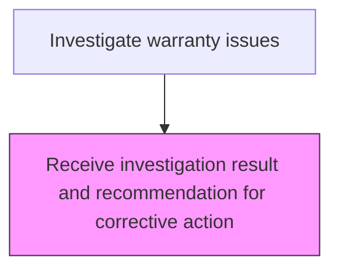
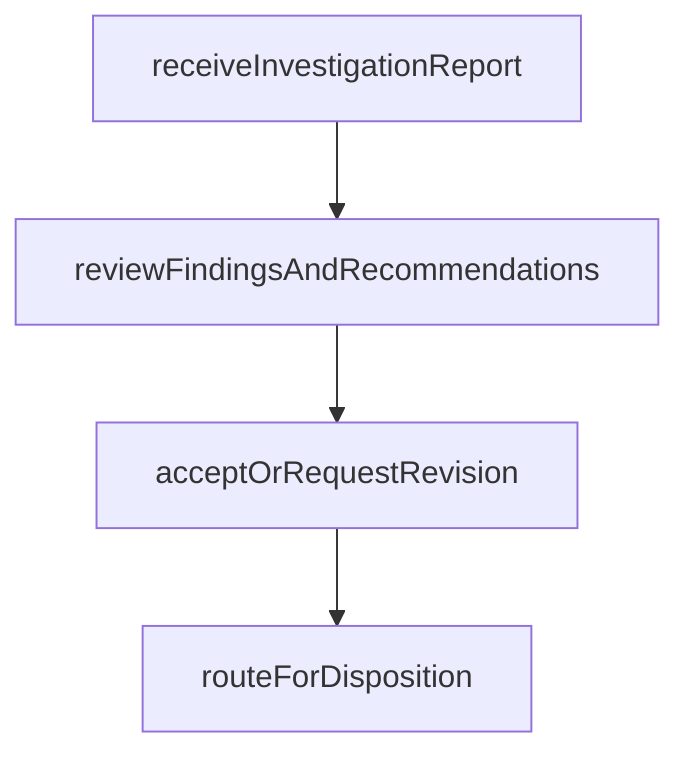

# Receive investigation result and recommendation for corrective action

> Business-as-Code definition for receiving investigation results and corrective action recommendations. Models the review, acceptance, and routing of investigation findings for warranty claim disposition.

## Overview

Receiving and reviewing completed investigation reports and corrective action recommendations from the analysis team. Evaluate the root cause determination for completeness and accuracy, assess the feasibility and appropriateness of proposed corrective actions, and route accepted results to the claim adjudication process for disposition.

## Process Hierarchy



## GraphDL

```yaml
receive:
  object: Investigation Result And Recommendation For Corrective Action
  actor: InvestigationReviewManager
  result: InvestigationResultAcceptance
```

## Actions

| Action | Description |
|--------|-------------|
| receiveInvestigationReport | Accept the completed investigation report from the analysis team |
| reviewFindingsAndRecommendations | Evaluate the root cause determination and proposed corrective actions |
| acceptOrRequestRevision | Approve findings or request additional investigation work |
| routeForDisposition | Forward accepted results to the claim adjudication process |

## Events

| Event | Description |
|-------|-------------|
| receiveInvestigationReportCompleted | accept the completed investigation report from the analysis team completed |
| reviewFindingsAndRecommendationsCompleted | evaluate the root cause determination and proposed corrective actions completed |
| acceptOrRequestRevisionCompleted | approve findings or request additional investigation work completed |
| routeForDispositionCompleted | forward accepted results to the claim adjudication process completed |

## Searches

| Search | Description |
|--------|-------------|
| getOpenItems | List items in progress by status or priority |
| getItemDetails | Retrieve details for a specific record |
| getItemHistory | Query history for a product or claim |

## Process Flow



## RACI Matrix

| Activity | Responsible | Accountable | Consulted | Informed |
|----------|-------------|-------------|-----------|----------|
| receiveInvestigationReport | Investigation Review Manager | Warranty Manager | Quality | Customer |
| acceptOrRequestRevision | Investigation Review Manager | Warranty Manager | Engineering | Finance |

## Related Processes

| Process | Relationship |
|---------|-------------|
| 6.3.2 Process warranty claims | Parent - part of warranty claims processing lifecycle |
| 6.3.2.4 Determine responsible party | Downstream - investigation results inform responsibility |

## Related Departments

| Department | Role |
|-----------|------|
| Warranty Administration | Coordinates warranty investigation activities |
| Quality Engineering | Provides technical investigation support |
| Field Service | Executes on-site service and part retrieval |

## Related Occupations

| Occupation | Involvement |
|-----------|-------------|
| Investigation Review Manager | Primary executor of this activity |
| Quality Engineer | Provides technical analysis support |

## KPIs

| KPI | Description | Unit |
|-----|-------------|------|
| Cycle Time | Average days to complete this activity | Days |
| Quality Score | Accuracy and completeness rating | % |
| Throughput | Number of items processed per period | Count |

## Usage

```typescript
import { receiveInvestigationResultAndRecommendationForCorrectiveAction } from '@headlessly/receive-investigation-result-and-recommendation-for-corrective-action'

const client = receiveInvestigationResultAndRecommendationForCorrectiveAction()

// Accept the completed investigation report from the analysis team
const result = await client.receiveInvestigationReport({
  claimId: 'WC-2025-001'
})

// Evaluate the root cause determination and proposed corrective actions
await client.reviewFindingsAndRecommendations({
  id: result.id
})
```
