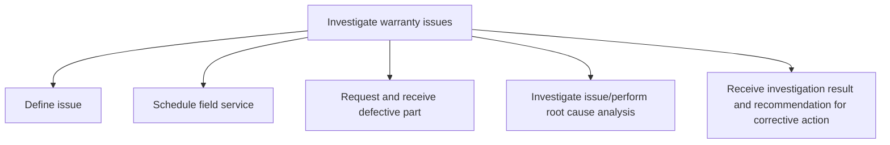
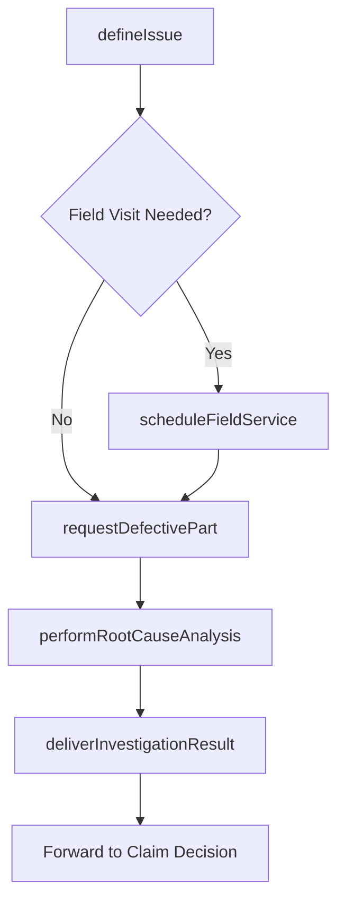

# Investigate warranty issues

> Business-as-Code definition for warranty issue investigation. Models issue definition, field service scheduling, defective part retrieval, root cause analysis, and corrective action recommendation.

## Overview

Investigating warranty claims that require deeper technical analysis. Define the reported issue, dispatch field service technicians for on-site investigation, retrieve defective parts for laboratory analysis, perform root cause determination, and deliver investigation findings with corrective action recommendations.

## Process Hierarchy



## GraphDL

```yaml
investigate:
  object: Warranty Issues
  actor: WarrantyEngineer
  result: InvestigationReport
```

## Actions

| Action | Description |
|--------|-------------|
| defineIssue | Document the reported warranty issue with symptoms, product details, and failure conditions |
| scheduleFieldService | Dispatch field service technician for on-site investigation of warranty claim |
| requestDefectivePart | Initiate retrieval of failed component for laboratory analysis |
| performRootCauseAnalysis | Conduct technical investigation to determine the underlying cause of failure |
| deliverInvestigationResult | Compile findings and corrective action recommendations into investigation report |

## Events

| Event | Description |
|-------|-------------|
| issueDefined | Warranty issue documented with failure details and scope |
| fieldServiceScheduled | Field technician dispatched for on-site investigation |
| defectivePartReceived | Failed component retrieved and received for analysis |
| rootCauseAnalysisPerformed | Technical root cause investigation completed |
| investigationResultDelivered | Investigation report with corrective actions submitted |

## Searches

| Search | Description |
|--------|-------------|
| getOpenInvestigations | List active warranty investigations by product, priority, or status |
| getInvestigationReport | Retrieve completed investigation findings and recommendations |
| getFieldServiceSchedule | Query scheduled field service visits by technician or region |
| getRootCauseHistory | Retrieve past root cause findings for similar product issues |

## Process Flow



## RACI Matrix

| Activity | Responsible | Accountable | Consulted | Informed |
|----------|-------------|-------------|-----------|----------|
| defineIssue | Warranty Analyst | Warranty Manager | Field Service | Customer |
| scheduleFieldService | Field Service Coordinator | Warranty Manager | Customer | Warranty Analyst |
| requestDefectivePart | Warranty Analyst | Warranty Manager | Logistics | Quality Engineering |
| performRootCauseAnalysis | Warranty Engineer | Quality Manager | Product Engineering | Warranty Manager |
| deliverInvestigationResult | Warranty Engineer | Quality Manager | Warranty Manager | Claims Processor |

## Sub-Processes

| ID | Name | Description |
|----|------|-------------|
| 6.3.2.3.1 | Define issue | Documenting the warranty issue with product details, failure symptoms, and operating conditions |
| 6.3.2.3.2 | Schedule field service | Scheduling additional investigative field service. This is performed for high priority claims or cla |
| 6.3.2.3.3 | Request and receive defective part | Requesting receipt of a defective part for further investigation. |
| 6.3.2.3.4 | Investigate issue/perform root cause analysis | Conducting technical analysis to determine the root cause of the product failure |
| 6.3.2.3.5 | Receive investigation result and recommendation for corrective action | Compiling investigation findings with recommendations for corrective and preventive action |

## Related Processes

| Process | Relationship |
|---------|-------------|
| 6.3.2.2 Validate warranty claim | Upstream - validated claims requiring investigation enter this process |
| 6.3.2.4 Determine responsible party | Downstream - investigation findings inform responsibility assignment |
| 6.3.2.6 Approve or reject warranty claim | Downstream - investigation results support claim decision |

## Related Departments

| Department | Role |
|-----------|------|
| Warranty Operations | Manages investigation workflow and claim coordination |
| Quality Engineering | Performs root cause analysis and recommends corrective actions |
| Field Service | Conducts on-site investigations and part retrieval |
| Product Engineering | Provides technical expertise for failure analysis |

## Related Occupations

| Occupation | Involvement |
|-----------|-------------|
| Warranty Engineer | Leads technical investigation and root cause analysis |
| Field Service Technician | Performs on-site inspections and part retrieval |
| Quality Analyst | Reviews investigation findings and tracks corrective actions |

## KPIs

| KPI | Description | Unit |
|-----|-------------|------|
| Investigation Cycle Time | Average days from issue definition to investigation completion | Days |
| Root Cause Identification Rate | Percentage of investigations with definitive root cause determined | % |
| Field Service Response Time | Average days from scheduling to on-site visit completion | Days |
| Corrective Action Implementation Rate | Percentage of recommended corrective actions implemented | % |

## Usage

```typescript
import { investigateWarrantyIssues } from '@headlessly/investigate-warranty-issues'

const investigation = investigateWarrantyIssues()

// Define and investigate a warranty issue
const issue = await investigation.defineIssue({
  claimId: 'WC-2025-1234',
  productId: 'PROD-5678',
  failureMode: 'premature-bearing-failure',
  operatingHours: 1200,
  reportedSymptoms: ['excessive-vibration', 'overheating']
})

// Perform root cause analysis
const result = await investigation.performRootCauseAnalysis({
  issueId: issue.id,
  analysisMethod: '5-why',
  defectivePartId: 'PART-9012'
})
```
