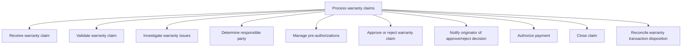
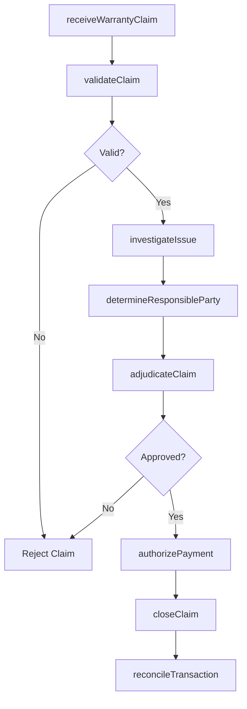

# Process warranty claims

> Business-as-Code definition for warranty claims processing. Models the full claim lifecycle from receipt and validation through investigation, approval, payment authorization, and reconciliation.

## Overview

Identifying, investigating, and processes warranty claims. This process includes: receipt and validation of a warranty claim; definition and diagnosis /root cause analysis of an issue and recommendation for corrective action; the determination of responsibility for settlement of the claim; the transaction being approved or denied; and the originator being notified and payment authorized. In the case of a recurring event, further investigation (definition and diagnosis or root cause analysis) is performed, and a recommendation for corrective action is made and implemented in production/design. It ends when the claim is closed.

## Process Hierarchy



## GraphDL

```yaml
process:
  object: Warranty Claims
  actor: WarrantyClaimsSpecialist
  result: ClaimDisposition
```

## Actions

| Action | Description |
|--------|-------------|
| receiveWarrantyClaim | Accept and log warranty claim from customer or dealer |
| validateClaim | Verify product eligibility, coverage period, and warranty terms |
| investigateIssue | Perform root cause analysis including field service if needed |
| determineResponsibleParty | Identify whether manufacturer, supplier, or customer is liable |
| adjudicateClaim | Approve or reject the warranty claim based on investigation |
| authorizePayment | Process payment authorization for approved claims |
| closeClaim | Finalize claim record and archive documentation |
| reconcileTransaction | Verify claim settlement against financial records |

## Events

| Event | Description |
|-------|-------------|
| warrantyClaimReceived | Warranty claim submitted and logged |
| claimValidated | Warranty eligibility and coverage verified |
| issueInvestigated | Root cause analysis completed with findings |
| responsiblePartyDetermined | Liability assigned to manufacturer, supplier, or customer |
| claimAdjudicated | Claim approved or rejected with rationale |
| paymentAuthorized | Claim payment processed and authorized |
| claimClosed | Claim finalized and archived |
| transactionReconciled | Claim settlement verified against financial records |

## Searches

| Search | Description |
|--------|-------------|
| getWarrantyClaims | List claims by status, product, customer, or date range |
| getClaimInvestigations | Retrieve investigation details and root cause findings |
| getPaymentAuthorizations | Query payment authorizations by claim or period |
| getReconciliationStatus | Check reconciliation status for warranty transactions |

## Process Flow



## RACI Matrix

| Activity | Responsible | Accountable | Consulted | Informed |
|----------|-------------|-------------|-----------|----------|
| receiveWarrantyClaim | Warranty Claims Specialist | Warranty Manager | Customer Service | Customer |
| validateClaim | Warranty Claims Specialist | Warranty Manager | Product Team | Finance |
| investigateIssue | Quality Engineer | Warranty Manager | Field Service, Engineering | Supplier |
| adjudicateClaim | Warranty Manager | VP After-Sales | Legal | Customer |
| authorizePayment | Finance Analyst | Warranty Manager | Accounting | VP Finance |

## Sub-Processes

| ID | Name | Description |
|----|------|-------------|
| 6.3.2.1 | Receive warranty claim | Accepting warranty claim submissions from customers, capturing product details, purchase information, and defect descriptions for processing. |
| 6.3.2.2 | Validate warranty claim | Ensuring that the claim falls within the parameters of the warranty in question. After validation is |
| 6.3.2.3 | Investigate warranty issues | Defining issues, scheduling field service inspections, requesting defective parts, performing root cause analysis, and recommending corrective actions. |
| 6.3.2.4 | Determine responsible party | Identifying whether the manufacturer, supplier, distributor, or customer is liable for the warranty issue based on investigation findings. |
| 6.3.2.5 | Manage pre-authorizations | Processing pre-authorization requests for warranty repairs or replacements before work is performed, ensuring coverage and cost approval. |
| 6.3.2.6 | Approve or reject warranty claim | Following Defining issue [20098], an approval or rejection with be made against the warranty claim.  |
| 6.3.2.7 | Notify originator of approve/reject decision | Communicating the claim adjudication outcome to the customer or dealer, providing rationale and next steps for approved or rejected claims. |
| 6.3.2.8 | Authorize payment | Approving and processing warranty-related financial transactions including repair costs, replacement part charges, and reimbursement amounts. |
| 6.3.2.9 | Close claim | Finalizing the warranty claim record, archiving documentation, and triggering post-resolution surveys and reporting. |
| 6.3.2.10 | Reconcile warranty transaction disposition | Assuring that the warranty transaction has been completed. |

## Related Processes

| Process | Relationship |
|---------|-------------|
| 6.1.6 Define and manage warranty offering | Upstream - warranty policies define claim eligibility |
| 6.3.3 Manage supplier recovery | Downstream - supplier-liable claims trigger recovery |
| 6.5.6 Evaluate and manage warranty performance | Downstream - claims data feeds performance evaluation |

## Related Departments

| Department | Role |
|-----------|------|
| Warranty Administration | Processes claims from receipt through closure |
| Quality Engineering | Investigates defects and performs root cause analysis |
| Finance | Authorizes payments and reconciles warranty transactions |
| Field Service | Conducts on-site inspections and repairs |

## Related Occupations

| Occupation | Involvement |
|-----------|-------------|
| Warranty Claims Specialist | Validates and processes warranty claims |
| Quality Engineer | Performs root cause investigations |
| Field Service Technician | Conducts on-site inspections |

## KPIs

| KPI | Description | Unit |
|-----|-------------|------|
| Claim Processing Cycle Time | Average days from claim receipt to disposition | Days |
| Claim Approval Rate | Percentage of submitted claims approved | % |
| Cost Per Claim | Average cost to process and settle a warranty claim | USD |
| Reconciliation Accuracy | Percentage of claims reconciled without discrepancy | % |

## Usage

```typescript
import { processWarrantyClaims } from '@headlessly/process-warranty-claims'

const claims = processWarrantyClaims()

// Receive and validate a warranty claim
const claim = await claims.receiveWarrantyClaim({
  productSerialNumber: 'SN-2024-12345',
  customerId: 'cust_67890',
  issueDescription: 'Motor failure within warranty period',
  claimType: 'manufacturer-defect'
})

// Adjudicate the claim
const decision = await claims.adjudicateClaim({
  claimId: claim.id,
  decision: 'approved',
  settlementType: 'replacement',
  responsibleParty: 'manufacturer'
})
```
