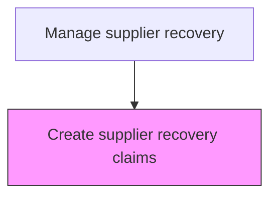
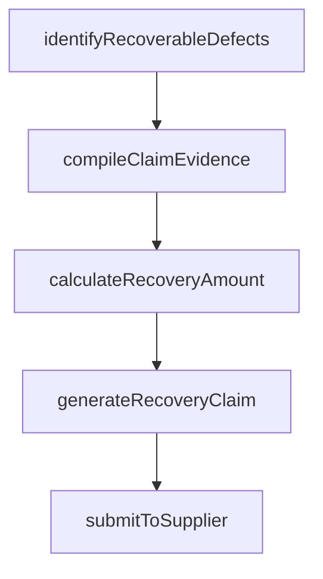

# Create supplier recovery claims

> Business-as-Code definition for supplier recovery claim creation. Models the generation, documentation, and submission of cost recovery claims against suppliers responsible for warranty defects.

## Overview

Generating and submitting cost recovery claims against suppliers whose components are the confirmed root cause of warranty defects. Identify supplier-attributable claims, compile investigation evidence and cost documentation, calculate the total recovery amount, and submit the formal claim to the responsible supplier per contractual terms.

## Process Hierarchy



## GraphDL

```yaml
create:
  object: Supplier Recovery Claims
  actor: SupplierRecoverySpecialist
  result: SupplierRecoveryClaim
```

## Actions

| Action | Description |
|--------|-------------|
| identifyRecoverableDefects | Select warranty claims where supplier components are the confirmed root cause |
| compileClaimEvidence | Gather investigation reports, test results, and cost documentation |
| calculateRecoveryAmount | Compute the total recovery amount including parts, labor, and logistics |
| generateRecoveryClaim | Create the formal recovery claim document for supplier submission |
| submitToSupplier | Deliver the recovery claim package to the responsible supplier |

## Events

| Event | Description |
|-------|-------------|
| recoverableDefectsIdentified | Supplier-attributable warranty claims selected for recovery |
| claimEvidenceCompiled | Supporting documentation assembled for recovery claim |
| recoveryAmountCalculated | Total recovery amount computed |
| recoveryClaimGenerated | Formal recovery claim document created |
| claimSubmittedToSupplier | Recovery claim delivered to supplier |

## Searches

| Search | Description |
|--------|-------------|
| getRecoverableClaims | List warranty claims eligible for supplier recovery by supplier or product |
| getRecoveryClaimStatus | Query submission and payment status of recovery claims |
| getSupplierRecoveryHistory | Retrieve recovery claim history for a supplier |

## Process Flow



## RACI Matrix

| Activity | Responsible | Accountable | Consulted | Informed |
|----------|-------------|-------------|-----------|----------|
| identifyRecoverableDefects | Supplier Recovery Specialist | Warranty Manager | Quality | Finance |
| calculateRecoveryAmount | Supplier Recovery Specialist | Finance Manager | Accounting | Procurement |
| submitToSupplier | Supplier Recovery Specialist | Procurement Manager | Legal | Supplier |

## Related Processes

| Process | Relationship |
|---------|-------------|
| 6.3.3 Manage supplier recovery | Parent - part of the supplier recovery process |
| 6.3.2.4 Determine responsible party | Upstream - responsibility determination identifies supplier-liable claims |

## Related Departments

| Department | Role |
|-----------|------|
| Warranty Administration | Identifies claims eligible for supplier recovery |
| Procurement | Manages supplier relationships and recovery negotiations |
| Finance | Calculates recovery amounts and tracks payments |

## Related Occupations

| Occupation | Involvement |
|-----------|-------------|
| Supplier Recovery Specialist | Creates and submits supplier recovery claims |
| Procurement Analyst | Coordinates claim submission and supplier communication |

## KPIs

| KPI | Description | Unit |
|-----|-------------|------|
| Recovery Submission Rate | Percentage of eligible claims submitted for supplier recovery | % |
| Recovery Amount | Total dollars recovered from suppliers per period | USD |
| Submission Cycle Time | Average days from defect confirmation to claim submission | Days |

## Usage

```typescript
import { createSupplierRecoveryClaims } from '@headlessly/create-supplier-recovery-claims'

const client = createSupplierRecoveryClaims()

// Identify recoverable defects
const claims = await client.identifyRecoverableDefects({
  supplierId: 'SUP-500',
  period: '2025-Q1',
  minClaimValue: 100
})

// Generate and submit recovery claim
const recovery = await client.generateRecoveryClaim({
  claimIds: claims.map(c => c.id),
  supplierId: 'SUP-500',
  recoveryBasis: 'warranty-agreement-clause-4.2'
})
```
